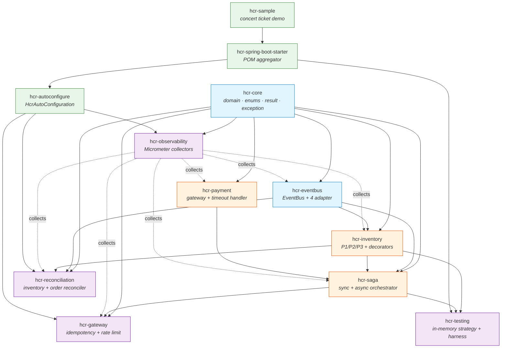
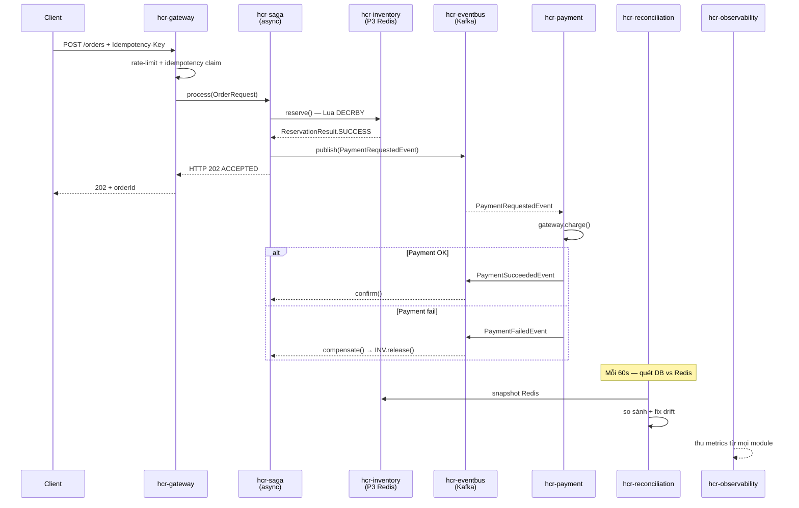

# HCR Framework

> **High Concurrency Resource** — Spring Boot framework cho bài toán phân phát tài nguyên giới hạn dưới tải cao.
>
> Java 17 · Spring Boot 3.2.5 · Maven multi-module · `io.hrc.*`

---

## 1. Framework sinh ra để làm gì?

HCR là framework **tái sử dụng** giúp developer xây dịch vụ phân phát tài nguyên có giới hạn cho nhiều người dùng đồng thời, **đảm bảo zero oversell** ngay cả dưới spike traffic. Thay vì mỗi đội tự viết lại logic reserve / thanh toán / saga / reconcile, framework gói chúng vào các module có thể **plug-and-play** qua Spring Boot starter.

Ý tưởng cốt lõi: tách **cơ chế** (atomic reservation, idempotency, saga, reconcile) ra khỏi **chính sách nghiệp vụ** (vé concert, flash sale, phòng khách sạn, slot khám bệnh). Developer extend các abstract class và config strategy phù hợp với SLA, framework xử lý phần còn lại.

---

## 2. Bài toán framework giải quyết

> *"Phân phối tài nguyên có giới hạn cho nhiều người dùng đồng thời, không vượt quá tồn kho, dưới điều kiện tải cao."*

Các bài toán cùng cấu trúc:

| Bài toán | Tài nguyên | Ràng buộc |
|----------|------------|-----------|
| Bán vé concert | Số vé | Không oversell |
| Flash sale | Số sản phẩm | Không bán quá số lượng |
| Đặt phòng khách sạn | Số phòng trống | Không double booking |
| Đặt slot khám bệnh | Slot bác sĩ | Không overbook |

Mọi bài toán đều quy về 4 bước:

```
1. RESERVE     — Giữ chỗ atomic (không oversell)
2. PROCESS     — Xử lý nghiệp vụ (thanh toán, KYC, ...)
3. CONFIRM     — Xác nhận chính thức / Rollback nếu fail
4. RECONCILE   — Dọn case treo, đảm bảo consistency
```

### Ba thử thách kỹ thuật chính

| Thử thách | Cách HCR xử lý |
|-----------|----------------|
| **Race condition** khi nhiều request giành chung 1 slot | 3 inventory strategy: P1 (DB lock), P2 (optimistic), P3 (Redis Lua atomic) |
| **Distributed transaction** giữa reserve và payment | Saga orchestration sync (P1/P2) hoặc async (P3) với compensate |
| **State drift** giữa cache (Redis) và source of truth (DB) | Reconciliation service so sánh + tự fix theo policy |

---

## 3. Nguyên tắc thiết kế

| # | Nguyên tắc | Áp dụng ở đâu |
|---|-----------|---------------|
| 1 | **Strategy Pattern** | 3 InventoryStrategy (P1/P2/P3) cùng interface, swap qua config |
| 2 | **Template Method** | `AbstractSagaOrchestrator`, `AbstractReconciliationService`, `AbstractPaymentGateway` định khung; subclass điền hook |
| 3 | **Decorator Pattern** | `CircuitBreakerInventoryDecorator` bọc strategy mà không sửa core |
| 4 | **Hexagonal / Ports & Adapters** | `EventBus` interface + 4 adapter (Kafka / Rabbit / Redis Streams / InMemory) |
| 5 | **Result Object** thay exception cho expected outcome | `ReservationResult`, `ValidationResult`, `PaymentResult` |
| 6 | **Idempotency by design** | `idempotencyKey` ở Gateway + `eventId` ở consumer (`hcr_processed_events`) |
| 7 | **Eventual consistency có giới hạn thời gian** | P3 cam kết drift ≤ 5 phút qua Reconciliation |
| 8 | **Observability built-in** | Mọi module xuất Micrometer metrics; `/actuator/hcr` introspection |
| 9 | **Spring Boot auto-configuration** | Developer chỉ cần `@EnableHighConcurrencyResource` + properties |
| 10 | **Separation of concerns** | 12 module độc lập, dependency 1 chiều, không cycle |

### 3 inventory strategy

| | P1 Pessimistic | P2 Optimistic | P3 Redis Atomic |
|--|:-:|:-:|:-:|
| Cơ chế | `SELECT FOR UPDATE` | `@Version` + retry | Lua `DECRBY` |
| Throughput | ~1 000 req/s | 1 000–5 000 req/s | 5 000–10 000 req/s |
| Consistency | Strong (0 ms) | Strong (0 ms) | Eventual (≤ 5 min) |
| Source of truth | PostgreSQL | PostgreSQL | Redis |
| DB trong critical path? | Có | Có | **Không** |

---

## 4. Mối quan hệ giữa các module

### 4.1 Dependency graph



### 4.2 Phân tầng vai trò

| Tầng | Module | Vai trò |
|------|--------|---------|
| **Foundation** | `hcr-core`, `hcr-eventbus` | Domain ngôn ngữ chung + giao tiếp bất đồng bộ |
| **Core capability** | `hcr-inventory`, `hcr-payment`, `hcr-saga` | 3 năng lực nghiệp vụ chính |
| **Cross-cutting** | `hcr-gateway`, `hcr-reconciliation`, `hcr-observability`, `hcr-testing` | Concerns cắt ngang (entry, drift fix, metrics, test) |
| **Packaging** | `hcr-autoconfigure`, `hcr-spring-boot-starter` | Spring Boot wiring + 1 dependency để dùng tất cả |
| **Demo** | `hcr-sample`, `hcr-product` | Concert ticket monolith / 3-microservice reference |

### 4.3 Luồng request (P3 async — đại diện cho high-concurrency)



---

## 5. Bắt đầu nhanh

```xml
<dependency>
    <groupId>io.hrc</groupId>
    <artifactId>hcr-spring-boot-starter</artifactId>
    <version>1.0.0-SNAPSHOT</version>
</dependency>
```

```java
@SpringBootApplication
@EnableHighConcurrencyResource
public class MyApp { }
```

```yaml
hcr:
  inventory:
    strategy: redis-atomic     # pessimistic | optimistic | redis-atomic
  saga:
    mode: async                # sync | async
  eventbus:
    type: kafka                # kafka | rabbitmq | redis-streams | in-memory
```

Demo đầy đủ tham khảo `hcr-sample/` (monolith) hoặc `hcr-product/` (3 microservice với load test k6).

---

## 6. Cấu trúc repository

```
hcr-parent/
├── hcr-core/                   # Domain ngôn ngữ chung
├── hcr-eventbus/               # EventBus + 4 adapter
├── hcr-inventory/              # 3 strategy P1/P2/P3 + decorator + persistence consumer
├── hcr-payment/                # Payment gateway abstraction + timeout
├── hcr-saga/                   # Sync + async orchestrator
├── hcr-gateway/                # Idempotency + rate limiting + entry point
├── hcr-reconciliation/         # Drift detection + auto-fix
├── hcr-observability/          # Micrometer metric collectors
├── hcr-testing/                # In-memory strategy + concurrency harness
├── hcr-autoconfigure/          # Spring Boot auto-config
├── hcr-spring-boot-starter/    # POM aggregator (1 dep để dùng tất cả)
├── hcr-sample/                 # Concert ticket monolith demo
├── hcr-product/                # 3-microservice reference (ms-order/inventory/payment)
└── docs/
    ├── framework_design.md     # Thiết kế chi tiết toàn framework
    └── PROGRESS.md             # Tiến độ + quyết định thiết kế
```

Mỗi module đều có:
- `README.md` — vai trò, nguyên lý thiết kế, class diagram
- `GUIDE.md` — thứ tự đọc code chi tiết file-by-file

---

## 7. Tài liệu liên quan

| File | Nội dung |
|------|----------|
| [`docs/framework_design.md`](docs/framework_design.md) | Thiết kế chi tiết — đọc khi cần hiểu sâu kiến trúc |
| [`docs/PROGRESS.md`](docs/PROGRESS.md) | Trạng thái implementation + quyết định thiết kế |
| [`CLAUDE.md`](CLAUDE.md) | Context ngắn cho AI agents (Claude Code) |
| `{module}/README.md` | Vai trò + class diagram của từng module |
| `{module}/GUIDE.md` | Hướng dẫn đọc code từng module |
