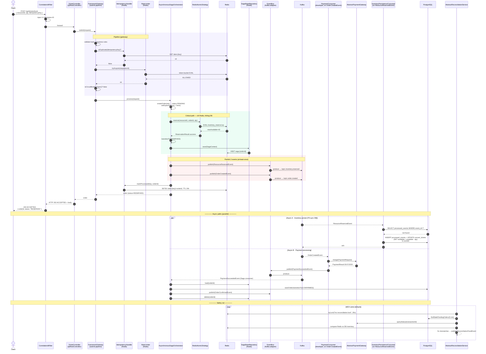

# HCR Framework — System Architecture

> **HCR (High Concurrency Resource)** — Spring Boot framework cho bài toán phân phát tài nguyên có giới hạn dưới tải cao (vé concert, flash sale, phòng khách sạn, slot khám bệnh). Mục tiêu cốt lõi: **zero oversell** dưới hàng nghìn request đồng thời.

Tài liệu này là cái nhìn tổng quan. Mỗi module có file `architecture.md` riêng đi sâu vào nội bộ.

---

## 1. System Overview

### 1.1. Tech Stack

| Layer | Công nghệ |
|---|---|
| Language / Runtime | Java 17 |
| Framework | Spring Boot 3.2.5 (parent POM) |
| Build | Maven multi-module (12 modules), packaging `pom`/`jar` |
| Persistence | PostgreSQL 15 (JPA/Hibernate); Redis 7 (Redisson 3.27.2) |
| Messaging | Kafka / RabbitMQ / Redis Streams / In-memory (4 EventBus adapters) |
| Resilience | Resilience4j 2.2.0 (Circuit Breaker), Redisson distributed lock |
| Observability | Micrometer 1.12.5 → Prometheus, Grafana dashboards |
| Boilerplate | Lombok |

### 1.2. Module Map (12 modules)

8 module nghiệp vụ cốt lõi:

| Module | Vai trò |
|---|---|
| **hcr-core** | Foundation: domain abstract classes, enums, exceptions, result objects |
| **hcr-eventbus** | Pub/Sub abstraction; 4 adapter (Kafka, RabbitMQ, Redis Streams, InMemory) |
| **hcr-inventory** | 3 strategies P1/P2/P3 + Circuit Breaker decorator + persistence consumer |
| **hcr-payment** | Payment gateway abstraction + Timeout handler (xử lý scenario A/B) |
| **hcr-saga** | Saga orchestration: synchronous (P1/P2) + asynchronous (P3) |
| **hcr-gateway** | HTTP entry point + idempotency + rate limiting + circuit breaker |
| **hcr-reconciliation** | Safety net định kỳ — fix 5 case inconsistency |
| **hcr-observability** | Micrometer metrics collectors cho mọi module |

4 module hạ tầng/đóng gói:

| Module | Vai trò |
|---|---|
| hcr-testing | Test utilities: concurrency helpers, mock data |
| hcr-autoconfigure | Spring Boot auto-configuration (`@ConditionalOnInventoryStrategy`, `@EnableHighConcurrencyResource`) |
| hcr-spring-boot-starter | Meta-package gộp toàn bộ module |
| hcr-sample | Demo app — concert ticket booking |

### 1.3. Module Dependency Graph

```
core ──► eventbus, payment
core ──► inventory ──► (eventbus)
                       │
core, inventory, payment, eventbus ──► saga ──► gateway
                                              ──► reconciliation
                                              ──► observability
```

Quy tắc: cấp dưới không được phụ thuộc cấp trên. `hcr-core` là nền và không phụ thuộc bất kỳ module nội bộ nào khác.

### 1.4. 3 Inventory Strategies — quyết định kiến trúc cốt lõi

| | **P1 Pessimistic** | **P2 Optimistic** | **P3 Redis Atomic** |
|---|:-:|:-:|:-:|
| Cơ chế | `SELECT … FOR UPDATE` | `@Version` + retry | Lua script `DECRBY` |
| Throughput | ~1,000 req/s | 1,000–5,000 req/s | 5,000–10,000 req/s |
| Consistency | Strong (0ms) | Strong (0ms) | Eventual (≤5 phút worst) |
| Source of truth | PostgreSQL | PostgreSQL | Redis |
| Saga | Synchronous (HTTP 201) | Synchronous (HTTP 201) | Asynchronous (HTTP 202) |
| DB trong critical path? | Có | Có | **Không** |

P1/P2 đều "strong consistency" nhờ DB lock; P3 đánh đổi nhất quán tức thời lấy throughput, dùng `hcr-reconciliation` làm safety net.

---

## 2. System Architecture Diagram (Mermaid Component)

```mermaid
graph TB
    Client[["Client / Frontend<br/>(REST POST /api/.../book)"]]

    subgraph BoundaryAPI["API Boundary"]
        Controller["@RestController<br/>(developer code, eg. TicketController)"]
        Filter["CorrelationIdFilter<br/>(Servlet filter)"]
    end

    subgraph EntryPipeline["hcr-gateway · Pipeline"]
        FG["FrameworkGateway&lt;REQ,O&gt;<br/>(abstract, final submit)"]
        Idem["IdempotencyHandler<br/>(Redis SETNX)"]
        RL["RateLimiter<br/>(Redis token bucket)"]
        CBCheck{"Circuit Breaker<br/>open?"}
    end

    subgraph SagaLayer["hcr-saga · Orchestration"]
        Sync["SynchronousSagaOrchestrator<br/>(P1/P2)"]
        Async["AsynchronousSagaOrchestrator<br/>(P3, requires SagaStateRepo)"]
        Steps["SagaStep · ReservationStep / PaymentStep / ConfirmationStep"]
        SagaRepo["SagaStateRepository&lt;O&gt;<br/>(persist state — async only)"]
    end

    subgraph InventoryLayer["hcr-inventory · 3 strategies"]
        Strategy{"InventoryStrategy<br/>(interface)"}
        P1["PessimisticLockStrategy<br/>SELECT FOR UPDATE"]
        P2["OptimisticLockStrategy<br/>@Version + retry"]
        P3["RedisAtomicStrategy<br/>Lua DECRBY"]
        CBDeco["CircuitBreakerInventoryDecorator<br/>(wraps strategy)"]
        Lua[(Lua Scripts<br/>inventory_reserve.lua<br/>inventory_release.lua)]
    end

    subgraph PaymentLayer["hcr-payment"]
        PG["PaymentGateway<br/>(interface)"]
        APG["AbstractPaymentGateway<br/>(idempotency, retry)"]
        Mock["MockPaymentGateway"]
        TH["TimeoutHandler<br/>(scenario A/B polling)"]
    end

    subgraph EventBusLayer["hcr-eventbus · Pub/Sub"]
        EB["EventBus<br/>(interface, at-least-once)"]
        Kafka["KafkaEventBusAdapter"]
        Rabbit["RabbitMQEventBusAdapter"]
        RedisStr["RedisStreamEventBusAdapter"]
        Memory["InMemoryEventBusAdapter"]
    end

    subgraph Persistence["hcr-inventory · Async Persistence (P3 only)"]
        SingleC["InventoryPersistenceConsumer<br/>(1 event = 1 tx)"]
        BatchC["BatchInventoryPersistenceConsumer<br/>(gom theo resourceId)"]
        Dedup["ProcessedEventRepository<br/>(idempotency dedup)"]
        Cleanup["ProcessedEventsCleanupJob<br/>@Scheduled"]
    end

    subgraph Reconciliation["hcr-reconciliation · Safety Net"]
        ARS["AbstractReconciliationService<br/>@Scheduled + Redisson lock<br/>5 cases"]
        OR["OrderReconciler"]
        IR["InventoryReconciler<br/>(Redis vs DB)"]
    end

    subgraph Observability["hcr-observability"]
        MM["MicrometerFrameworkMetrics"]
        Coll["Metrics Collectors<br/>Saga / Inventory / Payment / EventBus / Gateway / Reconciliation"]
    end

    subgraph Stores["External Stores"]
        Redis[("Redis 7<br/>inventory + idempotency<br/>+ rate limit + saga state")]
        Postgres[("PostgreSQL 15<br/>orders + inventory + processed_events")]
        Broker[("Message Broker<br/>Kafka / Rabbit / Streams")]
        Prom[("Prometheus")]
    end

    PaymentExt[["Third-Party Payment<br/>VNPay / Stripe / MoMo"]]

    Client -->|HTTPS| Filter
    Filter --> Controller
    Controller --> FG
    FG --> Idem
    FG --> RL
    FG --> CBCheck
    CBCheck -- closed --> Sync
    CBCheck -- closed --> Async

    Sync --> Steps
    Async --> Steps
    Async --> SagaRepo
    Steps --> Strategy
    Steps --> PG

    Strategy -. select by config .-> P1
    Strategy -. select by config .-> P2
    Strategy -. select by config .-> P3
    P1 -.optional.-> CBDeco
    P2 -.optional.-> CBDeco
    P3 -.optional.-> CBDeco
    P3 --> Lua
    P3 --> Redis
    P1 --> Postgres
    P2 --> Postgres

    PG --> APG
    APG --> Mock
    APG -.real impl.-> PaymentExt
    APG --> TH
    TH -. queryStatus on timeout .-> APG

    Sync --> EB
    Async --> EB
    EB -. switchable .-> Kafka
    EB -. switchable .-> Rabbit
    EB -. switchable .-> RedisStr
    EB -. switchable .-> Memory
    Kafka --> Broker
    Rabbit --> Broker
    RedisStr --> Redis

    EB --> SingleC
    EB --> BatchC
    SingleC --> Dedup
    BatchC --> Dedup
    SingleC --> Postgres
    BatchC --> Postgres
    Cleanup --> Postgres

    ARS --> OR
    ARS --> IR
    OR -. queryStatus .-> APG
    IR --> Redis
    IR --> Postgres
    ARS --> EB
    ARS --> Redis

    Idem --> Redis
    RL --> Redis
    SagaRepo --> Redis

    Coll -. observe .-> Strategy
    Coll -. observe .-> Sync
    Coll -. observe .-> Async
    Coll -. observe .-> EB
    Coll -. observe .-> APG
    Coll -. observe .-> ARS
    Coll -. observe .-> FG
    MM --> Coll
    MM --> Prom

    classDef external fill:#fef3c7,stroke:#d97706,color:#000
    classDef store fill:#e0e7ff,stroke:#4338ca,color:#000
    classDef abstract fill:#fce7f3,stroke:#be185d,color:#000
    class Client,PaymentExt external
    class Redis,Postgres,Broker,Prom store
    class FG,Strategy,Sync,Async,EB,PG,APG,ARS,CBDeco abstract
```



### Diagram notes

- **Giao thức:**
  - Client ⇄ Controller: HTTPS / REST + JSON.
  - Module ⇄ DB: JDBC qua JPA/Hibernate.
  - Module ⇄ Redis: RESP qua Redisson.
  - Module ⇄ Broker: native protocol theo adapter (Kafka API / AMQP / Redis Streams).
  - Module ⇄ Payment ngoài: HTTPS REST (do gateway impl của developer).
- **Switchable**: cùng một mã nguồn Saga có thể chạy với Kafka, RabbitMQ, hoặc Redis Streams chỉ bằng đổi `hcr.event-bus.type` trong `application.yml`. Tương tự với inventory strategy qua `hcr.inventory.strategy`.
- **Deployment**: framework phát hành dạng JAR; sample app deploy như Spring Boot fat JAR. Mỗi instance của ứng dụng chia sẻ Redis + Postgres + broker. Reconciliation chạy trên *mọi* instance nhưng `Redisson distributed lock` chỉ cho 1 instance làm việc tại 1 thời điểm.

---

## 3. End-to-End Request Flow (Mermaid Sequence)

Luồng tiêu biểu: client gửi `POST /api/tickets/book` để đặt vé concert. Cấu hình P3 (Redis Atomic + Async Saga + Kafka).



### Flow notes

- **Synchronous variant (P1/P2):** thay `RedisAtomicStrategy` bằng `PessimisticLockStrategy`/`OptimisticLockStrategy`, payment chạy ngay trong `executeFlow()` (không qua broker), kết thúc trả về **HTTP 201** với status `CONFIRMED`. Không cần `SagaStateRepository`.
- **Failure paths:**
  - Idempotency duplicate → throw `IdempotencyException` → HTTP 409.
  - Rate limit denied → `RateLimitExceededException` → HTTP 429.
  - CB open → `FrameworkException(SYSTEM_ERROR)` → HTTP 503.
  - Inventory insufficient → `ReservationResult.insufficient` → cancel + HTTP 4xx (sample: 422).
  - Payment fail (sync) → `compensate()` chạy ngược: release inventory → `cancelOrder()` → HTTP 4xx.
- **Tại sao 2 transaction tách rời?** Reservation (lock inventory) và Payment (gọi external) không bao giờ chạy trong cùng 1 DB transaction — tránh giữ lock DB trong suốt thời gian gọi payment gateway (có thể ≥ 30s). Điều này áp dụng cho cả P1, P2 (qua `TransactionTemplate` mỗi step), và P3 (tách hẳn qua EventBus).
- **At-least-once delivery:** mọi consumer đều phải idempotent. `InventoryPersistenceConsumer` dùng bảng `processed_events` (eventId là primary key) để dedup; saga consumer dùng state machine + `OrderStatus.canTransitionTo()`.

---

## 4. Known limitations & design tradeoffs

| Vấn đề | Tác động | Khắc phục |
|---|---|---|
| P3 gap giữa Redis DECR và `EventBus.publish()` | Crash giữa 2 step → event mất → DB inventory không sync | Reconciliation case 4 (UNPERSISTED_RESERVATION) phát hiện và fix ≤ 5 phút |
| Batch consumer ACK trước flush | Crash giữa ACK và DB flush → mất bản ghi | Reconciliation case 3 (INVENTORY_MISMATCH) so sánh Redis vs DB |
| Async saga state sống trên Redis | Redis flush → mất saga in-flight | `SagaStateRepository` có thể swap sang Postgres impl; reconciliation case 1/2 cứu order PENDING |
| Hot-key contention (Redis P3) | Một resourceId siêu hot → Redis CPU bottleneck | Sharding theo resourceId (chưa implement, ghi nhận trong roadmap) |

Chi tiết từng module: xem `architecture.md` trong từng thư mục module.
