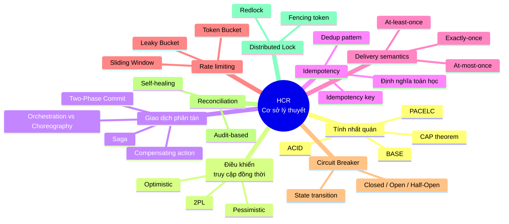
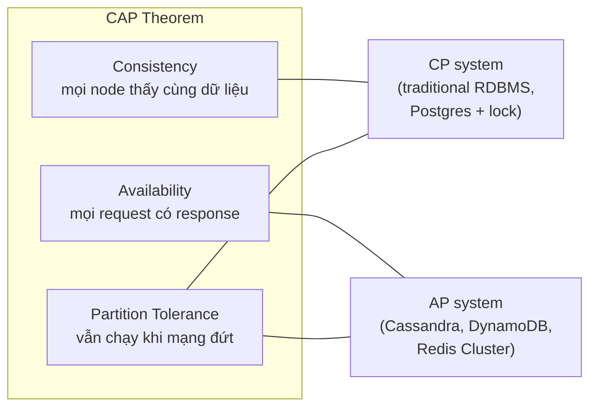
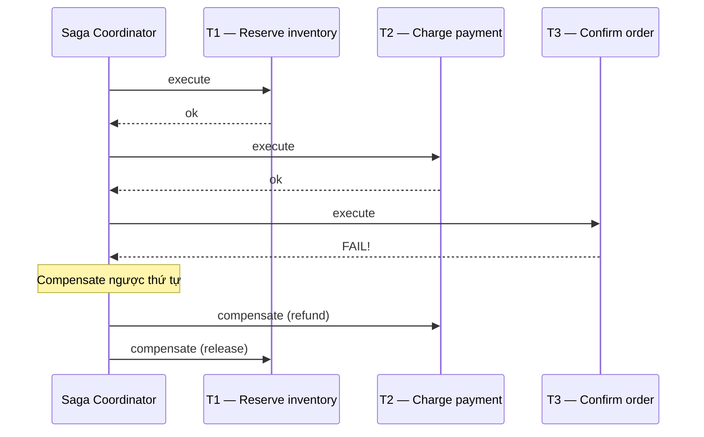
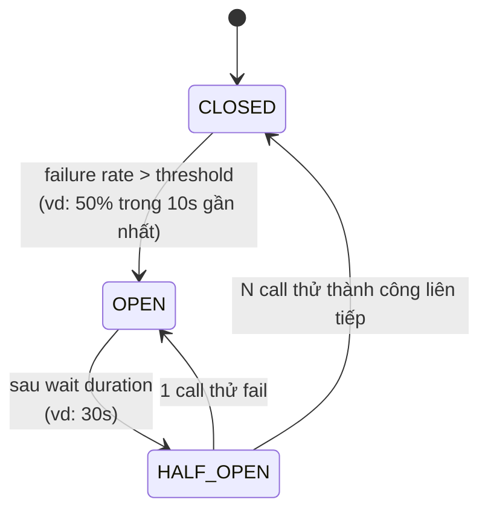

# Chương 2 — Cơ sở lý thuyết

> **Mục đích tài liệu:** Cung cấp toàn bộ chất liệu thô cho **Chương 2 — Cơ sở lý thuyết** của báo cáo đồ án tốt nghiệp. Mỗi mục lý thuyết được trình bày theo 4 phần chuẩn: **(1) Định nghĩa — (2) Cơ chế / Công thức / Thuật toán — (3) Ví dụ minh hoạ — (4) Áp dụng vào HCR Framework**. Các tham chiếu (citation) đặt cuối file ở mục Tài liệu tham khảo.
>
> **Liên kết với các chương khác:**
> - Chương 1 đã xác định 7 thách thức C1–C7 và 5 mục tiêu MT1–MT5 — chương này **cung cấp công cụ lý luận** để giải quyết.
> - Chương 3 sẽ **áp dụng** các pattern trong chương này vào kiến trúc HCR.

---

## 2.1. Tổng quan chương

Bài toán *zero-oversell at high concurrency* không phải bài toán mới — nó là một thể hiện của một loạt vấn đề đã được nghiên cứu kỹ lưỡng trong các lĩnh vực **cơ sở dữ liệu**, **hệ thống phân tán**, và **kỹ thuật phần mềm chịu lỗi**. Mục tiêu của chương này là tóm tắt nền tảng lý thuyết mà framework HCR xây dựng trên đó, rồi *mapping* từng khái niệm tới một thành phần cụ thể trong framework.

Chương này được tổ chức thành 9 mục lý thuyết và 1 mục khảo sát các framework cùng loại (related work):



---

## 2.2. Tính nhất quán dữ liệu — ACID, BASE, và CAP

### 2.2.1. ACID — Tính nhất quán cổ điển trong CSDL

Bốn thuộc tính ACID (Härder & Reuter, 1983) định nghĩa một transaction "đáng tin cậy":

| Thuộc tính | Định nghĩa | Ý nghĩa thực tế trong bài toán đặt chỗ |
|---|---|---|
| **A — Atomicity** (nguyên tử) | Tất cả thay đổi trong transaction hoặc cùng commit, hoặc cùng rollback | Trừ tiền và giảm tồn kho phải xảy ra "cùng nhau" |
| **C — Consistency** (nhất quán) | Sau commit, dữ liệu thoả mãn mọi ràng buộc nghiệp vụ | `available >= 0` luôn đúng |
| **I — Isolation** (cô lập) | Hai transaction chạy đồng thời cho kết quả như chạy tuần tự | Hai khách cùng đặt vé cuối không thể cùng thành công |
| **D — Durability** (bền vững) | Sau commit, dữ liệu còn nguyên dù server crash | Vé đã đặt không thể "biến mất" sau restart |

**Hạn chế trong hệ phân tán:** ACID nguyên gốc giả định một CSDL duy nhất. Khi transaction phải đi qua *nhiều nút* (microservice + payment gateway + Redis), việc duy trì cả 4 thuộc tính trở nên rất tốn kém — đây là lý do CAP theorem ra đời.

### 2.2.2. CAP theorem — Tam giác bất khả thi

**Phát biểu (Brewer 2000, chứng minh chính thức Gilbert & Lynch 2002):**

> *Một hệ phân tán không thể đồng thời đảm bảo cả ba thuộc tính: Consistency (C), Availability (A), và Partition Tolerance (P). Khi mạng bị phân vùng (network partition), hệ thống buộc phải chọn giữa C và A.*

| Thuộc tính | Định nghĩa hình thức |
|---|---|
| **Consistency (C)** | Mọi node đọc đều thấy cùng một giá trị tại cùng thời điểm (linearizability) |
| **Availability (A)** | Mọi request không-lỗi đều nhận được response (không-error) trong thời gian hữu hạn |
| **Partition tolerance (P)** | Hệ thống vẫn hoạt động khi một số message giữa các node bị mất hoặc trễ vô hạn |

Trong thực tế, mạng *luôn* có thể phân vùng (P là bắt buộc) → mọi hệ phân tán phải chọn giữa **CP** (chấp nhận một số request lỗi/timeout để giữ nhất quán) hoặc **AP** (chấp nhận đọc dữ liệu cũ để mọi request đều có response).



### 2.2.3. BASE — Đối nghịch của ACID cho hệ AP

**BASE** (Pritchett 2008) đặc trưng cho các hệ thống ưu tiên Availability hơn Consistency:

- **B**asically **A**vailable — luôn trả về response, kể cả response cũ.
- **S**oft state — trạng thái có thể thay đổi theo thời gian dù không có input mới (do đồng bộ ngầm).
- **E**ventual consistency — tất cả replica *cuối cùng* sẽ hội tụ về cùng một giá trị, miễn là không có update mới.

### 2.2.4. PACELC — Mở rộng CAP

CAP chỉ nói về hành vi *khi có partition*. **PACELC** (Abadi 2010) bổ sung: *khi không có partition (Else), hệ vẫn phải chọn giữa Latency (L) và Consistency (C)*.

> Ký hiệu: hệ **PA/EL** = AP khi partition + ưu tiên latency khi bình thường (Cassandra, DynamoDB).
> Hệ **PC/EC** = CP khi partition + ưu tiên consistency khi bình thường (Postgres truyền thống).

### 2.2.5. Áp dụng vào HCR Framework

HCR cung cấp **3 chiến lược** đại diện 3 điểm khác nhau trên trục CAP/PACELC:

| Strategy | CAP | PACELC | Đánh đổi cụ thể |
|---|---|---|---|
| **P1 — PessimisticLockStrategy** (`SELECT … FOR UPDATE`) | CP | PC/EC | Khi DB quá tải hoặc partition: request bị hold → timeout. **Linearizable**. |
| **P2 — OptimisticLockStrategy** (`@Version` + retry) | CP | PC/EC | Tương tự P1 nhưng giảm lock contention; vẫn linearizable do version check. |
| **P3 — RedisAtomicStrategy** (Redis + Lua + async DB sync) | AP* | PA/EL | Critical path **chỉ Redis**, DB sync sau ≤ 5 phút. Khi DB partition khỏi app: request vẫn được phục vụ. *(* Ngoại trừ trường hợp Redis-down → hệ thống fail.)* |

**Ý nghĩa:** developer **chọn lớp use case** (đặt phòng = CP, flash sale = AP) bằng cách đổi `hcr.inventory.strategy` trong YAML — đây là điểm khác biệt cốt lõi của HCR so với các framework cố định một mô hình.

---

## 2.3. Điều khiển truy cập đồng thời (Concurrency Control)

### 2.3.1. Bài toán

Khi nhiều transaction cùng đọc/ghi dữ liệu chung, các *anomaly* có thể xảy ra:

| Anomaly | Mô tả | Ví dụ trong đặt vé |
|---|---|---|
| **Lost update** | Hai transaction cùng đọc giá trị X, cùng ghi đè → một update bị mất | T1 và T2 cùng đọc `available = 1`, cả hai cùng giảm xuống 0, oversell |
| **Dirty read** | Đọc dữ liệu chưa commit của transaction khác | Hiếm trong bài toán này |
| **Non-repeatable read** | Cùng query trả 2 kết quả khác nhau trong cùng transaction | T1 đọc `available = 5`, lúc sau đọc lại = 4 |
| **Phantom read** | Cùng range query trả tập hàng khác nhau | T1 query "tất cả vé VIP còn lại" → mỗi lần kết quả khác |

Để chặn anomaly, hệ thống dùng một trong hai họ kỹ thuật chính: **Pessimistic** (Bernstein 1981) hoặc **Optimistic** (Kung & Robinson 1981).

### 2.3.2. Pessimistic Concurrency Control (PCC)

**Triết lý:** "Giả định sẽ có xung đột → khoá trước, thao tác sau."

**Cơ chế chính — Two-Phase Locking (2PL):** transaction trải qua hai pha:
1. **Growing phase:** chỉ acquire lock, không release.
2. **Shrinking phase:** sau lần release đầu tiên, không acquire thêm.

→ Đảm bảo *serializability* (tương đương lịch trình tuần tự).

**Trong SQL:** `SELECT … FOR UPDATE` đặt một **exclusive lock** lên hàng cho đến hết transaction.

```sql
BEGIN;
SELECT available FROM concert_tickets
  WHERE resource_id = 'concert-A1' FOR UPDATE;
-- Hàng bị khoá. T2 chạy cùng query phải đợi.
UPDATE concert_tickets SET available = available - 1
  WHERE resource_id = 'concert-A1';
COMMIT;
```

**Đặc tính:**
- ✅ Strong consistency, không bao giờ oversell.
- ✅ Đơn giản, dễ tranh luận đúng.
- ❌ Throughput giảm khi contention cao (request xếp hàng).
- ❌ Nguy cơ deadlock nếu lock nhiều hàng theo thứ tự khác nhau.

### 2.3.3. Optimistic Concurrency Control (OCC)

**Triết lý:** "Giả định ít xung đột → cứ thao tác, kiểm tra lúc commit."

**Cơ chế chính (Kung & Robinson 1981):** mỗi transaction chia thành 3 pha:
1. **Read phase:** đọc dữ liệu, ghi nhận version đã đọc (vd: `version = 7`).
2. **Validation phase:** kiểm tra version trên DB có thay đổi không.
3. **Write phase:** nếu version không đổi → commit; nếu đổi → abort + retry.

**Trong JPA/Hibernate:** annotation `@Version`:

```java
@Entity
public class ConcertTicket {
    @Id String resourceId;
    long available;
    @Version long version;   // tự động += 1 mỗi UPDATE
}
```

```sql
-- Khi UPDATE, Hibernate sinh:
UPDATE concert_tickets
   SET available = ?, version = version + 1
 WHERE resource_id = ? AND version = ?
-- Nếu rowcount = 0 → có T khác đã update → throw OptimisticLockException
```

**Khi gặp OptimisticLockException → retry.** Để tránh thundering herd, dùng **exponential backoff với jitter**:

$$
\text{delay}_n = \text{base} \cdot 2^n \cdot (1 + \text{rand}(-0.1, 0.1))
$$

**Đặc tính:**
- ✅ Không lock DB → throughput cao hơn PCC khi contention thấp/trung bình.
- ✅ Strong consistency vẫn được đảm bảo (do validation).
- ❌ Khi contention cao, retry rate tăng phi tuyến → throughput sụp.
- ❌ Phải implement retry logic + xử lý max retries.

### 2.3.4. So sánh PCC và OCC

| Đặc tính | PCC (Pessimistic) | OCC (Optimistic) |
|---|---|---|
| Khi nào tốt | Contention cao | Contention thấp/trung bình |
| Cơ chế | Lock trước | Validate sau |
| Wasted work | Ít (lock thì không đụng nhau) | Nhiều (retry sau xung đột) |
| Deadlock | Có thể (cần thứ tự lock) | Không (chỉ retry) |
| Latency p50 | Thấp khi không contention | Thấp |
| Latency p99 | Cao khi contention | Cao do retry |

**Bài học (Cahill 2008):** Trong workload "đọc nhiều ghi ít", OCC vượt trội. Trong workload "ghi nhiều cùng row" (chính là bài toán inventory), PCC ổn định hơn — nhưng OCC vẫn cạnh tranh nếu có chiến lược backoff tốt.

### 2.3.5. Áp dụng vào HCR

HCR hiện thực cả hai họ:

- **`PessimisticLockStrategy`** (P1) sử dụng `EntityManager.lock(entity, LockModeType.PESSIMISTIC_WRITE)` tương đương `SELECT … FOR UPDATE`.
- **`OptimisticLockStrategy`** (P2) dựa vào JPA `@Version` trong `AbstractInventoryEntity`, kèm vòng retry với exponential backoff + jitter.

**Quyết định kỹ thuật quan trọng:** P2 phải tạo **transaction MỚI cho mỗi lần retry** (không phải retry trong cùng transaction). Lý do: Hibernate cache version cũ trong session → retry trong cùng transaction luôn fail. Đây là một trong những bug khó tìm trong implementation OCC, được tài liệu hoá trong `CLAUDE.md` như một quy ước bắt buộc.

**Quyết định kỹ thuật quan trọng 2:** `reserveBatch()` (đặt nhiều resource cùng lúc) phải **sort key alphabet trước khi acquire** trong P1 — đây là kỹ thuật chuẩn chống deadlock trong 2PL.

---

## 2.4. Distributed Transactions và Saga Pattern

### 2.4.1. Vấn đề: vượt khỏi một CSDL

Khi một thao tác nghiệp vụ phải đi qua nhiều hệ thống độc lập (DB nội bộ + payment gateway bên ngoài + Redis + message broker), không có transaction ACID nào bao trùm cả tổng thể. Hai cách tiếp cận chính: **Two-Phase Commit (2PC)** và **Saga**.

### 2.4.2. Two-Phase Commit (2PC) — và tại sao không dùng

**Cơ chế:** một *coordinator* hỏi tất cả *participants* "sẵn sàng commit chưa?" (Phase 1 — prepare), rồi gửi quyết định "commit/abort" tới tất cả (Phase 2 — commit/rollback).

**Hạn chế nghiêm trọng:**
- **Blocking:** participant phải hold resource (lock) suốt từ prepare đến commit. Nếu coordinator chết, participant kẹt mãi.
- **Không scale qua mạng WAN:** giữa app server và payment gateway thật, latency 100–500ms × 2 round trip = 200–1000ms hold lock.
- **Payment gateway bên ngoài KHÔNG hỗ trợ 2PC** — hầu hết REST API thanh toán chỉ có "charge" (đồng bộ) hoặc webhook callback.

→ Thực tế: 2PC không khả thi cho bài toán "đặt vé + trừ tiền".

### 2.4.3. Saga Pattern (Garcia-Molina & Salem 1987)

**Saga** là chuỗi các *local transaction* $T_1, T_2, \ldots, T_n$, mỗi $T_i$ commit ngay khi xong. Nếu $T_k$ fail, hệ thống chạy *compensating transaction* $C_{k-1}, C_{k-2}, \ldots, C_1$ theo thứ tự ngược để "undo" về mặt nghiệp vụ.



**Tính chất compensating transaction phải có:**
- **Semantically inverse** — không phải "rollback DB" mà "đảo ngược tác động nghiệp vụ".
- **Idempotent** — có thể chạy nhiều lần mà không gây tác hại (vì có thể bị retry).
- **Commutative khi có thể** — không phụ thuộc thứ tự với các action khác.

**Lưu ý quan trọng (Pat Helland 2007):** Saga *không* cho isolation tự động. Trong khi saga đang chạy, dữ liệu trung gian có thể "lộ" ra ngoài (vd: order ở trạng thái RESERVED sẽ làm available giảm — khách khác thấy ngay). Đây là lý do HCR cần `OrderStatus` rõ ràng (PENDING → RESERVED → CONFIRMED) để client biết trạng thái và admin biết phải cancel/expire khi cần.

### 2.4.4. Hai mô hình triển khai Saga

**Orchestration:** một coordinator trung tâm (orchestrator) gọi từng service theo thứ tự.

**Choreography:** không có coordinator, mỗi service phát event và service khác lắng nghe để biết bước tiếp theo.

| Tiêu chí | Orchestration | Choreography |
|---|---|---|
| Logic flow | Tập trung 1 chỗ | Phân tán theo event listener |
| Dễ trace / debug | ✅ | ❌ (event spaghetti) |
| Coupling | Coordinator biết mọi service | Loose coupling |
| Scale operational | Kém hơn (coordinator là single point) | Tốt hơn |
| Phù hợp khi flow đơn giản | ✅ | ✅ |
| Phù hợp khi flow phức tạp 6+ bước | ❌ (orchestrator cồng kềnh) | ❌ (event hell) |

### 2.4.5. Áp dụng vào HCR

HCR chọn mô hình **orchestration** vì:
1. Bài toán phân phát tài nguyên có flow cố định 3 bước (Reserve → Pay → Confirm) — không quá phức tạp để cần choreography.
2. Cần debug / trace dễ — đồ án tốt nghiệp ưu tiên rõ ràng.
3. Compensating logic tập trung dễ verify đúng đắn.

`AbstractSagaOrchestrator` là *Template Method*:

- `process()` là method `final` — pipeline cố định (validate → createOrder → executeFlow → confirm/compensate).
- `executeFlow()` là hook cho 2 subclass quyết định **sync** (P1/P2) hay **async** (P3).

**Hai biến thể executeFlow:**

| Biến thể | Sync (`SynchronousSagaOrchestrator`) | Async (`AsynchronousSagaOrchestrator`) |
|---|---|---|
| Phù hợp với | P1, P2 (DB là source of truth) | P3 (Redis là source of truth) |
| Critical path | Reserve(DB) → Charge → Confirm — cùng 1 HTTP request | Reserve(Redis) → publish event → return RESERVED |
| HTTP response | 201 Created | 202 Accepted |
| `SagaStateRepository` | Optional | **Bắt buộc** — fail fast tại boot nếu null |
| Compensating | Inline trong cùng request | Qua EventBus consumer |

**Compensating action trong HCR:**
- `ReservationStep.compensate()` → `inventoryStrategy.release(...)`
- `PaymentStep.compensate()` → `paymentGateway.refund(...)` (nếu tiền đã trừ thật)
- `ConfirmationStep.compensate()` → no-op (chỉ là notification).

**Compensation theo thứ tự ngược** — đảm bảo ngữ nghĩa đúng (refund trước release inventory, để release không trigger restock notification cho user khác đang chờ một resource đã refund nhưng chưa release lại).

---

## 2.5. Idempotency và Dedup

### 2.5.1. Định nghĩa toán học

Một thao tác $f$ là **idempotent** nếu:

$$
f(f(x)) = f(x), \quad \forall x
$$

Nói cách khác: gọi $f$ một lần hay $n$ lần đều cho cùng kết quả.

**Ví dụ idempotent:**
- `SET key = 5` (Redis)
- `UPDATE … SET status = 'CONFIRMED' WHERE id = 'x'` (SQL — luôn ghi cùng giá trị)
- `DELETE FROM … WHERE id = 'x'` (xoá rồi xoá lại không có hiệu ứng phụ)

**Ví dụ KHÔNG idempotent:**
- `INCR counter` (Redis — mỗi lần tăng 1)
- `INSERT INTO orders VALUES (...)` (mỗi lần tạo bản ghi mới)
- `charge(amount)` trên payment gateway nếu không có idempotency key

### 2.5.2. Tại sao bài toán này cần idempotency

Có ba nguồn gây ra "gọi nhiều lần":

1. **Client retry:** mạng không ổn định → app mobile gửi request 2–3 lần.
2. **Producer retry:** publish event mất → publish lại.
3. **Consumer retry:** consume event nhưng processing fail giữa chừng → broker re-deliver.

Nếu *charge* hoặc *reserve* không idempotent, hậu quả là tiền bị trừ 2 lần / 2 đơn cho 1 ý định.

### 2.5.3. Pattern triển khai — Idempotency Key

**Cơ chế:** client/producer gắn một **idempotency key** (UUID, hash request body) vào request. Phía nhận lưu key đã xử lý vào storage có TTL.

```
Khi nhận request có idempotency-key K:
  IF K đã có trong store:
    → trả về kết quả đã lưu (cùng response, không xử lý lại)
  ELSE:
    → mark K đang xử lý
    → thực hiện business logic
    → lưu kết quả vào store với TTL
```

**Đặc tính storage:**
- Phải hỗ trợ **atomic check-and-set** (Redis `SETNX`, DB `INSERT … ON CONFLICT DO NOTHING`).
- TTL phải đủ dài để cover toàn bộ thời gian client có thể retry (thường ≥ 24h).

### 2.5.4. Pattern dedup tại consumer — Bảng `processed_events`

Khi at-least-once delivery, consumer có thể nhận cùng event nhiều lần. **Pattern dedup ở consumer:**

```sql
BEGIN;
INSERT INTO processed_events (event_id, processor)
  VALUES (?, ?)
  ON CONFLICT (event_id) DO NOTHING;

-- Nếu rowcount = 0 → đã xử lý → skip
-- Nếu rowcount = 1 → mới → tiếp tục business logic

UPDATE inventory SET available = available - ? WHERE resource_id = ?;
COMMIT;
```

**Anti-pattern (sai!):** dùng `WHERE available >= delta` để chống double-decrement. Khi consumer retry, nếu vừa xảy ra release đồng thời, available có thể đủ → decrement lần thứ 2 → oversell.

### 2.5.5. Áp dụng vào HCR

HCR có **ba lớp idempotency**:

| Lớp | Storage | Key | TTL | Mục đích |
|---|---|---|---|---|
| **Gateway** (`RedisIdempotencyHandler`) | Redis SETNX | `idempotency-key` từ client | 24h | Chống client retry double-submit |
| **Payment** (`AbstractPaymentGateway`) | Redis hoặc DB | `transactionId` | 7 ngày | Chống retry trong charge() double-charge |
| **Consumer dedup** (`ProcessedEventRepository` table `hcr_processed_events`) | PostgreSQL | `eventId` (UUID gắn vào DomainEvent khi tạo) | 7 ngày + cleanup job | Chống at-least-once delivery double-decrement |

**Quyết định kỹ thuật quan trọng:** trong P3, dedup tại consumer **bắt buộc dùng bảng `processed_events`** — không được dùng các trick dạng `WHERE available >= delta` vì có thể tạo race condition khi consumer retry trùng với release đồng thời.

---

## 2.6. Message Delivery Semantics

### 2.6.1. Ba mức bảo đảm

| Mức | Định nghĩa | Đặc tính |
|---|---|---|
| **At-most-once** | Mỗi message gửi tối đa 1 lần. Có thể bị mất. | Đơn giản nhất, không retry. |
| **At-least-once** | Mỗi message được gửi *ít nhất* 1 lần. Có thể bị duplicate. | Dùng phổ biến nhất. Cần dedup ở consumer. |
| **Exactly-once** | Mỗi message được xử lý chính xác 1 lần. Không mất, không lặp. | Khó nhất. Yêu cầu cooperation giữa producer + broker + consumer. |

### 2.6.2. Tại sao Exactly-once là khó

**Lập luận lý thuyết (Bishop & Esposito):** Khi có network partition, *không thể* phân biệt giữa "message thật sự mất" và "message đến nhưng ack mất" — buộc phải chọn giữa retry (có thể duplicate) hoặc không retry (có thể mất). Exactly-once chỉ đạt được khi cả ba bên (producer, broker, consumer) cùng cooperate qua *transaction-like protocol* (Kafka EoS với transactional producer + consumer).

**Chi phí:** Kafka EoS giảm throughput ~30 % so với at-least-once và yêu cầu cấu hình phức tạp.

### 2.6.3. Pattern thực tế — At-least-once + Dedup ở consumer

Đây là pattern **được dùng nhiều nhất trong industry** và có hiệu quả tương đương exactly-once với chi phí thấp hơn:

```
Producer side:
  - Retry khi publish fail
  - (Optional) Idempotent producer cấp connection (Kafka enable.idempotence=true)

Broker side:
  - Persist message với at-least-once delivery

Consumer side:
  - Pull message
  - Dedup qua processed_events table
  - Process business logic + write side-effect
  - Commit offset (Kafka) / ACK (Rabbit, Redis Stream) sau khi DB commit
```

**Quan trọng:** *commit offset / ack PHẢI sau khi DB commit*, không phải trước. Nếu trước, crash giữa hai thao tác → mất data.

### 2.6.4. Áp dụng vào HCR

HCR chấp nhận **at-least-once** trên cả 4 EventBus adapter (Kafka, RabbitMQ, Redis Streams, In-memory) — đây là contract chuẩn của interface `EventBus`. Mọi `EventHandler` được yêu cầu **bắt buộc idempotent**.

**Cơ chế dedup chuẩn của HCR:**
- `DomainEvent` có field `eventId` (UUID auto-generated tại producer).
- `InventoryPersistenceConsumer` và `BatchInventoryPersistenceConsumer` đều dedup qua bảng `hcr_processed_events`.
- `ProcessedEventsCleanupJob` (`@Scheduled`) xoá bản ghi cũ hơn N ngày để tránh phình bảng.

**Ngoại lệ — ACK trước flush trong `BatchInventoryPersistenceConsumer`:** để đạt throughput cao, batch consumer ACK ngay khi enqueue và flush vào DB sau ≤ 1 giây. Nếu crash giữa ACK và flush → mất data → reconciliation case 4 (UNPERSISTED_RESERVATION) phục hồi. Đây là trade-off có chủ ý, được ghi rõ trong tài liệu.

---

## 2.7. Rate Limiting

### 2.7.1. Bài toán

Khi tải đỉnh vượt khả năng phục vụ, cần một cơ chế **giới hạn số request được nhận** để bảo vệ hệ thống — không phải để giới hạn throughput trung bình mà để chống DDoS, abuse, hoặc đơn giản là tạo "burst absorber" cho hệ thống chính.

### 2.7.2. Bốn thuật toán phổ biến

#### a) Fixed Window

Đếm số request trong cửa sổ thời gian cố định (vd: mỗi phút). Reset count khi sang cửa sổ mới.

- ✅ Đơn giản nhất.
- ❌ Có hiện tượng "boundary spike" — nửa cuối phút N + nửa đầu phút N+1 có thể đạt 2× rate.

#### b) Sliding Window Log

Lưu timestamp của từng request, đếm số timestamp trong cửa sổ trượt.

- ✅ Chính xác.
- ❌ Tốn memory $O(n)$ với n = số request gần đây.

#### c) Leaky Bucket

Tưởng tượng một bucket có lỗ rò liên tục với tốc độ $r$. Request đổ vào bucket; nếu bucket đầy → reject.

- ✅ Cho output rate đều, chống burst.
- ❌ Không cho phép burst hợp lệ (vd: user F5 nhanh để xem update).

#### d) Token Bucket — Pattern HCR sử dụng

Bucket chứa tối đa $C$ token, tự động đầy lại với tốc độ $r$ token/giây. Mỗi request tiêu thụ 1 token; nếu không còn token → reject hoặc đợi.

**Công thức cập nhật (mỗi request):**

$$
\text{tokens} = \min\left(C,\ \text{tokens}_{\text{prev}} + (t_{\text{now}} - t_{\text{prev}}) \cdot r\right)
$$

```
def try_acquire():
    now = current_time_ms()
    tokens = min(C, tokens_prev + (now - last_refill) * r / 1000)
    last_refill = now
    if tokens >= 1:
        tokens -= 1
        return ALLOWED
    else:
        return DENIED, retry_after = (1 - tokens) / r * 1000
```

**Đặc tính:**
- ✅ Cho phép burst (tận dụng token tích luỹ).
- ✅ Output rate trung bình bị giới hạn = $r$.
- ✅ Memory $O(1)$ per key.
- ✅ Implement được atomic trong Redis qua Lua → consistency cross-instance.

### 2.7.3. Áp dụng vào HCR

`RedisTokenBucketRateLimiter` triển khai Token Bucket với các đặc điểm:

- **Atomic qua Lua script** — toàn bộ "đọc tokens, refill, consume, ghi back" trong 1 EVAL → không race giữa các app instance.
- **Per-key bucket** — key mặc định là `requesterId`, có thể override qua `getRateLimitKey(req)` để giới hạn per-user-per-resource.
- **Trả về `RateLimitResult`** chứa `allowed`, `remainingTokens`, `retryAfterMs` → client có thể kiên nhẫn retry đúng cách thay vì hammer.

**Cấu hình thực tế:**
```yaml
hcr.gateway.rate-limit:
  capacity: 100             # cho phép burst tối đa 100 request
  refill-per-second: 10     # rate trung bình 10 req/s/user
```

---

## 2.8. Circuit Breaker Pattern

### 2.8.1. Bài toán

Khi một dependency (DB, payment gateway, Redis) suy yếu, gọi nó liên tục với timeout dài (30s) sẽ:
1. **Block thread** — pool thread bị cạn.
2. **Lan truyền lỗi (cascading failure)** — request đến cũng bị treo theo.
3. **Lãng phí tài nguyên** — gọi mãi cũng fail.

**Giải pháp:** Circuit Breaker (Nygard 2007, *Release It!*) — "ngắt mạch" tự động khi phát hiện dependency đang fail, fail-fast cho request mới.

### 2.8.2. Ba trạng thái



| State | Hành vi |
|---|---|
| **CLOSED** | Bình thường — request đi qua. CB ghi nhận success/fail rate. |
| **OPEN** | Fail-fast — mọi request bị reject ngay (không gọi dependency). Sau wait duration → HALF_OPEN. |
| **HALF_OPEN** | Cho phép $N$ call thử đi qua. Nếu thành công liên tiếp → CLOSED. Nếu fail → OPEN lại. |

### 2.8.3. Tham số cấu hình điển hình

| Tham số | Ý nghĩa | Giá trị mẫu |
|---|---|---|
| `failure-rate-threshold` | % fail để mở mạch | 50 % |
| `slow-call-rate-threshold` | % slow-call (vượt slow-call-duration-threshold) để mở mạch | 100 % |
| `slow-call-duration-threshold` | Threshold cho slow call | 5s |
| `wait-duration-in-open-state` | Thời gian giữ OPEN trước khi thử HALF_OPEN | 30s |
| `permitted-calls-in-half-open-state` | Số call thử khi HALF_OPEN | 5 |
| `minimum-number-of-calls` | Số call tối thiểu trước khi tính rate | 10 |

### 2.8.4. Áp dụng vào HCR

HCR sử dụng **Resilience4j** thông qua `CircuitBreakerInventoryDecorator` — wrap bất kỳ `InventoryStrategy` nào.

**Quyết định kỹ thuật quan trọng — `release()` không bao giờ reject khi CB OPEN:**

`reserve()` khi CB OPEN → reject (an toàn — chỉ là từ chối khách mới).
`release()` khi CB OPEN → **vẫn cho qua delegate**. Lý do: nếu reject release, inventory đã bị giữ chỗ sẽ không bao giờ trả về → **leak vĩnh viễn**.

Pattern này khác với cách dùng CB thông thường (reject mọi call) — vì semantics của `release` là *compensating action* phải luôn thành công cuối cùng. Đây là một quyết định nghiệp vụ-trên-pattern (business overrides pattern) đáng được nhấn mạnh trong báo cáo.

---

## 2.9. Reconciliation và Eventual Consistency Repair

### 2.9.1. Bài toán

Trong hệ thống AP (eventual consistency), "cuối cùng nhất quán" không có nghĩa "tự động sửa được mọi sai lệch". Khi:
- Event publish bị mất giữa Redis DECR và `EventBus.publish()`.
- Payment gateway timeout — không biết tiền có trừ hay không.
- Redis crash recovery → một phần state mất.

→ Hệ thống cần một **safety net chạy ngầm theo lịch** để phát hiện và sửa.

### 2.9.2. Pattern Reconciliation (Helland 2007 — *Life beyond Distributed Transactions*)

**Triết lý:** Thay vì cố gắng đảm bảo "transaction atomic xuyên hệ", chấp nhận sai lệch tạm thời nhưng có **cơ chế tự sửa** dựa trên **ground truth** ở mỗi nguồn.

**Ba đặc điểm của reconciliation tốt:**
1. **Periodic** — chạy theo lịch (`@Scheduled`).
2. **Idempotent** — chạy nhiều lần không gây tác hại.
3. **Bounded recovery time** — guarantee thời gian sửa tối đa (vd: ≤ 5 phút).

### 2.9.3. Hai họ reconciliation

| Họ | Mô tả | Ví dụ |
|---|---|---|
| **Audit-based** | So sánh hai nguồn, log sai lệch, không tự sửa | Đối soát kế toán cuối ngày |
| **Self-healing** | Phát hiện sai lệch và **tự động sửa** theo policy đã định | HCR — fix Redis vs DB lệch, re-publish event mất |

### 2.9.4. Distributed Lock cho Reconciliation

Khi deploy nhiều app instance, *chỉ một instance* được làm việc trong một cycle để tránh race. Pattern: **distributed lock với fencing token**.

**Cơ chế Redlock (Redis distributed lock — Sentinel/cluster):**
1. Acquire `SET lock-key value NX EX 60`.
2. Nếu thành công → giữ lock với TTL 60s, làm việc.
3. Nếu fail → skip cycle.

**Lưu ý quan trọng (Kleppmann 2016):** Redlock không hoàn toàn an toàn nếu app pause GC dài hơn TTL. Cần **fencing token** — mỗi lần acquire trả về số tăng dần, downstream check "token mới hơn không?" trước khi accept write.

### 2.9.5. Áp dụng vào HCR — 5 case

`AbstractReconciliationService` chạy theo `@Scheduled` mặc định 5 phút, dùng Redisson distributed lock `hcr:reconciliation:lock`. Mỗi cycle xử lý 5 case:

| # | Case | Ground truth | Hành động |
|---|---|---|---|
| 1 | **STALE_PENDING** | DB orders | Cancel hoặc retry payment |
| 2 | **LATE_PAYMENT_SUCCESS** | Payment gateway `queryStatus()` | Xác nhận order nếu tiền đã trừ thật |
| 3 | **INVENTORY_MISMATCH** (P3) | Redis vs DB | Đồng bộ Redis về DB hoặc ngược lại theo policy |
| 4 | **UNPERSISTED_RESERVATION** | Order CONFIRMED nhưng DB inventory chưa giảm | Re-publish `ResourceReservedEvent` (cùng eventId → dedup) |
| 5 | **DUPLICATE_ORDER** | Bảng orders | Giữ 1 order, cancel + refund các order còn lại |

**Bounded recovery time = `schedule-delay-ms`** (default 5 phút). Đây là *consistency window* mà HCR cam kết với P3.

---

## 2.10. Distributed Lock — Bảo vệ critical section qua nhiều process

### 2.10.1. Hai trường hợp cần dùng

1. **Mutual exclusion across instances:** chỉ 1 instance trong cluster làm 1 việc tại 1 thời điểm (vd: reconciliation, scheduled job).
2. **Critical section qua nhiều process:** vd: 2 admin cùng restock 1 resource — cần lock để tránh ghi đè.

HCR chỉ dùng case 1; case 2 không xảy ra vì admin operation hiếm.

### 2.10.2. Redlock — Algorithm

Antirez (Sanfilippo, tác giả Redis) đề xuất:
1. Lấy timestamp $t_0$.
2. Thử SET NX EX trên *nhiều* node Redis độc lập.
3. Nếu thành công ở quá nửa số node và tổng thời gian < TTL → coi là acquired.
4. TTL còn lại = TTL ban đầu - (thời gian đã trôi qua).

### 2.10.3. Redlock Controversy (Kleppmann 2016)

Kleppmann chỉ ra Redlock không an toàn 100 % khi:
- Process pause (GC, swap) lâu hơn TTL.
- Clock drift giữa các Redis node.

**Khuyến nghị:** dùng Redlock cho *advisory lock* (best-effort). Cho *correctness lock* (bắt buộc), kết hợp với fencing token + downstream check.

### 2.10.4. Áp dụng vào HCR

HCR dùng **Redisson `RLock.tryLock(waitTime, leaseTime, unit)`** — implementation Redlock Java client phổ biến.

- Lock key: `hcr:reconciliation:lock`.
- waitTime: 30s.
- leaseTime: 60s (đủ cho 1 cycle reconciliation chạy xong).
- Mỗi instance không acquire được sẽ skip cycle, không retry — đảm bảo không deadlock.

**Limitation chấp nhận được:** HCR không dùng fencing token — vì worst case là một cycle reconciliation chạy trùng giữa 2 instance, mọi thao tác của reconciliation đều idempotent (qua `processed_events` dedup) → safe dù không tối ưu.

---

## 2.11. Khảo sát các framework cùng loại (Related Work)

### 2.11.1. Mục đích so sánh

Đặt HCR vào không gian các framework đã có để làm rõ vị trí và đóng góp khác biệt.

### 2.11.2. Bảng so sánh chi tiết

| Tiêu chí | **HCR** | **Eventuate Tram** | **Axon** | **Camunda 8** | **Temporal** | **Apache Seata** |
|---|---|---|---|---|---|---|
| Loại | Resource allocation framework | Saga + EventSourcing | CQRS + EventSourcing + Saga | BPM workflow engine | Workflow as code | Distributed transaction |
| Bài toán cốt lõi | Zero-oversell at high concurrency | Microservice transactional messaging | Event-driven domain modeling | Business process automation | Long-running workflow | XA-like distributed tx |
| Inventory abstraction | ✅ 3 chiến lược switchable | ❌ | ❌ | ❌ | ❌ | ⚠️ AT/TCC mode (chung chung) |
| Saga | ✅ Sync + Async, orchestration | ✅ Choreography + Orchestration | ✅ Saga manager | ✅ BPMN-driven | ✅ Workflow definition | ✅ TCC, SAGA mode |
| Reconciliation built-in | ✅ 5 case + distributed lock | ❌ | ❌ | ⚠️ Workflow timer | ⚠️ Workflow retry | ❌ |
| Idempotency built-in | ✅ Gateway + Consumer dedup | ✅ Producer-side | ⚠️ Manual | ✅ Workflow native | ✅ Workflow native | ⚠️ |
| Rate limiting | ✅ Token Bucket | ❌ | ❌ | ❌ | ❌ | ❌ |
| Circuit Breaker | ✅ Resilience4j integrated | ❌ | ❌ | ❌ | ❌ | ❌ |
| Multi-broker | ✅ Kafka / Rabbit / Redis Streams / In-memory | ✅ Kafka chính | ✅ AMQP / Kafka | ✅ Kafka | gRPC | ⚠️ |
| Tech stack | Spring Boot 3.2 + Java 17 | Spring Boot | Spring Boot | Java SDK | Go/Java SDK | Java |
| Open source | ✅ | ✅ | ✅ Community | ✅ Free / Enterprise | ✅ | ✅ |
| Tập trung vào *high concurrency*? | **✅** | ⚠️ | ⚠️ | ❌ | ❌ | ⚠️ |

### 2.11.3. Định vị HCR

Các framework hiện có đều **mạnh về workflow / saga đa năng**, nhưng:
- **Không** tập trung vào bài toán *zero-oversell at high concurrency*.
- **Không** cung cấp inventory abstraction với nhiều chiến lược switchable.
- **Không** ship reconciliation built-in cho 5 case cụ thể.

→ HCR có thể được mô tả là một **framework chuyên dụng** (specialized framework) — tập hẹp hơn nhưng chiều sâu hơn cho bài toán phân phát tài nguyên.

---

## 2.12. Tóm tắt chương 2

Chương 2 đã trình bày **9 mảng lý thuyết** mà HCR Framework xây dựng trên đó:

1. **ACID, BASE, CAP, PACELC** đặt nền tảng cho việc HCR cung cấp ba chiến lược inventory đại diện ba điểm khác nhau trên trục consistency-throughput.
2. **Pessimistic Concurrency Control (2PL)** và **Optimistic Concurrency Control (version + retry)** là cơ sở trực tiếp của P1 và P2.
3. **Saga Pattern (orchestration)** với compensating action là cơ sở của `AbstractSagaOrchestrator` cùng hai biến thể sync và async.
4. **Idempotency** ở 3 lớp (gateway, payment, consumer dedup) chống tác động lặp khi client/producer/consumer retry.
5. **At-least-once delivery + dedup** là contract chuẩn của 4 EventBus adapter của HCR.
6. **Token Bucket rate limiting** triển khai atomic qua Redis Lua trong `RedisTokenBucketRateLimiter`.
7. **Circuit Breaker** với Resilience4j bảo vệ inventory layer; quyết định kỹ thuật quan trọng là `release()` không bao giờ reject khi CB OPEN — tránh inventory leak.
8. **Reconciliation pattern (self-healing, periodic, distributed-locked)** là safety net cho 5 case inconsistency, đảm bảo bounded recovery time ≤ 5 phút trong P3.
9. **Distributed Lock (Redlock qua Redisson)** đảm bảo chỉ 1 instance làm reconciliation tại 1 thời điểm.

Cuối chương, mục **Related Work** so sánh HCR với 5 framework đương đại (Eventuate Tram, Axon, Camunda 8, Temporal, Apache Seata) để định vị HCR là *framework chuyên dụng cho bài toán zero-oversell at high concurrency* — khoảng trống mà các framework saga đa năng chưa lấp đầy. Toàn bộ các pattern này sẽ được áp dụng cụ thể vào kiến trúc 12 module trong **Chương 3**.

---

## Tài liệu tham khảo (sử dụng trong Chương 2)

> Format theo IEEE / ACM. Sinh viên có thể đổi sang format trường yêu cầu khi viết báo cáo chính thức.

1. T. Härder and A. Reuter, *"Principles of transaction-oriented database recovery,"* ACM Computing Surveys, vol. 15, no. 4, pp. 287–317, 1983.
2. E. Brewer, *"Towards robust distributed systems,"* keynote at PODC 2000.
3. S. Gilbert and N. Lynch, *"Brewer's conjecture and the feasibility of consistent, available, partition-tolerant web services,"* ACM SIGACT News, vol. 33, no. 2, pp. 51–59, 2002.
4. D. Abadi, *"Consistency tradeoffs in modern distributed database system design: CAP is only part of the story,"* IEEE Computer, vol. 45, no. 2, pp. 37–42, 2012.
5. D. Pritchett, *"BASE: An ACID alternative,"* ACM Queue, vol. 6, no. 3, pp. 48–55, 2008.
6. P. A. Bernstein, V. Hadzilacos, and N. Goodman, *Concurrency Control and Recovery in Database Systems.* Addison-Wesley, 1987.
7. H. T. Kung and J. T. Robinson, *"On optimistic methods for concurrency control,"* ACM Transactions on Database Systems, vol. 6, no. 2, pp. 213–226, 1981.
8. M. J. Cahill, U. Röhm, and A. D. Fekete, *"Serializable isolation for snapshot databases,"* ACM Transactions on Database Systems, vol. 34, no. 4, 2009.
9. H. Garcia-Molina and K. Salem, *"Sagas,"* ACM SIGMOD Record, vol. 16, no. 3, pp. 249–259, 1987.
10. P. Helland, *"Life beyond distributed transactions: An apostate's opinion,"* CIDR 2007.
11. P. Helland, *"Idempotence is not a medical condition,"* ACM Queue, vol. 10, no. 4, 2012.
12. M. Kleppmann, *"How to do distributed locking,"* blog post and *Designing Data-Intensive Applications*, O'Reilly, 2016.
13. M. T. Nygard, *Release It! Design and Deploy Production-Ready Software,* 2nd ed., Pragmatic Bookshelf, 2018.
14. S. Sanfilippo, *"Distributed locks with Redis (Redlock),"* redis.io, 2014.
15. C. Richardson, *Microservices Patterns: With examples in Java,* Manning, 2018.
16. W. Vogels, *"Eventually consistent,"* Communications of the ACM, vol. 52, no. 1, pp. 40–44, 2009.

---

## Phụ lục — Ánh xạ nhanh giữa lý thuyết và HCR

Bảng dưới phục vụ tra cứu ngược: từ một thành phần HCR cụ thể, tìm phần lý thuyết tương ứng để giải thích.

| Thành phần HCR | Lý thuyết tương ứng | Mục trong chương 2 |
|---|---|---|
| `PessimisticLockStrategy` | 2PL (Bernstein 1981) | 2.3.2 |
| `OptimisticLockStrategy` | OCC (Kung 1981) | 2.3.3 |
| `RedisAtomicStrategy` (Lua + async DB sync) | CAP — AP, BASE | 2.2 |
| `AbstractSagaOrchestrator` + 3 step | Saga (Garcia-Molina 1987) | 2.4 |
| `compensate()` reverse order | Compensating action | 2.4.3 |
| `AsynchronousSagaOrchestrator` | Long-Lived Transaction (Helland 2007) | 2.4 |
| `RedisIdempotencyHandler` | Idempotency key | 2.5.3 |
| `processed_events` table | Consumer dedup | 2.5.4 |
| 4 EventBus adapter | At-least-once + dedup | 2.6 |
| `RedisTokenBucketRateLimiter` | Token Bucket | 2.7.2.d |
| `CircuitBreakerInventoryDecorator` | Circuit Breaker (Nygard 2007) | 2.8 |
| `release()` không reject khi OPEN | Business overrides pattern | 2.8.4 |
| `AbstractReconciliationService` 5 case | Self-healing reconciliation (Helland 2007) | 2.9 |
| Redisson `RLock` cho reconciliation | Redlock (Sanfilippo 2014, Kleppmann 2016) | 2.10 |

---

> **Hết Chương 2.** &nbsp;·&nbsp; Tiếp theo: Chương 3 sẽ áp dụng các pattern này vào kiến trúc cụ thể của HCR. Tài liệu nguồn cho Chương 3 đã có sẵn:
> - `architecture.md` (root) + 8 file `[module]/architecture.md` cho phần *kiến trúc tổng quan và chi tiết*.
> - `03-decision-log.md` (sẽ viết tiếp) cho phần *quyết định kỹ thuật và rationale*.
