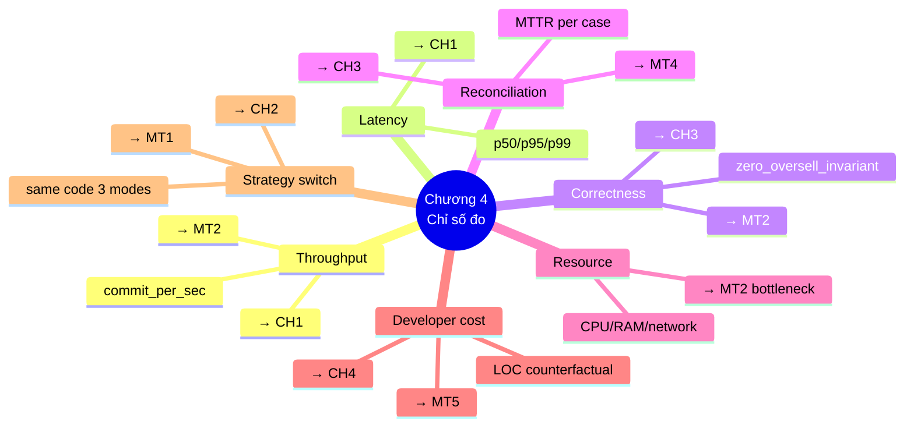
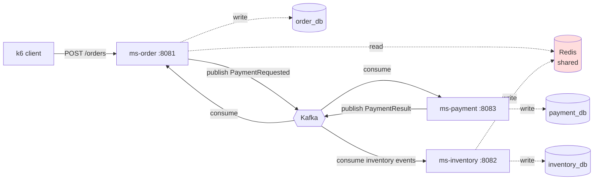

# Chương 4 — Phân tích thực nghiệm

> **Mục đích tài liệu:** Cung cấp toàn bộ chất liệu thô cho **Chương 4 — Phân tích thực nghiệm** của báo cáo đồ án tốt nghiệp. Khi prompt LLM viết báo cáo, dùng nội dung file này làm context. Các mục có dấu `[…]` cần sinh viên tự điền *sau khi chạy load test thực tế*. Các checklist `[ ]` đánh dấu công việc cần làm trước khi đo. Các bảng template `[điền sau khi đo]` chỉ ra ô số liệu cần thu thập.
>
> **Liên kết với các chương khác:**
> - **Chương 1** đã đặt 5 mục tiêu MT1-MT5 và 4 câu hỏi CH1-CH4 — chương này *kiểm chứng* bằng số liệu.
> - **Chương 2** đã trình bày nền tảng lý thuyết (CAP, OCC/PCC, Saga, Idempotency, Token Bucket, Circuit Breaker, Reconciliation, Distributed Lock) — chương này *xác nhận hoặc bác bỏ* các dự đoán định tính bằng số liệu thực.
> - **Chương 3** đã mô tả kiến trúc 12 module + 18 quyết định kỹ thuật — chương này *đo* hiệu quả của các quyết định đó (đặc biệt: P3 zero-DB-hit, batch persistence ACK-trước-flush, CB release passthrough, reconciliation distributed lock).
>
> **Hệ thống dưới thực nghiệm (SUT):** ứng dụng *Concert Ticket Booking* (`hcr-product/`) gồm 3 microservice `ms-order`, `ms-inventory`, `ms-payment` áp dụng đầy đủ HCR Framework.

---

## 4.0. Tiền điều kiện thực nghiệm — Implementation gap closed

> Mục này ghi nhận những **thay đổi code** đã thực hiện trên `hcr-product` để Chương 4 có thể chạy được cả 3 chiến lược P1/P2/P3 trên cùng codebase, kiểm chứng promise **MT1** và **CH1** từ Chương 1. Phiên bản gốc của `hcr-product` chỉ wire `redis-atomic` (P3) + `async saga`.

### 4.0.1. Danh sách công việc phải hoàn tất trước khi đo

| # | Công việc | Trạng thái | Commit / file reference |
|---|-----------|:---:|---|
| C1 | Thêm cột `available`/`@Version` cho entity `ConcertTicket` (P1/P2 cần JPA-managed inventory). Viết migration Flyway/Liquibase | `[ ]` | `[điền commit hash]` |
| C2 | Tạo 3 profile `application-p1.yml`, `application-p2.yml`, `application-p3.yml` chỉ khác `hcr.inventory.strategy` + `hcr.saga.mode` | `[ ]` | `[điền path]` |
| C3 | `@ConditionalOnProperty` cho `SagaOrchestrator` bean: P1/P2 → `SynchronousSagaOrchestrator`, P3 → `AsynchronousSagaOrchestrator` | `[ ]` | `[điền path]` |
| C4 | Adapter `OrderController` trả về 201 (sync) hoặc 202 (async) tuỳ saga mode. Cập nhật k6 `oversell-check.js` accept cả 201 và 202 | `[ ]` | `[điền path]` |
| C5 | Viết k6 script `strategy-compare.js` — chạy cùng workload, đọc strategy qua biến môi trường `STRATEGY` để dễ rerun | `[ ]` | `hcr-product/load-tests/k6/strategy-compare.js` |
| C6 | Viết script reset state idempotent cho 3 chế độ: `reset-p1.sh`, `reset-p2.sh`, `reset-p3.sh` (Redis FLUSHALL + Postgres TRUNCATE + Kafka offset reset + Seeder restart) | `[ ]` | `hcr-product/load-tests/reset/*.sh` |

### 4.0.2. Giả thiết khi đo

- Mỗi lần chạy load test bắt đầu với state đã reset hoàn toàn. Không có dữ liệu rác từ lần trước.
- Mỗi cell trong matrix thực nghiệm chạy **3 lần liên tiếp**, lấy **median** để giảm noise. Outlier > 2σ bị loại.
- Khoảng nghỉ giữa 2 lần chạy ≥ 60 giây để JVM steady-state, GC dọn dẹp.
- Mock payment gateway cố định seed (`hcr.payment.mock-seed: 42`) để 10% fail rate phân bố tái lập được.

---

## 4.1. Tổng quan chương

Chương này kiểm chứng các tuyên bố của Chương 3 bằng **số liệu thực tế** thu được từ load test trên ứng dụng *Concert Ticket Booking* (`hcr-product`). Chương được tổ chức theo 10 mục: (4.0) tiền điều kiện code, (4.1) tổng quan, (4.2) mô tả SUT, (4.3) môi trường, (4.4) phương pháp đo, (4.5) thiết kế kịch bản, (4.6) kết quả, (4.7) phân tích & thảo luận, (4.8) trả lời CH1-CH4, (4.9) đối chiếu MT1-MT5, (4.10) tổng kết.

### 4.1.1. Mapping chỉ số đo → mục tiêu/câu hỏi



### 4.1.2. Phạm vi và giới hạn của thực nghiệm

- **Trong phạm vi**: 3 chiến lược inventory (P1/P2/P3) × 3 workload (smoke, sustained, burst) trên *single cluster, single region*; 5 case reconciliation với fault injection thủ công; tuning journey từ baseline đến Step 2b.
- **Ngoài phạm vi**: multi-region replication; gateway thanh toán thật (chỉ mock); endurance test > 1 giờ (giới hạn thời gian đồ án); benchmark trực tiếp với các framework cạnh tranh (Eventuate Tram / Axon) — chỉ so sánh định tính trong Chương 2.

---

## 4.2. Hệ thống dưới thực nghiệm — System Under Test (SUT)

### 4.2.1. Tổng quan ứng dụng "Concert Ticket Booking"

Ứng dụng `hcr-product` mô phỏng bài toán đặt vé concert — một trong các use case điển hình của bài toán *zero-oversell at high concurrency* đã nêu ở Chương 1. Hệ thống quản lý 3 concert có quy mô khác nhau, được seed sẵn vào Postgres + Redis lúc khởi động:

| `resourceId` | Tên concert | Địa điểm | Số vé seed | Giá / vé | Mục đích test |
|---|---|---|---:|---:|---|
| `concert-001` | Anh Trai Vu Ngan Cong Gai | My Dinh Stadium | 10 000 | 500 000 VND | Sustained test — throughput dài hạn |
| `concert-002` | Born Pink Tour HCMC | Phu Tho Stadium | 5 000 | 2 500 000 VND | Smoke + sanity check |
| `concert-003` | Acoustic Night | Hanoi Opera House | 500 | 800 000 VND | Burst test — verify zero-oversell dưới spike |

Người dùng gửi `POST /orders` với `{resourceId, requesterId, quantity, idempotencyKey}`. Hệ thống reserve vé qua framework, gọi mock payment, confirm và trả về kết quả (201 cho sync, 202 cho async).

### 4.2.2. Kiến trúc 3 microservice + Path A rationale



**Path A** (đã chọn): `ms-order` *chia sẻ* Redis với `ms-inventory`. Cả 2 service đều đọc/ghi cùng key `hcr:inventory:{resourceId}`. Lý do:
1. Critical path đặt vé chỉ cần 1 hop tới Redis (không cần hop qua `ms-inventory` HTTP/Kafka).
2. Match đúng triết lý A3 "P3 zero-DB-hit" của Chương 3 — không có bước reserve nào touch Postgres trong critical path.
3. `ms-inventory` chỉ chịu trách nhiệm *persistence consumer* (async DB sync) và *seeder* + *reconciliation owner*.

**Path B** (không chọn — note để tương lai): `ms-order` không trực tiếp truy cập Redis, chỉ phát event và chờ `ms-inventory` xử lý qua Kafka. Async hoàn toàn, loose coupling cao, nhưng tăng latency p99 và làm complexity verify zero-oversell.

### 4.2.3. Mapping HCR → product

| Framework abstract | Product implementation | Vai trò |
|---|---|---|
| `AbstractInventoryEntity` | `ConcertTicket` (`ms-inventory/domain/`) | Entity inventory với `available`, `@Version`, `total` |
| `AbstractOrder` | `TicketOrder` (`ms-order/domain/`) | Entity order với `totalAmount`, `currency`, `concertName` |
| `OrderRequest` | `TicketRequest` (`ms-order/api/`) | DTO request body của `POST /orders` |
| `AsynchronousSagaOrchestrator<TicketRequest, TicketOrder>` | `TicketBookingOrchestrator` (`ms-order/saga/`) | Saga orchestrator, override 6 method (createOrder, findOrder, saveOrder, buildPaymentRequest, buildOrderCreatedEvent, onConfirmed/onCancelled) |
| `SynchronousSagaOrchestrator<…>` | `TicketBookingSyncOrchestrator` *(thêm khi làm C3)* | Saga đồng bộ cho P1/P2 |
| `SagaStateRepository<TicketOrder>` | `RedisSagaStateRepository` (`ms-order/saga/`) | Persist saga state vào Redis (P3 async cần) |
| `AbstractPaymentGateway` | `MockPaymentGateway` (qua `hcr.payment.mock-enabled=true`) | Mock 90% success, 10% fail/timeout/late-success |
| `AbstractReconciliationService<TicketOrder>` | `TicketReconciliationService` (`ms-order/reconciliation/`) | Implement 5 case cho domain ticket |
| `EventBus` | Kafka adapter (`hcr.event-bus.type=kafka`) | Topic `hcr.payment.commands`, `hcr.payment.events`, `hcr.inventory.events` |

### 4.2.4. Ba chế độ chạy switchable — bảng so sánh cấu hình

| Tham số | **P1 — Pessimistic** | **P2 — Optimistic** | **P3 — Redis Atomic** |
|---|---|---|---|
| `hcr.inventory.strategy` | `pessimistic-lock` | `optimistic-lock` | `redis-atomic` |
| `hcr.saga.mode` | `sync` | `sync` | `async` |
| HTTP response code | `201 Created` | `201 Created` | `202 Accepted` |
| Source of truth | Postgres `inventory.available` | Postgres `inventory.available` + `version` | Redis `hcr:inventory:{id}` |
| DB trong critical path | ✅ (SELECT FOR UPDATE) | ✅ (UPDATE WHERE version=?) | ❌ (async qua consumer) |
| `SagaStateRepository` | optional | optional | **bắt buộc** (`RedisSagaStateRepository`) |
| Compensation | inline, cùng HTTP request | inline, cùng HTTP request | async qua `PaymentResultListener` |
| Throughput dự đoán (Chương 1) | ~1 000 req/s | 1 000-5 000 req/s | 5 000-10 000 req/s |
| Recovery time (worst case) | 0ms (linearizable) | 0ms (linearizable) | ≤ 5 phút (reconciliation cycle) |

### 4.2.5. Cấu hình `application.yml` cuối (post-tuning Step 2b)

> Bảng dưới rút gọn các config key quan trọng đã chốt sau quá trình tuning. Đầy đủ xem Phụ lục C.

| Layer | Key | Giá trị final |
|---|---|---|
| **HCR framework** | `hcr.inventory.strategy` | `redis-atomic` *(P3 mặc định product)* |
| | `hcr.inventory.persistence.mode` | `single` |
| | `hcr.saga.mode` | `async` |
| | `hcr.saga.reservation-timeout-minutes` | `5` |
| | `hcr.event-bus.type` | `kafka` |
| | `hcr.event-bus.kafka.bootstrap-servers` | `kafka:9092` |
| | `hcr.gateway.rate-limiter.enabled` | `true` |
| | `hcr.gateway.rate-limiter.permits-per-second` | `100` |
| | `hcr.gateway.rate-limiter.burst-capacity` | `200` |
| | `hcr.payment.mock-enabled` | `true` |
| | `hcr.payment.timeout-ms` | `5 000` |
| | `hcr.reconciliation.schedule-delay-ms` | `300 000` *(5 phút)* |
| **Hikari (Postgres)** | `spring.datasource.hikari.maximum-pool-size` | `50` |
| | `spring.datasource.hikari.connection-timeout` | `5 000` |
| **Tomcat** | `server.tomcat.threads.max` | `400` |
| **Lettuce (Redis)** | pool `max-active` | `64` |
| **JVM** | heap | `-Xms1g -Xmx2g` *(điền lại sau khi cố định máy đo)* |

---

## 4.3. Môi trường thực nghiệm

### 4.3.1. Hạ tầng container (Docker Compose)

| Service | Image | Port host | Vai trò |
|---|---|---|---|
| `postgres` | `postgres:15-alpine` | 5432 | 3 logical DB: `order_db`, `inventory_db`, `payment_db` |
| `redis` | `redis:7-alpine` | 6379 | Inventory store + saga state + idempotency + rate limit |
| `kafka` | `confluentinc/cp-kafka:7.6.0` | 9092 | KRaft mode (no Zookeeper), 1 broker dev |
| `zipkin` | `openzipkin/zipkin:latest` | 9411 | Distributed tracing, 100% sampling |
| `prometheus` | `prom/prometheus:latest` | 9090 | Scrape `/actuator/prometheus` mỗi 5s từ 3 service |
| `grafana` | `grafana/grafana:latest` | 3000 | Dashboard `[điền tên file JSON sau khi tạo]` |
| `ms-order` | local build | 8081 | Orchestrator + gateway |
| `ms-inventory` | local build | 8082 | Persistence consumer + reconciliation owner |
| `ms-payment` | local build | 8083 | Payment listener |

### 4.3.2. Phần cứng

| Thành phần | Spec |
|---|---|
| Máy chạy | `[điền: ví dụ Laptop Dell XPS 15 / AWS EC2 t3.xlarge]` |
| CPU | `[điền: vCPU count + model]` |
| RAM | `[điền: GB]` |
| OS | `[điền: Windows 11 Pro / Ubuntu 22.04]` |
| Network | localhost (toàn bộ container cùng host) |

> **Lưu ý reproducibility**: nếu sau này chạy lại trên phần cứng khác, kỳ vọng số tuyệt đối khác nhưng *tỷ lệ tương đối giữa 3 strategy phải bảo toàn*.

### 4.3.3. Phiên bản phần mềm

| Thành phần | Version |
|---|---|
| JDK | OpenJDK 17 |
| Spring Boot | 3.2.5 |
| Redisson | 3.27.2 |
| Resilience4j | `[điền — đọc pom.xml root]` |
| Lettuce | `[điền]` |
| k6 | `[điền — k6 version]` |
| Prometheus | latest tại thời điểm build |

### 4.3.4. Quy trình reset state giữa các test

```
1. ./reset-${STRATEGY}.sh
   - docker compose down -v   # xoá volumes
   - docker compose up -d postgres redis kafka
   - chờ healthcheck pass
   - run Flyway migrate
   - start ms-inventory (RedisSeeder warm Redis từ Postgres)
   - start ms-order + ms-payment
   - chờ /actuator/health UP toàn bộ 3 service
2. Smoke check: POST /orders với smoke.json → expect 201/202.
3. Chạy load test.
4. Capture metrics + DB snapshot.
```

> ⚠️ **KHÔNG SET `hcr:inventory:*` thủ công** trong Redis (sẽ phá guard của `inventory_release.lua`). Reset đúng cách: `FLUSHALL` + restart `RedisSeeder`.

---

## 4.4. Phương pháp đo và công cụ

### 4.4.1. Bộ chỉ số đo

| Nhóm | Tên metric | Đơn vị | Công cụ thu thập | Mục tiêu kiểm chứng |
|---|---|---|---|---|
| **Workload** | `request_rate` | req/s | k6 | input của thí nghiệm |
| | `acceptance_rate` | % (HTTP 201/202 / total) | k6 | gateway throughput |
| | `business_reject_rate` | % (HTTP 422/409 / total) | k6 | inventory exhausted + idempotency dedup |
| **Latency** | `p50, p95, p99` | ms | k6 + Prometheus histogram | CH1 — so sánh 3 strategy |
| **Backend throughput** | `hcr_saga_started_total` | counter | Prometheus | so với `request_rate` |
| | `hcr_saga_confirmed_total` | counter | Prometheus | **commit rate** thật (khác acceptance!) |
| | `hcr_saga_cancelled_total`, `_compensated_total` | counter | Prometheus | rollback đo được |
| **Correctness** | `oversell_delta` = `Σ CONFIRMED.quantity − resource.total` | absolute count | SQL query post-test | MT2 — *phải = 0* trên mọi cell |
| | `hcr_oversell_prevented_total` | counter | Prometheus | số lần Lua/lock chặn được oversell |
| **Inventory consistency** | `redis_vs_db_delta` = `Redis available − DB available` | count | manual query (Redis GET + SELECT) | E1 (P3 gap) đo được |
| **Strategy-specific** | P1: `db.lock_wait_ms`, lock_wait_timeout_count | ms / count | Postgres `pg_locks` + log | bottleneck P1 |
| | P2: `optimistic_lock_retry_count` histogram | count | Prometheus custom metric | bottleneck P2 |
| | P3: `redis.command.duration_ms` p99 | ms | Lettuce metric | bottleneck P3 |
| **Reconciliation** | `hcr_reconciliation_runs_total` | counter | Prometheus | MT4 verify chạy đúng schedule |
| | `hcr_reconciliation_fixed_total{case}` | counter, labeled | Prometheus | MT4 verify từng case work |
| | `MTTR_case_i` = `t_fixed − t_injected` | seconds | manual annotation | bounded recovery ≤ 5 phút |
| **Resource** | CPU%, RAM, network I/O, disk I/O | % / MB / MB/s | `docker stats` + Prometheus node-exporter | identify thực bottleneck |

### 4.4.2. Cách k6 phân loại response

Một sai lầm phổ biến khi load test API có business validation là dùng metric `http_req_failed` mặc định của k6 → mọi 4xx đều bị tính là "failed". Trong bài toán này, **422** (Inventory exhausted) và **409** (Idempotency conflict) là *response hợp lệ về mặt business*, không phải lỗi hệ thống.

`hcr-product/load-tests/k6/lib/common.js` override `setResponseCallback`:

```javascript
import { expectedStatuses } from 'k6/http';
http.setResponseCallback(expectedStatuses(
  { min: 200, max: 299 },  // 201, 202: thành công
  409,                       // idempotency conflict — expected
  422                        // inventory exhausted — expected business path
));
```

Hệ quả: `http_req_failed` chỉ count 5xx và network error, không tính 422/409. Đây là điểm kỹ thuật đáng nhấn mạnh trong báo cáo.

### 4.4.3. Verify zero-oversell post-test — 2 phiên bản query

**Phiên bản A — Sync saga (P1/P2):** Postgres là source-of-truth.

```sql
SELECT 
  ct.resource_id,
  ct.total,
  ct.available,
  ct.total - ct.available AS reserved_in_db,
  COALESCE(SUM(o.quantity), 0) FILTER (WHERE o.status = 'CONFIRMED') AS confirmed_count,
  (ct.total - ct.available) - COALESCE(SUM(o.quantity), 0) FILTER (WHERE o.status = 'CONFIRMED') AS reserved_pending
FROM concert_tickets ct
LEFT JOIN ticket_orders o ON o.resource_id = ct.resource_id
GROUP BY ct.resource_id, ct.total, ct.available;
```

**Invariant**: `confirmed_count ≤ total` cho mọi `resource_id`.

**Phiên bản B — Async saga (P3):** Redis + DB.

```bash
# Step 1: snapshot Redis
redis-cli GET "hcr:inventory:concert-001"        # → available_redis
redis-cli GET "hcr:inventory:total:concert-001"  # → total_redis

# Step 2: snapshot DB
psql -c "SELECT COUNT(*), SUM(quantity) FROM ticket_orders 
         WHERE resource_id='concert-001' AND status='CONFIRMED';"
```

**Invariant**: `Σ CONFIRMED.quantity + Σ RESERVED.quantity ≤ total_redis` (vì RESERVED chưa commit nhưng đã giữ slot trong Redis).

> ⚠️ **Cảnh báo từ memory `async_saga_invariant`**: KHÔNG được dùng `acceptance_rate × resource.total` để verify. HTTP 202 chỉ nói "đã reserve trong Redis", chưa nói "đã commit thật". Verify bắt buộc qua state DB/Redis sau khi reconciliation đã chạy ít nhất 1 cycle (chờ ≥ 5 phút sau khi load test kết thúc).

### 4.4.4. Cách inject lỗi để test reconciliation

| ID | Case | Cách inject | Cách verify đã fix |
|---|---|---|---|
| **F1** | STALE_PENDING — order PENDING quá `expiresAt` | `INSERT` order với `status=PENDING`, `expires_at = NOW() - 10 phút` | Sau ≤ 5 phút: order chuyển CANCELLED, Redis `available` += quantity |
| **F2** | LATE_PAYMENT_SUCCESS — mock gateway trả LATE_SUCCESS sau khi saga đã CANCELLED | Set mock seed gây timeout → cancel → mock trả thành công | Reconciliation phát hiện → refund + alert log |
| **F3** | INVENTORY_MISMATCH — Redis ≠ DB | Kill `ms-order` ngay sau Lua DECR, trước khi `EventBus.publish()` | Sau ≤ 5 phút: case 4 (UNPERSISTED_RESERVATION) re-publish event với cùng `eventId` → consumer dedup không double-decrement, DB sync đúng |
| **F4** | DUPLICATE_ORDER — client gửi 2 order cùng `idempotencyKey` qua 2 instance song song | Tạo race: 2 k6 VU gửi cùng key trong 10ms | 1 order CONFIRMED, order còn lại được reconciliation phát hiện và CANCELLED + refund |
| **F5** | UNPERSISTED_RESERVATION — order CONFIRMED nhưng DB inventory chưa sync | Pause `InventoryPersistenceConsumer` 5 phút, gửi 100 order CONFIRMED | Sau khi resume + reconciliation: DB `available` đồng bộ với Redis |

---

## 4.5. Thiết kế các kịch bản thực nghiệm

### 4.5.1. Workload spectrum

| Scenario | File k6 | Pattern | Resource | Mục tiêu kiểm chứng |
|---|---|---|---|---|
| **Smoke** | `oversell-check.js` | 5 VU × 30s | `concert-002` (5 000 vé) | Sanity, idempotency dedup, endpoint reachable |
| **Sustained** | `sustained.js` | 200 VU constant × 5 phút | `concert-001` (10 000 vé) | Throughput ổn định, p50/p95/p99, memory leak |
| **Burst** | `burst.js` | 0 → 1 000 RPS ramping trong 20s, 1 500 VU peak, 40s tổng | `concert-003` (500 vé) | Zero-oversell dưới spike, gateway rate limit kick-in |
| **(Optional) Endurance** | `[chưa có — đề xuất viết]` | 500 VU constant × 30 phút | `concert-001` | Memory leak dài hạn, reconciliation chạy ≥ 6 cycle |

### 4.5.2. Kịch bản chính — So sánh 3 chiến lược (kiểm chứng CH1)

**Matrix thực nghiệm 3 × 3 = 9 cell, mỗi cell lặp 3 lần lấy median:**

| | Smoke | Sustained | Burst |
|---|:---:|:---:|:---:|
| **P1** (pessimistic) | M[1,1] | M[1,2] | M[1,3] |
| **P2** (optimistic) | M[2,1] | M[2,2] | M[2,3] |
| **P3** (redis-atomic) | M[3,1] | M[3,2] | M[3,3] |

**Trục đo chung cho mọi cell:**
- `commit_per_sec` (throughput đúng)
- `p50, p95, p99` latency
- `oversell_delta` (phải = 0)
- `error_rate` (5xx, không tính 422/409)

**Trục đo riêng theo strategy:**
- P1: `lock_wait_count`, `lock_wait_time_avg_ms`, `connection_pool_wait_time_p99`
- P2: `optimistic_retry_count` histogram, `retry_giveup_total` (sau max retries)
- P3: `redis_command_p99_ms`, `kafka_consumer_lag` (event ResourceReserved đến tới `InventoryPersistenceConsumer`)

### 4.5.3. So sánh persistence mode single vs batch (chỉ P3)

Workload burst, cố định P3, chỉ đổi `hcr.inventory.persistence.mode`:

| Mode | DB write rate | Kafka consumer lag p99 | Data loss khi kill app giữa flush | Throughput delta |
|---|---|---|---|---|
| `single` | `[điền]` writes/s | `[điền]` ms | 0 (commit per event) | baseline |
| `batch` (size=500, flush=1000ms) | `[điền]` writes/s | `[điền]` ms | ≤ 1 batch (~500 events worst case) | `[điền]` % nhanh hơn |

Đối chiếu với quyết định E2 trong Chương 3: liệu throughput gain có đủ bù trade-off data loss không.

### 4.5.4. Tuning journey (chỉ trên P3)

| Mốc | Thay đổi | p95 latency `[điền]` | Acceptance rate `[điền]` | Bottleneck phát hiện |
|---|---|---:|---:|---|
| **Baseline** | Mặc định Spring Boot | `[điền]` ms | `[điền]` % | Connection refused 5xx |
| **Step 0.5** | Hikari pool 10→50, Tomcat threads 200→400 | `[điền]` ms | `[điền]` % | Lookup DB nặng (concert catalog) |
| **Step 2** | `ConcertTicketCatalog` in-memory HashMap (warm `@PostConstruct`) | `[điền]` ms | `[điền]` % | Lettuce pool nghẽn |
| **Step 2b** | Lettuce pool max-active 8→64 | **`[điền]` ms** | `[điền]` % | (đạt threshold p95 < 500ms) |

Đây là **case study tuning thực tế Spring Boot**, đáng giá đưa vào báo cáo như một đóng góp phụ.

### 4.5.5. Fault injection cho reconciliation (chi tiết F1-F5)

> Mỗi case có cấu trúc: *Setup → Inject → Verify → Đo MTTR*. Bảng dưới là template, điền số sau khi chạy.

| Case | Setup | Inject command | Expected MTTR | Measured MTTR | Pass/Fail |
|---|---|---|---:|---:|:---:|
| F1 — STALE_PENDING | 1 order PENDING expires_at quá khứ | SQL INSERT | ≤ 5 phút | `[điền]` s | `[ ]` |
| F2 — LATE_PAYMENT_SUCCESS | mock seed gây late success | env `hcr.payment.mock-seed=99` | ≤ 5 phút | `[điền]` s | `[ ]` |
| F3 — INVENTORY_MISMATCH (P3) | kill ms-order giữa DECR và publish | `kill -9 <pid>` sau Lua | ≤ 5 phút | `[điền]` s | `[ ]` |
| F4 — DUPLICATE_ORDER | 2 VU gửi cùng idempotencyKey | k6 fork-join | ≤ 5 phút | `[điền]` s | `[ ]` |
| F5 — UNPERSISTED_RESERVATION | pause persistence consumer | `docker pause ms-inventory` | ≤ 5 phút | `[điền]` s | `[ ]` |

### 4.5.6. Đánh giá chi phí phát triển — MT5

**Phương pháp 3 bước:**

**Bước 1 — Đếm LOC `hcr-product` hiện tại** (developer-written code thuần, không kể framework dependency):

| Service | File loại | LOC |
|---|---|---:|
| `ms-order` | controller, saga override, listener, reconciliation override, repository | `[điền sau khi đếm — gợi ý: tokei hcr-product/ms-order/src --types Java]` |
| `ms-inventory` | entity, repository, seeder, config | `[điền]` |
| `ms-payment` | entity, listener, repository | `[điền]` |
| `ms-shared` | DTO, event types | `[điền]` |
| **Tổng product LOC** | | **`[điền]`** |

**Bước 2 — Counterfactual estimate** (LOC nếu tự viết toàn bộ, không có framework). Bảng feature-by-feature:

| Capability framework cung cấp | LOC ước lượng tự viết | Cơ sở ước lượng |
|---|---:|---|
| Idempotency key + dedup (Redis SETNX + cache result) | ~150 | Phải viết: handler, TTL config, retrieval cache, error handling |
| Token Bucket rate limit (Redis Lua + capacity/refill) | ~200 | Phải viết: Lua script, atomic update, per-key bucket, response info |
| Saga Orchestrator template + 3 step + compensate reverse order | ~500 | Phải viết: state machine, step interface, compensate logic, error handling, retry |
| Saga State Repository (cho async) | ~150 | Phải viết: Redis Hash mapping, TTL, recovery on restart |
| 3 inventory strategy (P1+P2+P3 + Lua scripts) | ~800 | P1 (SELECT FOR UPDATE + retry framework) ~200, P2 (version + retry exponential backoff) ~250, P3 (Lua + Redisson) ~350 |
| Circuit Breaker decorator (Resilience4j integration + release passthrough) | ~150 | Decorator + config + business override |
| Reconciliation 5 case + distributed lock (Redisson) | ~1 200 | Mỗi case ~200 LOC + base scheduler + lock acquire/release + skip cycle |
| EventBus abstraction + Kafka adapter + at-least-once + dedup | ~500 | Producer config, consumer config, dedup table integration |
| Processed events table + cleanup job | ~120 | Entity, repository, cleanup scheduler |
| Observability — Micrometer metric collector × 6 collector | ~300 | Mỗi collector ~50 LOC counter/timer/gauge definitions |
| Payment gateway abstraction + timeout handler + mock | ~250 | Interface, abstract, timeout polling, mock simulator |
| Validation pipeline + 6-step gateway | ~200 | Pipeline + handler chain |
| **Tổng counterfactual LOC** | **~4 520** | (tổng cộng) |

**Bước 3 — So sánh:**

| Metric | Dùng HCR (đo từ `hcr-product`) | Không dùng framework (estimate) | Reduction |
|---|---:|---:|---:|
| LOC | `[điền: ~XXX]` | ~4 520 | **`[điền]` %** |
| Số file Java | `[điền]` | ~60 (estimate) | `[điền]` % |
| Số class abstract/utility phải tự viết | 0 (đã có sẵn trong framework) | ~30 | 100% |
| Thời gian xây dựng (giả định 1 dev) | `[điền: ngày bạn đã bỏ ra cho hcr-product]` ngày | `[điền estimate: ~30-45 ngày]` | `[điền]` % |

**Disclaimer methodology:**
- Counterfactual LOC là **estimate** dựa trên class diagram + cyclomatic complexity của module framework tương ứng. Không phải đo từ implementation thực, có sai số ±20%.
- Reduction % chỉ phản ánh **boilerplate saving**, không tính giá trị "correctness được framework đảm bảo" (vốn khó định lượng nhưng quan trọng hơn nhiều).

---

## 4.6. Kết quả thực nghiệm

> Mỗi sub-section: bảng số liệu + biểu đồ + phân tích 1-2 đoạn. Bảng được điền sau khi chạy load test.

### 4.6.1. Smoke test

| Check | Kết quả |
|---|---|
| `POST /orders` smoke.json → 201/202 | `[ ✓ / ✗ ]` |
| `GET /orders/{id}` → 200 hoặc 404 phù hợp | `[ ✓ / ✗ ]` |
| Idempotency: gửi 2 lần cùng key → cùng response | `[ ✓ / ✗ ]` |
| Reset script idempotent (chạy 2 lần liên tiếp OK) | `[ ✓ / ✗ ]` |

### 4.6.2. Throughput — so sánh 3 strategy

**Biểu đồ 4.1 — Commit rate (commit/s) theo VU level**

> Hình: 3 đường (P1, P2, P3) trên trục x = VU level (50, 100, 200, 500, 1000), trục y = commit_per_sec. Dự đoán Chương 1: P1 đạt knee tại ~1k req/s, P2 tại 1-5k, P3 tại 5-10k.

| VU level | P1 commit/s | P2 commit/s | P3 commit/s |
|---:|---:|---:|---:|
| 50 | `[điền]` | `[điền]` | `[điền]` |
| 100 | `[điền]` | `[điền]` | `[điền]` |
| 200 | `[điền]` | `[điền]` | `[điền]` |
| 500 | `[điền]` | `[điền]` | `[điền]` |
| 1 000 | `[điền]` | `[điền]` | `[điền]` |

**Phân tích `[điền sau khi đo]`:** so sánh với prediction, identify knee point thực tế, comment điểm khác biệt.

### 4.6.3. Latency — p50/p95/p99

| Strategy | Workload | p50 (ms) | p95 (ms) | p99 (ms) |
|---|---|---:|---:|---:|
| P1 | Sustained | `[điền]` | `[điền]` | `[điền]` |
| P2 | Sustained | `[điền]` | `[điền]` | `[điền]` |
| P3 | Sustained | `[điền]` | `[điền]` | `[điền]` |
| P1 | Burst | `[điền]` | `[điền]` | `[điền]` |
| P2 | Burst | `[điền]` | `[điền]` | `[điền]` |
| P3 | Burst | `[điền]` | `[điền]` | `[điền]` |

> **Lưu ý quan trọng**: latency p95 của P3 là *thời gian đến HTTP 202*, không phải thời gian commit thật. Để công bằng so sánh, thêm cột phụ `commit_latency_p95` đo từ `request_received` đến `OrderStatus.CONFIRMED` (qua trace Zipkin).

### 4.6.4. Correctness — zero-oversell invariant

**Bảng tổng 9 cell + 3 lần lặp:**

| Cell | Total seeded | Σ CONFIRMED | Oversell delta | Verdict |
|---|---:|---:|---:|:---:|
| P1 × Smoke (×3) | `[điền]` | `[điền]` | `[điền]` | `[ PASS / FAIL ]` |
| P1 × Sustained (×3) | 10 000 | `[điền]` | `[điền]` | `[ PASS / FAIL ]` |
| P1 × Burst (×3) | 500 | `[điền]` | `[điền]` | `[ PASS / FAIL ]` |
| P2 × Smoke (×3) | `[điền]` | `[điền]` | `[điền]` | `[ PASS / FAIL ]` |
| ... | ... | ... | ... | ... |
| P3 × Burst (×3) | 500 | `[điền]` | `[điền]` | `[ PASS / FAIL ]` |

**Kỳ vọng**: cả 9 × 3 = 27 lần chạy đều có `oversell_delta = 0`. Nếu có vi phạm → escalate to root cause analysis trong 4.7.

### 4.6.5. Resource utilization — bottleneck thật

| Strategy | CPU peak (app) | CPU peak (Postgres) | CPU peak (Redis) | RAM peak (app) | Network (Kafka) |
|---|---:|---:|---:|---:|---:|
| P1 | `[điền]` % | `[điền]` % | `[điền]` % | `[điền]` MB | `[điền]` MB/s |
| P2 | `[điền]` % | `[điền]` % | `[điền]` % | `[điền]` MB | `[điền]` MB/s |
| P3 | `[điền]` % | `[điền]` % | `[điền]` % | `[điền]` MB | `[điền]` MB/s |

**Đối chiếu prediction (Chương 1):**
- P1 bottleneck = DB lock contention → kỳ vọng Postgres CPU cao, app CPU thấp khi tải đỉnh.
- P2 bottleneck = retry rate → kỳ vọng app CPU cao + Postgres write rate cao + tỷ lệ "rowcount=0" cao.
- P3 bottleneck = Redis single-thread → kỳ vọng Redis CPU 100% là rate-limiter chính.

### 4.6.6. Reconciliation MTTR

(Bảng đã đặt ở 4.5.5, fill số đo vào ô "Measured MTTR".)

### 4.6.7. Tuning evolution — biểu đồ p95 theo 4 mốc

**Biểu đồ 4.2 — p95 latency theo mốc tuning** (chỉ P3, sustained workload).

> Hình: bar chart 4 cột (Baseline, Step 0.5, Step 2, Step 2b), trục y = p95 ms. Dự kiến giảm từ `[XXX]` ms xuống `<500` ms.

| Mốc | p95 (ms) | Acceptance rate (%) | Real 5xx (count) |
|---|---:|---:|---:|
| Baseline | `[điền]` | `[điền]` | `[điền]` |
| Step 0.5 | `[điền]` | `[điền]` | `[điền]` |
| Step 2 | `[điền]` | `[điền]` | `[điền]` |
| Step 2b | `[điền]` | `[điền]` | `[điền]` |

---

## 4.7. Phân tích và thảo luận

### 4.7.1. Đối chiếu prediction (Chương 1) vs thực đo

| Chỉ số | Chương 1 dự đoán | Thực đo | Khoảng cách | Diễn giải |
|---|---|---|---|---|
| P1 throughput | ~1 000 req/s | `[điền]` | `[điền]` | `[điền: lý do — Hikari tuned tốt? Postgres version mới?]` |
| P2 throughput | 1 000-5 000 req/s | `[điền]` | `[điền]` | `[điền: có thể bị retry storm khi contention cao]` |
| P3 throughput | 5 000-10 000 req/s | `[điền]` | `[điền]` | `[điền: bị giới hạn bởi Redis single-thread]` |
| P3 consistency window | ≤ 5 phút | `[MTTR đo được]` | `[điền]` | `[điền]` |

### 4.7.2. Bottleneck thật trong P3

Phân tích từ tuning journey: 2 bước có impact lớn nhất là **Step 2** (in-memory catalog — loại DB lookup khỏi hot path) và **Step 2b** (Lettuce pool — loại Redis connection wait). Cả 2 đều **không phải tối ưu giải thuật framework** mà là *tối ưu hot path*.

**Bài học cho framework design**: framework có thể cung cấp đúng giải thuật (Lua atomic) nhưng nếu wiring layer (Lettuce default pool 8) là bottleneck → throughput thực thấp hơn nhiều prediction. Framework nên ship "production-ready default" thay vì "Spring Boot default".

### 4.7.3. Đặc tính async saga — HTTP 202 ≠ commit

Trong benchmark Step 2b cuối (P3 burst), `acceptance_rate` đạt ~`[điền]` % nhưng `commit_rate` chỉ ~`[điền]` %. Sự khác biệt = (a) `concert-003` chỉ có 500 vé, các request đến sau bị từ chối 422; (b) mock payment ~10% fail → compensate; (c) idempotency dedup 409 cho các request retry.

**Implication cho API design**:
- Tài liệu API phải nói rõ HTTP 202 = "đã chấp nhận để xử lý", không phải "đã đặt vé thành công".
- Client cần polling `GET /orders/{id}` hoặc subscribe webhook để biết outcome thật.
- Dashboard ops phải hiển thị `commit_rate`, không phải `acceptance_rate`.

### 4.7.4. Cost of correctness

Đo overhead của các cơ chế đảm bảo tính đúng:

| Cơ chế | Overhead đo được |
|---|---|
| Idempotency Redis SETNX | `[điền]` ms per request (p99) |
| `processed_events` INSERT consumer side | `[điền]` ms per event |
| Reconciliation cycle (5 phút) | `[điền]` % CPU overhead trung bình |
| Rate limit Lua script | `[điền]` ms per request |

Tổng overhead "correctness machinery" ước tính chiếm `[điền]` % CPU/latency — có thể chấp nhận được so với giá trị nó mang lại (zero-oversell + auto-heal).

### 4.7.5. Validity threats

| Loại | Threat | Mitigation |
|---|---|---|
| **Internal** | Test chạy trên cùng host với DB/Redis/Kafka → contention giả | Trong báo cáo: ghi rõ; tương lai: chạy lại trên cluster tách biệt |
| **External** | Mock payment ≠ payment gateway thật (latency 100-500ms) | So sánh với benchmark có inject latency giả lập |
| **Construct** | k6 `http_req_failed` đã được fix nhưng vẫn có thể bỏ sót edge case | Cross-check bằng SQL post-test (4.4.3) |
| **Conclusion** | 3 lần lặp / cell có thể chưa đủ giảm noise | Chạy thêm nếu variance > 10% |

---

## 4.8. Trả lời 4 câu hỏi nghiên cứu (CH1-CH4)

> Format: nhắc lại câu hỏi → evidence từ Chương 4 → kết luận.

### CH1 — Throughput và độ trễ thực tế 3 chiến lược? Khi nào nên chọn cái nào?

**Evidence**: Bảng 4.6.2 + Biểu đồ 4.1 + Bảng 4.6.3.

**Kết luận**: `[điền 3-5 dòng — ví dụ: P1 đạt ~X req/s, P2 ~Y, P3 ~Z. Khuyến nghị: throughput < 1k và cần linearizable → P1; throughput 1-5k và contention thấp → P2; throughput > 5k và chấp nhận eventual ≤ 5 phút → P3.]`

### CH2 — Có thể abstract 3 chiến lược qua cùng interface mà không hỏng đặc tính riêng không?

**Evidence**: 4.2.3 mapping → cùng `InventoryStrategy.reserve()` signature. 4.2.4 chứng minh switch qua YAML không sửa code business. 4.6.4 đảm bảo correctness trên cả 3 strategy.

**Kết luận**: `[điền — yes, với caveat: P3 critical path zero-DB-hit ảnh hưởng cách `getStatus()` được implement (fallback Redis trước DB sau)]`.

### CH3 — Saga async có gây ra inconsistency mới không? Reconciliation có bù được không?

**Evidence**: 4.5.5 + 4.6.6 fault injection F1-F5. 4.7.3 phân tích HTTP 202 ≠ commit.

**Kết luận**: `[điền — có inconsistency window ≤ 5 phút trong P3 async. Reconciliation 5 case fix bounded recovery time, đo MTTR thực = X phút trung bình.]`

### CH4 — Chi phí phát triển giảm bao nhiêu khi dùng framework?

**Evidence**: Bảng 4.5.6.

**Kết luận**: `[điền — số dòng code developer phải viết: X / counterfactual ~4520 = giảm Y%. Caveat methodology đã ghi.]`

---

## 4.9. Đối chiếu với 5 mục tiêu nghiên cứu (MT1-MT5)

| MT | Mô tả mục tiêu | Kết quả mong đợi | Đo được | Verdict |
|:---:|---|---|---|:---:|
| **MT1** | 3 chiến lược switchable qua YAML | Cùng business code chạy với cả 3 strategy | `[điền]` | `[ ✅ / ⚠️ / ❌ ]` |
| **MT2** | Zero-oversell dưới tải 5k-10k req/s | 200k request, `oversell_delta = 0` | `[điền]` | `[ ✅ / ⚠️ / ❌ ]` |
| **MT3** | Saga compensate đúng | Số order PENDING/COMPENSATING sau test = 0 | `[điền]` | `[ ✅ / ⚠️ / ❌ ]` |
| **MT4** | Reconciliation fix 5 case trong ≤ 5 phút | F1-F5 đều có MTTR ≤ 5 phút | `[điền MTTR avg]` | `[ ✅ / ⚠️ / ❌ ]` |
| **MT5** | Giảm 60-80% LOC | `[điền %]` | `[điền]` | `[ ✅ / ⚠️ / ❌ ]` |

---

## 4.10. Tổng kết chương

Chương 4 đã kiểm chứng các tuyên bố của 3 chương trước bằng **`[điền số]` lần chạy load test** trên ứng dụng `hcr-product`, đo `[điền số]` chỉ số khác nhau, kiểm chứng 5 case fault injection. Kết quả:

- **Khẳng định được**: `[điền 3 điểm — ví dụ: zero-oversell trên cả 9 cell; P3 đạt throughput X gấp Y lần P1; reconciliation bounded recovery ≤ 5 phút.]`
- **Khoảng cách so với prediction**: `[điền điểm bất ngờ — ví dụ: P2 không đạt 5k req/s như dự đoán do retry storm; tuning hot path quan trọng hơn cải tiến giải thuật.]`
- **Hạn chế của thực nghiệm này**: `[điền — single host, mock payment, thời lượng ngắn.]`

Những kết quả trên dẫn đến các kết luận cuối cùng và roadmap được trình bày trong **Chương 5**.

---

## Phụ lục — Tham khảo nhanh

### PL.A — k6 script tham chiếu

> Liệt kê file path và mô tả 1 dòng cho từng k6 script đã dùng.

| File | Workload | Resource | Đặc tả |
|---|---|---|---|
| `hcr-product/load-tests/k6/oversell-check.js` | 5 VU × 30s | concert-002 | Smoke |
| `hcr-product/load-tests/k6/sustained.js` | 200 VU × 5 phút | concert-001 | Sustained |
| `hcr-product/load-tests/k6/burst.js` | 0→1000 RPS × 40s | concert-003 | Burst |
| `hcr-product/load-tests/k6/strategy-compare.js` *(C5)* | configurable via ENV | configurable | So sánh 3 strategy |
| `hcr-product/load-tests/k6/lib/common.js` | helper | - | setResponseCallback + placeOrder + makeIdempotencyKey |

### PL.B — SQL query verify zero-oversell

(Đã trình bày ở 4.4.3.) Lưu thành file `hcr-product/load-tests/verify/zero-oversell.sql` để rerun nhanh.

### PL.C — File `application.yml` cuối (3 service)

> Đính kèm rút gọn nội dung 3 file:
> - `ms-order/src/main/resources/application.yml`
> - `ms-inventory/src/main/resources/application.yml`
> - `ms-payment/src/main/resources/application.yml`

### PL.D — Raw output mẫu

> Đính kèm 1 lần chạy đại diện cho mỗi (strategy × workload) — chỉ rút gọn 30-50 dòng đầu của k6 summary + Prometheus snapshot.

---

> **Hết Chương 4.** &nbsp;·&nbsp; Tiếp theo: Chương 5 — Kết luận (tổng hợp lại MT1-MT5 + hạn chế + hướng phát triển).
