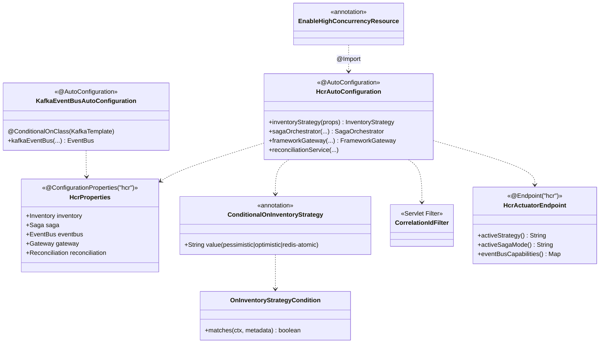

# hcr-autoconfigure

> Spring Boot auto-configuration — `@EnableHighConcurrencyResource` + `HcrProperties` để wire toàn framework qua YAML.

---

## 1. Vai trò trong framework

`hcr-autoconfigure` là **module wiring** — tự đăng ký bean cho tất cả module HCR (Inventory strategy, Saga orchestrator, EventBus adapter, Gateway, Reconciliation, Observability) dựa trên `application.yml` của developer.

Không có module này, developer phải tự `@Bean` cho từng strategy / adapter / handler — vài chục dòng config. Có module này, chỉ cần:

```java
@EnableHighConcurrencyResource
```

```yaml
hcr:
  inventory.strategy: redis-atomic
  saga.mode: async
  eventbus.type: kafka
```

---

## 2. Tại sao cần module này?

Spring Boot auto-config sinh ra để giải quyết "bean wiring boilerplate". Áp dụng cho framework HCR:

| Vấn đề | Giải pháp |
|--------|-----------|
| Mỗi developer wire khác nhau → behavior khác | `HcrAutoConfiguration` chuẩn hoá |
| Đổi strategy phải sửa code Java | Đổi 1 dòng YAML, restart |
| Conditional bean phức tạp (Kafka chỉ load khi có Kafka) | `@ConditionalOnInventoryStrategy`, `@ConditionalOnClass` |
| Không có chỗ debug config đang active | `HcrActuatorEndpoint` expose `/actuator/hcr` |
| Validate config sai phát hiện trễ | `HcrProperties` `@Validated` — fail fast lúc startup |

---

## 3. Nguyên lý thiết kế

| Nguyên lý | Áp dụng |
|-----------|---------|
| **Convention over Configuration** | Default values hợp lý cho 80% case — chỉ override khi cần |
| **Conditional bean registration** | `@ConditionalOnProperty`, `@ConditionalOnClass`, `@ConditionalOnInventoryStrategy` |
| **Type-safe configuration** | `HcrProperties` với `@ConfigurationProperties` + Bean Validation |
| **Fail Fast at startup** | Async saga mà thiếu `SagaStateRepository` → throw lúc context init |
| **Custom condition** | `OnInventoryStrategyCondition` đọc property và quyết định bean nào load |
| **Composable annotation** | `@EnableHighConcurrencyResource` import auto-config |
| **Actuator integration** | `HcrActuatorEndpoint` cho `/actuator/hcr` debug |

---

## 4. Class diagram



---

## 5. Thành phần chính

| Package | Thành phần | Vai trò |
|---------|-----------|---------|
| `(root)` | `HcrAutoConfiguration` | Bean wiring chính |
| `(root)` | `HcrProperties` | Type-safe config |
| `(root)` | `KafkaEventBusAutoConfiguration` | Conditional khi có Kafka |
| `annotation` | `EnableHighConcurrencyResource` | Entry annotation cho user |
| `condition` | `ConditionalOnInventoryStrategy`, `OnInventoryStrategyCondition` | Custom condition theo strategy property |
| `filter` | `CorrelationIdFilter` | Filter bean được auto register |
| `actuator` | `HcrActuatorEndpoint` | `/actuator/hcr` debug endpoint |

---

## 6. Property chuẩn

```yaml
hcr:
  inventory:
    strategy: redis-atomic           # pessimistic | optimistic | redis-atomic
    persistence:
      mode: single                   # single | batch
      batch-size: 500
      flush-interval-ms: 1000
    circuit-breaker:
      failure-rate-threshold: 50
      wait-duration-in-open-state: 30s
  saga:
    mode: async                      # sync | async
    timeout: 30s
  eventbus:
    type: kafka                      # kafka | rabbitmq | redis-streams | in-memory
    bootstrap-servers: localhost:9092
  gateway:
    rate-limit:
      capacity: 100
      refill-per-second: 50
    idempotency:
      ttl: 24h
  reconciliation:
    enabled: true
    interval: 60s
```

---

## 7. Liên kết

- Chi tiết đọc code → [`GUIDE.md`](GUIDE.md)
- Thiết kế tổng → [`../docs/framework_design.md`](../docs/framework_design.md) §11
