# hcr-core

> Module nền tảng — định nghĩa **ngôn ngữ chung** cho toàn framework. Tất cả module khác đều phụ thuộc vào module này.

---

## 1. Vai trò trong framework

`hcr-core` là **foundation layer** — nơi đặt domain model, enum, exception, và result object dùng chung. Mọi giao tiếp giữa các module HCR đều đi qua type được định nghĩa ở đây: `OrderRequest` truyền từ Gateway xuống Saga, `ReservationResult` trả từ Inventory lên Saga, `DomainEvent` chảy qua EventBus tới Reconciliation, v.v.

Module này **không có dependency** vào bất kỳ module HCR nào khác — nó là điểm gốc của dependency graph.

---

## 2. Tại sao cần module này?

Không có `hcr-core`, mỗi module sẽ phải tự định nghĩa lại:

- Trạng thái order (`PENDING`, `CONFIRMED`, ...) — dễ lệch giữa Inventory và Saga
- Lý do thất bại (string magic — không type-safe, dễ typo)
- Cách báo lỗi (mỗi nơi 1 exception riêng — caller phải catch hàng tá kiểu)
- DTO cho event bus (Inventory phát ra format X, Saga consume kỳ vọng format Y → drift)

`hcr-core` xử lý bằng cách **chuẩn hoá**:

| Vấn đề | Giải pháp trong `hcr-core` |
|--------|----------------------------|
| Trạng thái lung tung | `OrderStatus` enum + `canTransitionTo()` (state machine) |
| Magic string lý do fail | `FailureReason` enum (8 lý do chuẩn) |
| Lỗi không type-safe | `FrameworkException` + 5 subclass có context |
| Expected outcome dùng exception | `ReservationResult`, `ValidationResult` (Result Object pattern) |
| Event drift giữa producer/consumer | `DomainEvent` base class với `eventId`, `correlationId`, `retryCount` |

---

## 3. Nguyên lý thiết kế

| Nguyên lý | Áp dụng |
|-----------|---------|
| **Domain-Driven Design — Ubiquitous Language** | Tất cả domain term có 1 định nghĩa duy nhất tại core |
| **Open/Closed** | Abstract class (`AbstractResource`, `AbstractOrder`) — extend, không sửa |
| **Result Object** thay exception cho expected outcome | `ReservationResult.success()` vs `insufficient()` không throw |
| **Fail Fast** với State Machine | `OrderStatus.canTransitionTo()` chặn transition sai ngay tại domain |
| **Type Safety over String** | `FailureReason` enum thay string; `ConsistencyLevel` enum thay boolean |
| **Package-private visibility** cho framework-only methods | `transitionTo()`, `markDepleted()` — developer không gọi trực tiếp |
| **Single Responsibility per package** | `domain/`, `enums/`, `exception/`, `result/` |

---

## 4. Class diagram

```mermaid
classDiagram
    direction TB

    class OrderStatus {
        <<enumeration>>
        PENDING
        RESERVED
        CONFIRMED
        CANCELLED
        EXPIRED
        +canTransitionTo(OrderStatus) boolean
        +isTerminal() boolean
    }

    class ResourceStatus {
        <<enumeration>>
        ACTIVE
        LOW_STOCK
        DEPLETED
        DEACTIVATED
        +isAcceptingOrders() boolean
    }

    class FailureReason {
        <<enumeration>>
        OUT_OF_STOCK
        DUPLICATE_REQUEST
        VALIDATION_FAILED
        PAYMENT_FAILED
        PAYMENT_TIMEOUT
        PAYMENT_UNKNOWN
        RESERVATION_EXPIRED
        SYSTEM_ERROR
    }

    class ConsistencyLevel {
        <<enumeration>>
        STRONG
        EVENTUAL
    }

    class AbstractResource {
        <<abstract>>
        #String resourceId
        #int totalQuantity
        #int availableQuantity
        #ResourceStatus status
        #Instant createdAt
        #Instant updatedAt
        +validate()* void
        ~markLowStock() void
        ~markDepleted() void
    }

    class AbstractOrder {
        <<abstract>>
        #String orderId
        #String resourceId
        #String idempotencyKey
        #OrderStatus status
        #Instant expiresAt
        ~transitionTo(OrderStatus) void
    }

    class OrderRequest {
        +String resourceId
        +String idempotencyKey
        +int quantity
        +validateRequest()* void
    }

    class DomainEvent {
        <<abstract>>
        #String eventId
        #String eventType
        #String correlationId
        #int retryCount
        #Instant occurredAt
    }

    class OrderAccessor {
        <<utility>>
        +transitionTo(AbstractOrder, OrderStatus)
    }

    class ReservationResult {
        +Status status
        +int remainingAfter
        +FailureReason reason
        +success(int)$ ReservationResult
        +insufficient()$ ReservationResult
        +error(FailureReason)$ ReservationResult
    }

    class ValidationResult {
        +List~ValidationError~ errors
        +ok()$ ValidationResult
        +merge(ValidationResult) ValidationResult
        +throwIfInvalid() void
    }

    class InventorySnapshot {
        +String resourceId
        +int available
        +int total
        +String source
        +getDelta(InventorySnapshot) int
    }

    class FrameworkException {
        <<abstract>>
        #FailureReason reason
        #String resourceId
        #String orderId
    }

    class InsufficientInventoryException {
        +int requestedQuantity
        +int availableQuantity
    }

    class PaymentException
    class IdempotencyException {
        +String idempotencyKey
    }
    class ValidationException
    class ReconciliationException

    AbstractResource ..> ResourceStatus
    AbstractOrder ..> OrderStatus
    AbstractOrder ..> ConsistencyLevel
    OrderAccessor ..> AbstractOrder
    ReservationResult ..> FailureReason
    FrameworkException ..> FailureReason
    InsufficientInventoryException --|> FrameworkException
    PaymentException --|> FrameworkException
    IdempotencyException --|> FrameworkException
    ValidationException --|> FrameworkException
    ReconciliationException --|> FrameworkException
    ValidationException ..> ValidationResult
```

---

## 5. Thành phần chính

| Package | Thành phần | Vai trò |
|---------|-----------|---------|
| `enums` | `OrderStatus`, `ResourceStatus`, `FailureReason`, `ConsistencyLevel` | Type-safe trạng thái + lý do |
| `domain` | `AbstractResource`, `AbstractOrder`, `OrderRequest`, `DomainEvent` | Base class developer extend |
| `result` | `ReservationResult`, `ValidationResult`, `InventorySnapshot` | Result Object cho expected outcome |
| `exception` | `FrameworkException` + 5 subclass | Hierarchical lỗi có context (reason / resourceId / orderId) |

---

## 6. Liên kết

- Chi tiết đọc code → [`GUIDE.md`](GUIDE.md)
- Thiết kế tổng → [`../docs/framework_design.md`](../docs/framework_design.md) §2
