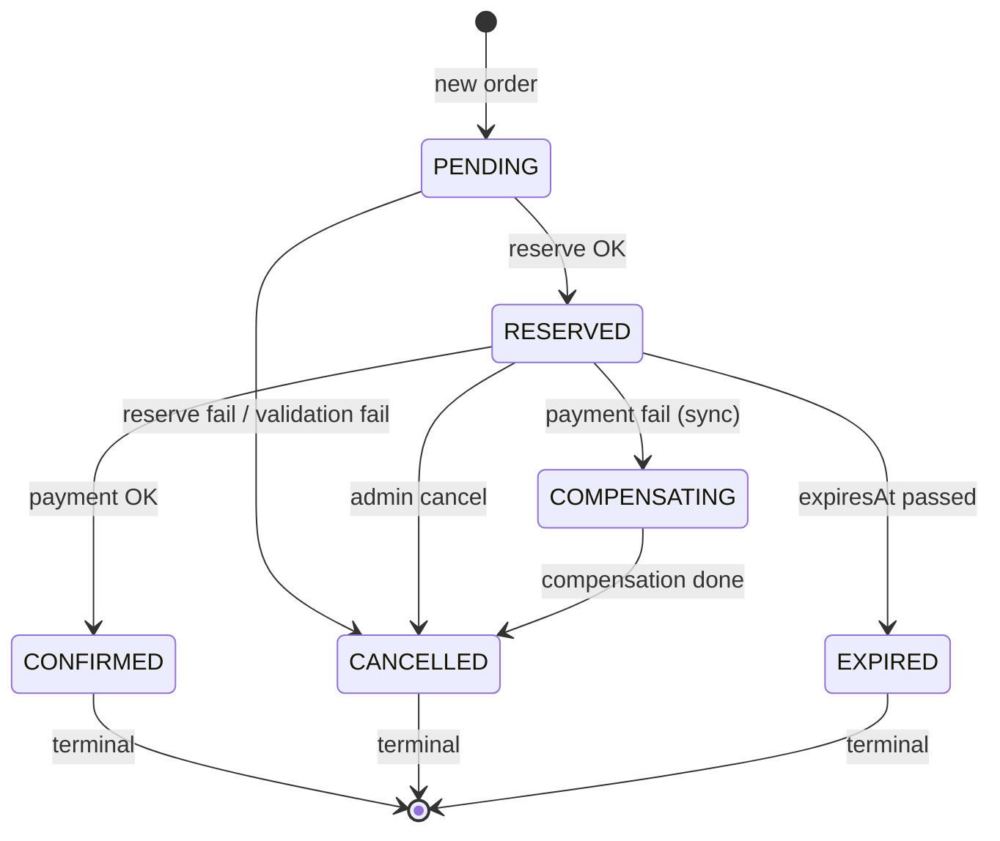

# hcr-core — Module Architecture

## Module Purpose

Foundation của toàn framework. Định nghĩa **shared types** mà mọi module khác đều phụ thuộc:

- **Domain abstract classes** (`AbstractOrder`, `AbstractResource`, `OrderRequest`, `DomainEvent`) — developer extend để có entity nghiệp vụ riêng.
- **Standard enums** (`OrderStatus`, `FailureReason`, `ConsistencyLevel`, `ResourceStatus`) chuẩn hoá lifecycle và lý do thất bại trên toàn hệ thống.
- **Framework exceptions** (`FrameworkException`, `IdempotencyException`, `InsufficientInventoryException`, `PaymentException`, `ReconciliationException`, `ValidationException`).
- **Result objects** (`ReservationResult`, `InventorySnapshot`, `ValidationResult`) — DTO immutable trả về từ các module khác.

`hcr-core` **không phụ thuộc** bất kỳ module nội bộ nào khác và phải giữ trạng thái này. Mọi class trong đây phải là pure Java + Lombok + JPA annotations — không tham chiếu Spring beans, không gọi Redis/Kafka, không có side-effect.

## Class / Structure Diagram (Mermaid Class)

```mermaid
classDiagram
    direction LR

    class AbstractOrder {
      <<MappedSuperclass abstract>>
      +String orderId
      +String resourceId
      +String requesterId
      +int quantity
      +OrderStatus status
      +String idempotencyKey
      +FailureReason failureReason
      +Instant createdAt
      +Instant updatedAt
      +Instant expiresAt
      +isPending() boolean
      +isExpired() boolean
      +isTerminal() boolean
      ~transitionTo(OrderStatus) void
      ~markFailedWith(FailureReason) void
    }

    class AbstractResource {
      <<MappedSuperclass abstract>>
    }

    class OrderRequest {
      <<abstract>>
      +String resourceId
      +String requesterId
      +int quantity
      +String idempotencyKey
      +validateRequest() void
    }

    class DomainEvent {
      <<abstract>>
      +String eventId
      +String resourceId
      +String correlationId
      +Instant occurredAt
      +getEventType() String
    }

    class OrderAccessor {
      <<package-private>>
      +transitionTo(AbstractOrder, OrderStatus)$ void
      +markFailedWith(AbstractOrder, FailureReason)$ void
    }

    class OrderStatus {
      <<enum>>
      PENDING
      RESERVED
      CONFIRMED
      CANCELLED
      EXPIRED
      COMPENSATING
      +isTerminal() boolean
      +canTransitionTo(OrderStatus) boolean
    }

    class FailureReason {
      <<enum>>
      INSUFFICIENT_INVENTORY
      PAYMENT_FAILED
      PAYMENT_TIMEOUT
      RESERVATION_EXPIRED
      VALIDATION_FAILED
      RATE_LIMIT_EXCEEDED
      SYSTEM_ERROR
      ...
    }

    class ConsistencyLevel {
      <<enum>>
      STRONG
      EVENTUAL
    }

    class ResourceStatus {
      <<enum>>
      ACTIVE
      DEPLETED
      DEACTIVATED
    }

    class ReservationResult {
      <<value object>>
      +boolean success
      +long newAvailable
      +FailureReason failureReason
      +String message
      +success(long)$ ReservationResult
      +insufficient(long)$ ReservationResult
      +error(FailureReason, String)$ ReservationResult
    }

    class InventorySnapshot {
      <<value object>>
      +String resourceId
      +long total
      +long available
      +String source
      +Instant snapshotAt
    }

    class ValidationResult {
      <<value object>>
      +boolean valid
      +List~FieldError~ errors
      +ok()$ ValidationResult
      +fail(field, msg)$ ValidationResult
      +merge(other) ValidationResult
      +throwIfInvalid() void
    }

    class FrameworkException {
      <<RuntimeException>>
      +FailureReason reason
      +String correlationId
      +String resourceId
    }

    class IdempotencyException
    class InsufficientInventoryException
    class PaymentException
    class ReconciliationException
    class ValidationException

    AbstractOrder "1" --> "1" OrderStatus : status
    AbstractOrder "1" --> "0..1" FailureReason : failureReason
    AbstractOrder ..> OrderAccessor : friend
    OrderRequest <|.. UserRequestImpl : developer extends
    AbstractOrder <|-- DeveloperOrder : developer extends
    DomainEvent <|-- OrderEvents : extended in eventbus
    DomainEvent <|-- InventoryEvents
    DomainEvent <|-- PaymentEvents

    FrameworkException <|-- IdempotencyException
    FrameworkException <|-- InsufficientInventoryException
    FrameworkException <|-- PaymentException
    FrameworkException <|-- ReconciliationException
    FrameworkException <|-- ValidationException
```



<details>
<summary>📐 draw.io XML — paste vào Extras → Edit Diagram</summary>

```xml
<mxGraphModel dx="1400" dy="1100" grid="1" gridSize="10" guides="1" tooltips="1" connect="1" arrows="1" fold="1" page="1" pageScale="1" pageWidth="1320" pageHeight="1020" math="0" shadow="0">
  <root>
    <mxCell id="0"/>
    <mxCell id="1" parent="0"/>

    <mxCell id="c_AbstractOrder" value="&lt;b&gt;AbstractOrder&lt;/b&gt;&lt;br/&gt;&lt;i&gt;«MappedSuperclass abstract»&lt;/i&gt;&lt;hr/&gt;+ orderId: String&lt;br/&gt;+ resourceId: String&lt;br/&gt;+ requesterId: String&lt;br/&gt;+ quantity: int&lt;br/&gt;+ status: OrderStatus&lt;br/&gt;+ idempotencyKey: String&lt;br/&gt;+ failureReason: FailureReason&lt;br/&gt;+ createdAt: Instant&lt;br/&gt;+ updatedAt: Instant&lt;br/&gt;+ expiresAt: Instant&lt;hr/&gt;+ isPending(): boolean&lt;br/&gt;+ isExpired(): boolean&lt;br/&gt;+ isTerminal(): boolean&lt;br/&gt;~ transitionTo(OrderStatus): void&lt;br/&gt;~ markFailedWith(FailureReason): void" style="rounded=0;whiteSpace=wrap;html=1;align=left;verticalAlign=top;spacingLeft=8;spacingTop=4;spacingRight=8;fontSize=11;fillColor=#dae8fc;strokeColor=#6c8ebf;" vertex="1" parent="1">
      <mxGeometry x="40" y="40" width="320" height="380" as="geometry"/>
    </mxCell>

    <mxCell id="c_OrderRequest" value="&lt;b&gt;OrderRequest&lt;/b&gt;&lt;br/&gt;&lt;i&gt;«abstract»&lt;/i&gt;&lt;hr/&gt;+ resourceId: String&lt;br/&gt;+ requesterId: String&lt;br/&gt;+ quantity: int&lt;br/&gt;+ idempotencyKey: String&lt;hr/&gt;+ validateRequest(): void" style="rounded=0;whiteSpace=wrap;html=1;align=left;verticalAlign=top;spacingLeft=8;spacingTop=4;spacingRight=8;fontSize=11;fillColor=#dae8fc;strokeColor=#6c8ebf;" vertex="1" parent="1">
      <mxGeometry x="400" y="40" width="260" height="170" as="geometry"/>
    </mxCell>

    <mxCell id="c_DomainEvent" value="&lt;b&gt;DomainEvent&lt;/b&gt;&lt;br/&gt;&lt;i&gt;«abstract»&lt;/i&gt;&lt;hr/&gt;+ eventId: String&lt;br/&gt;+ resourceId: String&lt;br/&gt;+ correlationId: String&lt;br/&gt;+ occurredAt: Instant&lt;hr/&gt;+ getEventType(): String" style="rounded=0;whiteSpace=wrap;html=1;align=left;verticalAlign=top;spacingLeft=8;spacingTop=4;spacingRight=8;fontSize=11;fillColor=#dae8fc;strokeColor=#6c8ebf;" vertex="1" parent="1">
      <mxGeometry x="400" y="230" width="260" height="170" as="geometry"/>
    </mxCell>

    <mxCell id="c_AbstractResource" value="&lt;b&gt;AbstractResource&lt;/b&gt;&lt;br/&gt;&lt;i&gt;«MappedSuperclass abstract»&lt;/i&gt;" style="rounded=0;whiteSpace=wrap;html=1;align=left;verticalAlign=top;spacingLeft=8;spacingTop=4;spacingRight=8;fontSize=11;fillColor=#dae8fc;strokeColor=#6c8ebf;" vertex="1" parent="1">
      <mxGeometry x="400" y="420" width="260" height="70" as="geometry"/>
    </mxCell>

    <mxCell id="c_OrderAccessor" value="&lt;b&gt;OrderAccessor&lt;/b&gt;&lt;br/&gt;&lt;i&gt;«package-private»&lt;/i&gt;&lt;hr/&gt;+ $ transitionTo(AbstractOrder, OrderStatus): void&lt;br/&gt;+ $ markFailedWith(AbstractOrder, FailureReason): void" style="rounded=0;whiteSpace=wrap;html=1;align=left;verticalAlign=top;spacingLeft=8;spacingTop=4;spacingRight=8;fontSize=11;fillColor=#e1d5e7;strokeColor=#9673a6;" vertex="1" parent="1">
      <mxGeometry x="400" y="510" width="260" height="130" as="geometry"/>
    </mxCell>

    <mxCell id="c_OrderStatus" value="&lt;b&gt;OrderStatus&lt;/b&gt;&lt;br/&gt;&lt;i&gt;«enum»&lt;/i&gt;&lt;hr/&gt;PENDING&lt;br/&gt;RESERVED&lt;br/&gt;CONFIRMED&lt;br/&gt;CANCELLED&lt;br/&gt;EXPIRED&lt;br/&gt;COMPENSATING&lt;hr/&gt;+ isTerminal(): boolean&lt;br/&gt;+ canTransitionTo(OrderStatus): boolean" style="rounded=0;whiteSpace=wrap;html=1;align=left;verticalAlign=top;spacingLeft=8;spacingTop=4;spacingRight=8;fontSize=11;fillColor=#fff2cc;strokeColor=#d6b656;" vertex="1" parent="1">
      <mxGeometry x="700" y="40" width="240" height="220" as="geometry"/>
    </mxCell>

    <mxCell id="c_FailureReason" value="&lt;b&gt;FailureReason&lt;/b&gt;&lt;br/&gt;&lt;i&gt;«enum»&lt;/i&gt;&lt;hr/&gt;INSUFFICIENT_INVENTORY&lt;br/&gt;PAYMENT_FAILED&lt;br/&gt;PAYMENT_TIMEOUT&lt;br/&gt;RESERVATION_EXPIRED&lt;br/&gt;VALIDATION_FAILED&lt;br/&gt;RATE_LIMIT_EXCEEDED&lt;br/&gt;SYSTEM_ERROR&lt;br/&gt;..." style="rounded=0;whiteSpace=wrap;html=1;align=left;verticalAlign=top;spacingLeft=8;spacingTop=4;spacingRight=8;fontSize=11;fillColor=#fff2cc;strokeColor=#d6b656;" vertex="1" parent="1">
      <mxGeometry x="700" y="280" width="240" height="200" as="geometry"/>
    </mxCell>

    <mxCell id="c_ConsistencyLevel" value="&lt;b&gt;ConsistencyLevel&lt;/b&gt;&lt;br/&gt;&lt;i&gt;«enum»&lt;/i&gt;&lt;hr/&gt;STRONG&lt;br/&gt;EVENTUAL" style="rounded=0;whiteSpace=wrap;html=1;align=left;verticalAlign=top;spacingLeft=8;spacingTop=4;spacingRight=8;fontSize=11;fillColor=#fff2cc;strokeColor=#d6b656;" vertex="1" parent="1">
      <mxGeometry x="700" y="500" width="240" height="100" as="geometry"/>
    </mxCell>

    <mxCell id="c_ResourceStatus" value="&lt;b&gt;ResourceStatus&lt;/b&gt;&lt;br/&gt;&lt;i&gt;«enum»&lt;/i&gt;&lt;hr/&gt;ACTIVE&lt;br/&gt;DEPLETED&lt;br/&gt;DEACTIVATED" style="rounded=0;whiteSpace=wrap;html=1;align=left;verticalAlign=top;spacingLeft=8;spacingTop=4;spacingRight=8;fontSize=11;fillColor=#fff2cc;strokeColor=#d6b656;" vertex="1" parent="1">
      <mxGeometry x="700" y="620" width="240" height="120" as="geometry"/>
    </mxCell>

    <mxCell id="c_ReservationResult" value="&lt;b&gt;ReservationResult&lt;/b&gt;&lt;br/&gt;&lt;i&gt;«value object»&lt;/i&gt;&lt;hr/&gt;+ success: boolean&lt;br/&gt;+ newAvailable: long&lt;br/&gt;+ failureReason: FailureReason&lt;br/&gt;+ message: String&lt;hr/&gt;+ $ success(long): ReservationResult&lt;br/&gt;+ $ insufficient(long): ReservationResult&lt;br/&gt;+ $ error(FailureReason, String): ReservationResult" style="rounded=0;whiteSpace=wrap;html=1;align=left;verticalAlign=top;spacingLeft=8;spacingTop=4;spacingRight=8;fontSize=11;fillColor=#d5e8d4;strokeColor=#82b366;" vertex="1" parent="1">
      <mxGeometry x="980" y="40" width="320" height="220" as="geometry"/>
    </mxCell>

    <mxCell id="c_InventorySnapshot" value="&lt;b&gt;InventorySnapshot&lt;/b&gt;&lt;br/&gt;&lt;i&gt;«value object»&lt;/i&gt;&lt;hr/&gt;+ resourceId: String&lt;br/&gt;+ total: long&lt;br/&gt;+ available: long&lt;br/&gt;+ source: String&lt;br/&gt;+ snapshotAt: Instant" style="rounded=0;whiteSpace=wrap;html=1;align=left;verticalAlign=top;spacingLeft=8;spacingTop=4;spacingRight=8;fontSize=11;fillColor=#d5e8d4;strokeColor=#82b366;" vertex="1" parent="1">
      <mxGeometry x="980" y="280" width="320" height="160" as="geometry"/>
    </mxCell>

    <mxCell id="c_ValidationResult" value="&lt;b&gt;ValidationResult&lt;/b&gt;&lt;br/&gt;&lt;i&gt;«value object»&lt;/i&gt;&lt;hr/&gt;+ valid: boolean&lt;br/&gt;+ errors: List&amp;lt;FieldError&amp;gt;&lt;hr/&gt;+ $ ok(): ValidationResult&lt;br/&gt;+ $ fail(field, msg): ValidationResult&lt;br/&gt;+ merge(other): ValidationResult&lt;br/&gt;+ throwIfInvalid(): void" style="rounded=0;whiteSpace=wrap;html=1;align=left;verticalAlign=top;spacingLeft=8;spacingTop=4;spacingRight=8;fontSize=11;fillColor=#d5e8d4;strokeColor=#82b366;" vertex="1" parent="1">
      <mxGeometry x="980" y="460" width="320" height="200" as="geometry"/>
    </mxCell>

    <mxCell id="c_FrameworkException" value="&lt;b&gt;FrameworkException&lt;/b&gt;&lt;br/&gt;&lt;i&gt;«RuntimeException»&lt;/i&gt;&lt;hr/&gt;+ reason: FailureReason&lt;br/&gt;+ correlationId: String&lt;br/&gt;+ resourceId: String" style="rounded=0;whiteSpace=wrap;html=1;align=left;verticalAlign=top;spacingLeft=8;spacingTop=4;spacingRight=8;fontSize=11;fillColor=#f8cecc;strokeColor=#b85450;" vertex="1" parent="1">
      <mxGeometry x="40" y="820" width="320" height="130" as="geometry"/>
    </mxCell>

    <mxCell id="c_IdempotencyException" value="&lt;b&gt;IdempotencyException&lt;/b&gt;" style="rounded=0;whiteSpace=wrap;html=1;align=left;verticalAlign=middle;spacingLeft=8;fontSize=11;fillColor=#f8cecc;strokeColor=#b85450;" vertex="1" parent="1">
      <mxGeometry x="400" y="820" width="260" height="40" as="geometry"/>
    </mxCell>

    <mxCell id="c_InsufficientInventoryException" value="&lt;b&gt;InsufficientInventoryException&lt;/b&gt;" style="rounded=0;whiteSpace=wrap;html=1;align=left;verticalAlign=middle;spacingLeft=8;fontSize=11;fillColor=#f8cecc;strokeColor=#b85450;" vertex="1" parent="1">
      <mxGeometry x="400" y="880" width="260" height="40" as="geometry"/>
    </mxCell>

    <mxCell id="c_PaymentException" value="&lt;b&gt;PaymentException&lt;/b&gt;" style="rounded=0;whiteSpace=wrap;html=1;align=left;verticalAlign=middle;spacingLeft=8;fontSize=11;fillColor=#f8cecc;strokeColor=#b85450;" vertex="1" parent="1">
      <mxGeometry x="400" y="940" width="260" height="40" as="geometry"/>
    </mxCell>

    <mxCell id="c_ReconciliationException" value="&lt;b&gt;ReconciliationException&lt;/b&gt;" style="rounded=0;whiteSpace=wrap;html=1;align=left;verticalAlign=middle;spacingLeft=8;fontSize=11;fillColor=#f8cecc;strokeColor=#b85450;" vertex="1" parent="1">
      <mxGeometry x="700" y="820" width="260" height="40" as="geometry"/>
    </mxCell>

    <mxCell id="c_ValidationException" value="&lt;b&gt;ValidationException&lt;/b&gt;" style="rounded=0;whiteSpace=wrap;html=1;align=left;verticalAlign=middle;spacingLeft=8;fontSize=11;fillColor=#f8cecc;strokeColor=#b85450;" vertex="1" parent="1">
      <mxGeometry x="700" y="880" width="260" height="40" as="geometry"/>
    </mxCell>

    <mxCell id="r_ao_os" value="status&#xa;1" style="endArrow=open;html=1;rounded=0;fontSize=10;exitX=1;exitY=0.2;exitDx=0;exitDy=0;entryX=0;entryY=0.5;entryDx=0;entryDy=0;" edge="1" parent="1" source="c_AbstractOrder" target="c_OrderStatus">
      <mxGeometry relative="1" as="geometry"/>
    </mxCell>

    <mxCell id="r_ao_fr" value="failureReason&#xa;0..1" style="endArrow=open;html=1;rounded=0;fontSize=10;exitX=1;exitY=0.6;exitDx=0;exitDy=0;entryX=0;entryY=0.3;entryDx=0;entryDy=0;" edge="1" parent="1" source="c_AbstractOrder" target="c_FailureReason">
      <mxGeometry relative="1" as="geometry"/>
    </mxCell>

    <mxCell id="r_ao_oa" value="«friend»" style="endArrow=open;html=1;rounded=0;dashed=1;fontSize=10;exitX=1;exitY=0.95;exitDx=0;exitDy=0;entryX=0;entryY=0.5;entryDx=0;entryDy=0;" edge="1" parent="1" source="c_AbstractOrder" target="c_OrderAccessor">
      <mxGeometry relative="1" as="geometry"/>
    </mxCell>

    <mxCell id="r_idem_fe" value="" style="endArrow=block;endFill=0;endSize=20;html=1;rounded=0;startArrow=none;exitX=0;exitY=0.5;exitDx=0;exitDy=0;entryX=1;entryY=0.2;entryDx=0;entryDy=0;" edge="1" parent="1" source="c_IdempotencyException" target="c_FrameworkException">
      <mxGeometry relative="1" as="geometry"/>
    </mxCell>

    <mxCell id="r_inv_fe" value="" style="endArrow=block;endFill=0;endSize=20;html=1;rounded=0;startArrow=none;exitX=0;exitY=0.5;exitDx=0;exitDy=0;entryX=1;entryY=0.4;entryDx=0;entryDy=0;" edge="1" parent="1" source="c_InsufficientInventoryException" target="c_FrameworkException">
      <mxGeometry relative="1" as="geometry"/>
    </mxCell>

    <mxCell id="r_pay_fe" value="" style="endArrow=block;endFill=0;endSize=20;html=1;rounded=0;startArrow=none;exitX=0;exitY=0.5;exitDx=0;exitDy=0;entryX=1;entryY=0.6;entryDx=0;entryDy=0;" edge="1" parent="1" source="c_PaymentException" target="c_FrameworkException">
      <mxGeometry relative="1" as="geometry"/>
    </mxCell>

    <mxCell id="r_rec_fe" value="" style="endArrow=block;endFill=0;endSize=20;html=1;rounded=0;startArrow=none;edgeStyle=orthogonalEdgeStyle;exitX=0;exitY=0.5;exitDx=0;exitDy=0;entryX=1;entryY=0.8;entryDx=0;entryDy=0;" edge="1" parent="1" source="c_ReconciliationException" target="c_FrameworkException">
      <mxGeometry relative="1" as="geometry"/>
    </mxCell>

    <mxCell id="r_val_fe" value="" style="endArrow=block;endFill=0;endSize=20;html=1;rounded=0;startArrow=none;edgeStyle=orthogonalEdgeStyle;exitX=0;exitY=0.5;exitDx=0;exitDy=0;entryX=1;entryY=0.95;entryDx=0;entryDy=0;" edge="1" parent="1" source="c_ValidationException" target="c_FrameworkException">
      <mxGeometry relative="1" as="geometry"/>
    </mxCell>

    <mxCell id="note_ext" value="&lt;b&gt;Subclasses extended in other modules:&lt;/b&gt;&lt;br/&gt;• hcr-eventbus → OrderEvents, InventoryEvents, PaymentEvents (extend DomainEvent)&lt;br/&gt;• Developer code → DeveloperOrder (extends AbstractOrder), UserRequestImpl (extends OrderRequest)" style="rounded=0;whiteSpace=wrap;html=1;align=left;verticalAlign=top;spacingLeft=8;spacingTop=6;spacingRight=8;fontSize=10;fillColor=#f5f5f5;strokeColor=#666666;dashed=1;" vertex="1" parent="1">
      <mxGeometry x="980" y="820" width="320" height="100" as="geometry"/>
    </mxCell>
  </root>
</mxGraphModel>
```

</details>

### State machine của `OrderStatus`



<details>
<summary>📐 draw.io XML — paste vào Extras → Edit Diagram</summary>

```xml
<mxGraphModel dx="900" dy="600" grid="1" gridSize="10" guides="1" tooltips="1" connect="1" arrows="1" fold="1" page="1" pageScale="1" pageWidth="900" pageHeight="600" math="0" shadow="0">
  <root>
    <mxCell id="0"/>
    <mxCell id="1" parent="0"/>
    <mxCell id="s_init" value="" style="ellipse;fillColor=#000000;strokeColor=#000000;" vertex="1" parent="1">
      <mxGeometry x="40" y="240" width="20" height="20" as="geometry"/>
    </mxCell>
    <mxCell id="s_pending" value="PENDING" style="rounded=1;whiteSpace=wrap;html=1;fillColor=#dae8fc;strokeColor=#6c8ebf;fontSize=13;fontStyle=1;" vertex="1" parent="1">
      <mxGeometry x="120" y="220" width="120" height="60" as="geometry"/>
    </mxCell>
    <mxCell id="s_reserved" value="RESERVED" style="rounded=1;whiteSpace=wrap;html=1;fillColor=#dae8fc;strokeColor=#6c8ebf;fontSize=13;fontStyle=1;" vertex="1" parent="1">
      <mxGeometry x="320" y="220" width="120" height="60" as="geometry"/>
    </mxCell>
    <mxCell id="s_confirmed" value="CONFIRMED" style="rounded=1;whiteSpace=wrap;html=1;fillColor=#d5e8d4;strokeColor=#82b366;fontSize=13;fontStyle=1;" vertex="1" parent="1">
      <mxGeometry x="520" y="100" width="120" height="60" as="geometry"/>
    </mxCell>
    <mxCell id="s_compensating" value="COMPENSATING" style="rounded=1;whiteSpace=wrap;html=1;fillColor=#fff2cc;strokeColor=#d6b656;fontSize=13;fontStyle=1;" vertex="1" parent="1">
      <mxGeometry x="520" y="220" width="120" height="60" as="geometry"/>
    </mxCell>
    <mxCell id="s_cancelled" value="CANCELLED" style="rounded=1;whiteSpace=wrap;html=1;fillColor=#f8cecc;strokeColor=#b85450;fontSize=13;fontStyle=1;" vertex="1" parent="1">
      <mxGeometry x="520" y="340" width="120" height="60" as="geometry"/>
    </mxCell>
    <mxCell id="s_expired" value="EXPIRED" style="rounded=1;whiteSpace=wrap;html=1;fillColor=#f8cecc;strokeColor=#b85450;fontSize=13;fontStyle=1;" vertex="1" parent="1">
      <mxGeometry x="520" y="440" width="120" height="60" as="geometry"/>
    </mxCell>
    <mxCell id="s_terminal" value="" style="ellipse;fillColor=#ffffff;strokeColor=#000000;strokeWidth=2;" vertex="1" parent="1">
      <mxGeometry x="730" y="260" width="24" height="24" as="geometry"/>
    </mxCell>
    <mxCell id="s_terminal_inner" value="" style="ellipse;fillColor=#000000;strokeColor=#000000;" vertex="1" parent="1">
      <mxGeometry x="736" y="266" width="12" height="12" as="geometry"/>
    </mxCell>
    <mxCell id="e1" value="new order" style="endArrow=classic;html=1;rounded=0;fontSize=11;" edge="1" parent="1" source="s_init" target="s_pending">
      <mxGeometry relative="1" as="geometry"/>
    </mxCell>
    <mxCell id="e2" value="reserve OK" style="endArrow=classic;html=1;rounded=0;fontSize=11;" edge="1" parent="1" source="s_pending" target="s_reserved">
      <mxGeometry relative="1" as="geometry"/>
    </mxCell>
    <mxCell id="e3" value="reserve fail / validation fail" style="endArrow=classic;html=1;rounded=0;fontSize=11;edgeStyle=orthogonalEdgeStyle;" edge="1" parent="1" source="s_pending" target="s_cancelled">
      <mxGeometry relative="1" as="geometry">
        <Array as="points">
          <mxPoint x="180" y="370"/>
          <mxPoint x="500" y="370"/>
        </Array>
      </mxGeometry>
    </mxCell>
    <mxCell id="e4" value="payment OK" style="endArrow=classic;html=1;rounded=0;fontSize=11;" edge="1" parent="1" source="s_reserved" target="s_confirmed">
      <mxGeometry relative="1" as="geometry"/>
    </mxCell>
    <mxCell id="e5" value="payment fail (sync)" style="endArrow=classic;html=1;rounded=0;fontSize=11;" edge="1" parent="1" source="s_reserved" target="s_compensating">
      <mxGeometry relative="1" as="geometry"/>
    </mxCell>
    <mxCell id="e6" value="admin cancel" style="endArrow=classic;html=1;rounded=0;fontSize=11;edgeStyle=orthogonalEdgeStyle;" edge="1" parent="1" source="s_reserved" target="s_cancelled">
      <mxGeometry relative="1" as="geometry"/>
    </mxCell>
    <mxCell id="e7" value="expiresAt passed" style="endArrow=classic;html=1;rounded=0;fontSize=11;edgeStyle=orthogonalEdgeStyle;" edge="1" parent="1" source="s_reserved" target="s_expired">
      <mxGeometry relative="1" as="geometry"/>
    </mxCell>
    <mxCell id="e8" value="compensation done" style="endArrow=classic;html=1;rounded=0;fontSize=11;" edge="1" parent="1" source="s_compensating" target="s_cancelled">
      <mxGeometry relative="1" as="geometry"/>
    </mxCell>
    <mxCell id="e9" value="" style="endArrow=classic;html=1;rounded=0;" edge="1" parent="1" source="s_confirmed" target="s_terminal">
      <mxGeometry relative="1" as="geometry"/>
    </mxCell>
    <mxCell id="e10" value="" style="endArrow=classic;html=1;rounded=0;" edge="1" parent="1" source="s_cancelled" target="s_terminal">
      <mxGeometry relative="1" as="geometry"/>
    </mxCell>
    <mxCell id="e11" value="" style="endArrow=classic;html=1;rounded=0;" edge="1" parent="1" source="s_expired" target="s_terminal">
      <mxGeometry relative="1" as="geometry"/>
    </mxCell>
  </root>
</mxGraphModel>
```

</details>

`OrderStatus.canTransitionTo()` enforce máy trạng thái này — `AbstractOrder.transitionTo()` throw `IllegalStateException` nếu vi phạm.

## Capabilities (Provided to Devs)

Khi developer tạo ứng dụng dùng HCR, họ được dùng sẵn các thứ sau:

| Capability | Class | Cách dùng điển hình |
|---|---|---|
| Order entity ready-to-extend | `AbstractOrder` | `@Entity class TicketOrder extends AbstractOrder { … }` — đã có sẵn 9 cột chuẩn (orderId, status, idempotencyKey, expiresAt, …) |
| Resource entity ready-to-extend | `AbstractResource` | Tương tự `AbstractOrder`, dành cho catalog metadata |
| Request DTO base | `OrderRequest` | `class TicketRequest extends OrderRequest` — framework tự validate `resourceId/requesterId/quantity/idempotencyKey` |
| Event base | `DomainEvent` | Mọi event domain đều extend → có sẵn `eventId`, `correlationId`, `occurredAt` cho distributed tracing |
| Result wrappers | `ReservationResult`, `ValidationResult`, `InventorySnapshot` | Static factories: `ReservationResult.success(...)`, `ValidationResult.ok().merge(...).throwIfInvalid()` |
| Standard exceptions | `FrameworkException` + 5 subclass | Kết hợp với `FailureReason` enum để cancel order với nguyên nhân rõ ràng |
| Order state machine | `OrderStatus.canTransitionTo()` | Bảo vệ tính nhất quán — không thể skip step (ví dụ PENDING → CONFIRMED bị reject) |

### Quy ước quan trọng cho developer

1. **KHÔNG được set `OrderStatus` trực tiếp** từ code nghiệp vụ. Chỉ `AbstractSagaOrchestrator` (qua `OrderAccessor`) được phép gọi `transitionTo()` — đảm bảo state machine luôn được enforce.
2. **`AbstractOrder` đã đánh dấu `@MappedSuperclass`** — class con chỉ cần thêm `@Entity @Table(name = "...")` và các field nghiệp vụ riêng.
3. **`DomainEvent.correlationId`** PHẢI được propagate xuyên suốt một request — `CorrelationIdFilter` trong `hcr-gateway` sinh ra UUID nếu client không gửi `X-Correlation-ID`.

## To-Do / Detailed Implementation

| Hạng mục | Trạng thái | Ghi chú |
|---|---|---|
| `AbstractOrder` lifecycle | ✅ Implemented | 9 cột chuẩn + state-machine enforced |
| `OrderStatus.canTransitionTo()` | ✅ Implemented | 6 trạng thái, 3 terminal |
| `DomainEvent` correlation | ✅ Implemented | `eventId` auto-generated UUID |
| `ValidationResult.merge()` | ✅ Implemented | Đã được dùng trong `FrameworkGateway` và `AbstractSagaOrchestrator` |
| `AbstractResource` | ⚠️ **Stub** | Hiện chưa có cột nghiệp vụ chuẩn (status/total/available) — Inventory đã dùng `AbstractInventoryEntity` riêng. **TODO:** quyết định có gộp `AbstractResource` ↔ `AbstractInventoryEntity` không, hoặc xoá `AbstractResource` nếu trùng vai trò |
| `FailureReason` coverage | ⚠️ Cần audit | Một số case từ saga (ví dụ async payment unknown) chưa map enum tương ứng — cần bổ sung `PAYMENT_UNKNOWN`, `RECONCILIATION_FIXED` |
| `ConsistencyLevel.HYBRID` | ❌ Chưa có | Roadmap: P3 + read-through DB cho admin queries |
| Javadoc tiếng Việt vs tiếng Anh | ⚠️ Hỗn hợp | Một số class dùng tiếng Việt, một số tiếng Anh — chuẩn hoá theo CONTRIBUTING |

### Logic cần implement chi tiết hơn

- **`AbstractOrder.transitionTo()` hiện ném `IllegalStateException` thẳng.** Nên cân nhắc throw `FrameworkException(FailureReason.SYSTEM_ERROR, ...)` để gateway có thể map sang HTTP 500 chuẩn thay vì để Spring xử lý mặc định.
- **`OrderRequest.validateRequest()` là default no-op.** Cần cung cấp template helper (`ValidationResult builder`) để developer khỏi viết boilerplate.
- **Versioning của event:** `DomainEvent` chưa có `schemaVersion` — khi rolling deploy, consumer cũ có thể gặp event mới và crash. **TODO:** thêm field `version` (default 1) + handler hỗ trợ version negotiation.
