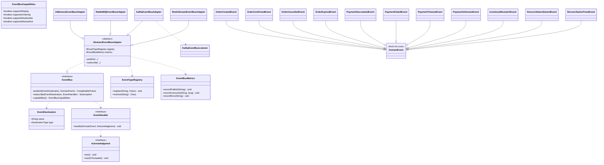

# hcr-eventbus

> Abstraction giao tiếp bất đồng bộ — `EventBus` interface + 4 adapter (Kafka / RabbitMQ / Redis Streams / InMemory).

---

## 1. Vai trò trong framework

`hcr-eventbus` là **lớp giao tiếp bất đồng bộ** giữa các module và giữa các microservice. Saga publish `PaymentRequestedEvent` lên bus, Payment consume; Inventory publish `ResourceDepletedEvent`, Reconciliation consume; Order service publish, Inventory persistence consume — tất cả đi qua `EventBus`.

Module này **không biết về nghiệp vụ** — nó chỉ cung cấp khả năng publish / subscribe / acknowledge cho `DomainEvent`.

---

## 2. Tại sao cần module này?

Nếu hard-code Kafka client trực tiếp vào Saga và Payment:

- Đổi sang RabbitMQ phải sửa cả Saga và Payment
- Test phải spawn Kafka thật (chậm, fragile)
- Mỗi developer team có thể chọn kiểu serialize khác → drift
- Không có chỗ chung để thu metric publish/consume rate

`hcr-eventbus` giải quyết bằng cách:

| Vấn đề | Giải pháp |
|--------|-----------|
| Vendor lock-in | `EventBus` interface — chuyển broker = đổi 1 dòng config |
| Test chậm | `InMemoryEventBusAdapter` chạy trong cùng JVM, sync hoặc async tuỳ test |
| Capability không tương đương (Kafka có replay, Rabbit không) | `EventBusCapabilities` — Saga có thể query trước khi assume hành vi |
| Topic/queue naming drift | `EventDestination` value object — định nghĩa 1 chỗ |
| Metric không thống nhất | `EventBusMetrics` — adapter nào cũng emit cùng counter |

---

## 3. Nguyên lý thiết kế

| Nguyên lý | Áp dụng |
|-----------|---------|
| **Hexagonal / Ports & Adapters** | `EventBus` (port) + 4 adapter cho 4 broker |
| **Template Method** | `AbstractEventBusAdapter` chứa logic chung (retry, metric, eventTypeRegistry); subclass điền I/O |
| **Capability Discovery** | `EventBusCapabilities` để runtime biết broker hỗ trợ gì (replay, ordering, DLQ) |
| **Type Registry** | `EventTypeRegistry` map `eventType` ↔ `Class<?>` — ai cũng deserialize được nếu đã register |
| **Manual Acknowledgment** | `Acknowledgment.ack()` / `nack()` — consumer kiểm soát commit, không tự ack khi handler chưa xong |
| **Strategy via config** | `hcr.eventbus.type=kafka|rabbitmq|redis-streams|in-memory` |

---

## 4. Class diagram

---

## 5. Thành phần chính

| Package | Thành phần | Vai trò |
|---------|-----------|---------|
| `(root)` | `EventBus`, `EventHandler`, `EventDestination`, `Acknowledgment`, `EventBusCapabilities`, `EventTypeRegistry` | Interface + value object |
| `adapter` | `AbstractEventBusAdapter` | Template chung |
| `adapter.inmemory` | `InMemoryEventBusAdapter` | Cho test + dev |
| `adapter.kafka` | `KafkaEventBusAdapter`, `KafkaEventBusListener` | Production async |
| `adapter.rabbitmq` | `RabbitMQEventBusAdapter` | Khi cần routing pattern |
| `adapter.redis` | `RedisStreamEventBusAdapter` | Khi đã có Redis, không muốn thêm broker |
| `event.order` | `OrderCreatedEvent`, `Confirmed`, `Cancelled`, `Expired` | Event chuẩn từ Saga |
| `event.payment` | `PaymentSucceededEvent`, `Failed`, `Timeout`, `Unknown` | Event chuẩn từ Payment |
| `event.reconciliation` | `InventoryMismatchEvent`, `ReconciliationStartedEvent`, `Fixed` | Event chuẩn từ Reconciliation |
| `metrics` | `EventBusMetrics` | Counter publish/consume/error |

---

## 6. So sánh 4 adapter

| Adapter | Replay | Ordering | DLQ | Use case |
|---------|:-:|:-:|:-:|----------|
| InMemory | ❌ | ✅ | ❌ | Test, dev local |
| Kafka | ✅ | ✅ partition-key | ✅ | Production high-throughput |
| RabbitMQ | ❌ | ✅ queue-level | ✅ | Routing pattern, low-throughput |
| Redis Streams | ✅ (giới hạn) | ✅ | ⚠️ thủ công | Đã có Redis, không muốn thêm broker |

---

## 7. Liên kết

- Chi tiết đọc code → [`GUIDE.md`](GUIDE.md)
- Thiết kế tổng → [`../docs/framework_design.md`](../docs/framework_design.md) §6
