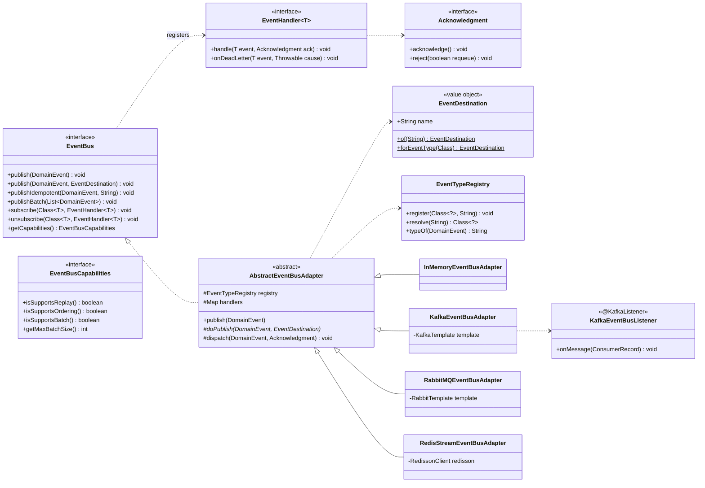
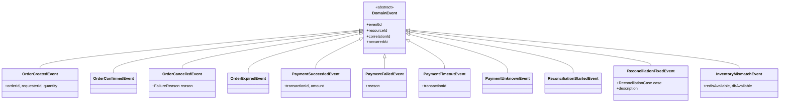
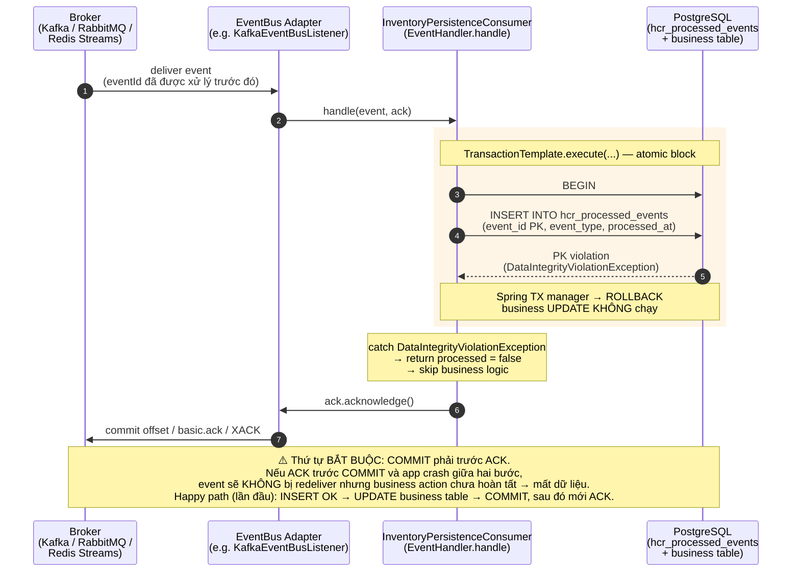

# hcr-eventbus — Module Architecture

## Module Purpose

Tách Saga / Inventory / Reconciliation khỏi loại broker thật sự (Kafka, RabbitMQ, Redis Streams, in-memory). Mục tiêu:

- **Một interface `EventBus`** thống nhất `publish` / `subscribe` cho mọi adapter.
- **At-least-once delivery** trên mọi adapter — consumer phải tự lo idempotency.
- **Switchable** qua config (`hcr.event-bus.type=kafka|rabbitmq|redis-streams|inmemory`) — không cần đổi 1 dòng code Saga.
- **Capability discovery** (`EventBusCapabilities`) — code có thể hỏi "adapter này có hỗ trợ replay không?" thay vì hardcode tên adapter.
- **Event types chuẩn** cho 3 nhóm: order, payment, reconciliation. Inventory events ở trong `hcr-inventory` (vì sinh ra từ Strategy).

Phụ thuộc: chỉ `hcr-core` (cho `DomainEvent`).

## Class / Structure Diagram (Mermaid Class)



### Event hierarchy (events được publish qua bus này)



## Capabilities (Provided to Devs)

| Capability | API | Ghi chú |
|---|---|---|
| Publish 1 event mặc định | `eventBus.publish(event)` | Routing tự động: `EventDestination.forEventType(event.getClass())` chọn topic theo tên event |
| Publish lên topic cụ thể | `eventBus.publish(event, EventDestination.of("order-priority"))` | Override default routing |
| Publish idempotent (chống retry-double) | `eventBus.publishIdempotent(event, idemKey)` | Adapter dùng key này để dedup ở producer side (Redis SETNX hoặc Kafka header) |
| Publish batch | `eventBus.publishBatch(events)` | Tận dụng batch của broker, atomic |
| Subscribe handler | `eventBus.subscribe(OrderCreatedEvent.class, handler)` | Có thể subscribe nhiều handler cho cùng event |
| Discover capability | `eventBus.getCapabilities().isSupportsReplay()` | Code logic có điều kiện không hardcode adapter |
| Dead-letter hook | `EventHandler.onDeadLetter(event, cause)` | Adapter gọi khi retry quá ngưỡng |
| Manual ack/reject | `Acknowledgment.acknowledge()` / `reject(requeue)` | Giữ control trong tay handler — đảm bảo at-least-once đúng nghĩa |

### 4 adapter built-in

| Adapter | When to use | At-least-once cơ chế |
|---|---|---|
| `InMemoryEventBusAdapter` | Unit test, local dev | Direct dispatch trong process |
| `KafkaEventBusAdapter` | Production, throughput cao, replay | Kafka consumer commit offset chỉ sau handler ack |
| `RabbitMQEventBusAdapter` | Production, ưu tiên ordering / routing key phức tạp | AMQP basic.ack |
| `RedisStreamEventBusAdapter` | Triển khai single-stack với Redis (giảm số dependency) | XACK sau khi handler ack |

### Standard event topics (default `EventDestination`)

| Event | Destination mặc định |
|---|---|
| `OrderCreatedEvent` / `OrderConfirmedEvent` / `OrderCancelledEvent` / `OrderExpiredEvent` | `hcr.order.*` |
| `PaymentSucceededEvent` / `PaymentFailedEvent` / `PaymentTimeoutEvent` / `PaymentUnknownEvent` | `hcr.payment.*` |
| `ResourceReservedEvent` / `ResourceReleasedEvent` / `ResourceDepletedEvent` / `ResourceLowStockEvent` / `ResourceRestockedEvent` | `hcr.inventory.*` (định nghĩa trong `hcr-inventory`, publish qua `EventBus`) |
| `ReconciliationStartedEvent` / `ReconciliationFixedEvent` / `InventoryMismatchEvent` | `hcr.reconciliation.*` |

## Consumer-side Idempotency Pattern — luồng xử lý event redelivery

EventBus đảm bảo **at-least-once delivery** trên mọi adapter (Kafka, RabbitMQ, Redis Streams, InMemory): khi broker chưa nhận được `ACK` (do consumer crash, network timeout, app restart, …), event sẽ được redeliver. Để tránh xử lý nghiệp vụ hai lần, **mỗi consumer phải tự lo idempotency** thông qua bảng `hcr_processed_events` với khoá chính `event_id` (xem [`ProcessedEvent.java`](../hcr-inventory/src/main/java/io/hrc/inventory/persistence/ProcessedEvent.java)).

Luồng xử lý của một event bị redeliver được minh hoạ trong sơ đồ bên dưới. Khi consumer nhận được event, toàn bộ thao tác nghiệp vụ và việc ghi `eventId` vào bảng `hcr_processed_events` được thực hiện trong cùng một transaction cơ sở dữ liệu. Nếu `eventId` đã tồn tại trong bảng — tức là event đang bị redeliver — primary-key constraint trên bảng ném `DataIntegrityViolationException`, toàn bộ transaction rollback, và consumer gọi `Acknowledgment.acknowledge()` để báo cho broker biết event đã được xử lý mà không thực hiện bất kỳ thao tác nghiệp vụ nào. Ngược lại, nếu đây là lần đầu tiên event được xử lý, transaction commit thành công trước khi `acknowledge()` được gọi. Thứ tự này rất quan trọng: nếu `acknowledge()` được gọi trước khi commit, ứng dụng có thể crash giữa hai bước và event sẽ không được redeliver trong khi thao tác nghiệp vụ chưa hoàn tất.

> **Reference implementation:** [`InventoryPersistenceConsumer.processIdempotent`](../hcr-inventory/src/main/java/io/hrc/inventory/persistence/InventoryPersistenceConsumer.java) — `transactionTemplate.execute(...)` ôm cả `processedEventRepository.save(...)` lẫn business `UPDATE`; nhánh redelivery bắt `DataIntegrityViolationException` rồi return `false` (skip business) → ACK ở ngoài.



<details>
<summary>📐 draw.io XML — paste vào Extras → Edit Diagram</summary>

```xml
<mxGraphModel dx="1200" dy="800" grid="1" gridSize="10" guides="1" tooltips="1" connect="1" arrows="1" fold="1" page="1" pageScale="1" pageWidth="1100" pageHeight="760" math="0" shadow="0">
  <root>
    <mxCell id="0"/>
    <mxCell id="1" parent="0"/>

    <mxCell id="lf_broker" value="Broker&lt;br/&gt;(Kafka / RabbitMQ / Redis Streams)" style="shape=umlLifeline;perimeter=lifelinePerimeter;whiteSpace=wrap;html=1;align=center;fillColor=#dae8fc;strokeColor=#6c8ebf;fontSize=11;fontStyle=1;size=50;" vertex="1" parent="1">
      <mxGeometry x="40" y="40" width="160" height="540" as="geometry"/>
    </mxCell>
    <mxCell id="lf_bus" value="EventBus Adapter&lt;br/&gt;(e.g. KafkaEventBusListener)" style="shape=umlLifeline;perimeter=lifelinePerimeter;whiteSpace=wrap;html=1;align=center;fillColor=#dae8fc;strokeColor=#6c8ebf;fontSize=11;fontStyle=1;size=50;" vertex="1" parent="1">
      <mxGeometry x="240" y="40" width="200" height="540" as="geometry"/>
    </mxCell>
    <mxCell id="lf_consumer" value="InventoryPersistenceConsumer&lt;br/&gt;(EventHandler.handle)" style="shape=umlLifeline;perimeter=lifelinePerimeter;whiteSpace=wrap;html=1;align=center;fillColor=#e1d5e7;strokeColor=#9673a6;fontSize=11;fontStyle=1;size=50;" vertex="1" parent="1">
      <mxGeometry x="480" y="40" width="240" height="540" as="geometry"/>
    </mxCell>
    <mxCell id="lf_db" value="PostgreSQL&lt;br/&gt;(hcr_processed_events + business table)" style="shape=umlLifeline;perimeter=lifelinePerimeter;whiteSpace=wrap;html=1;align=center;fillColor=#d5e8d4;strokeColor=#82b366;fontSize=11;fontStyle=1;size=50;" vertex="1" parent="1">
      <mxGeometry x="760" y="40" width="240" height="540" as="geometry"/>
    </mxCell>

    <mxCell id="frame_tx" value="atomic: transactionTemplate.execute(...)" style="rounded=0;whiteSpace=wrap;html=1;align=left;verticalAlign=top;spacingLeft=8;spacingTop=4;fontSize=10;fontStyle=1;fillColor=none;strokeColor=#d6b656;dashed=1;dashPattern=8 4;" vertex="1" parent="1">
      <mxGeometry x="490" y="220" width="510" height="180" as="geometry"/>
    </mxCell>

    <mxCell id="m1" value="① deliver event (eventId đã được xử lý trước đó)" style="endArrow=block;endFill=1;html=1;rounded=0;fontSize=11;" edge="1" parent="1">
      <mxGeometry relative="1" as="geometry">
        <mxPoint x="120" y="160" as="sourcePoint"/>
        <mxPoint x="340" y="160" as="targetPoint"/>
      </mxGeometry>
    </mxCell>
    <mxCell id="m2" value="② handle(event, ack)" style="endArrow=block;endFill=1;html=1;rounded=0;fontSize=11;" edge="1" parent="1">
      <mxGeometry relative="1" as="geometry">
        <mxPoint x="340" y="195" as="sourcePoint"/>
        <mxPoint x="600" y="195" as="targetPoint"/>
      </mxGeometry>
    </mxCell>
    <mxCell id="m3" value="③ BEGIN" style="endArrow=block;endFill=1;html=1;rounded=0;fontSize=11;" edge="1" parent="1">
      <mxGeometry relative="1" as="geometry">
        <mxPoint x="600" y="255" as="sourcePoint"/>
        <mxPoint x="880" y="255" as="targetPoint"/>
      </mxGeometry>
    </mxCell>
    <mxCell id="m4" value="④ INSERT hcr_processed_events (event_id PK, event_type, processed_at)" style="endArrow=block;endFill=1;html=1;rounded=0;fontSize=11;" edge="1" parent="1">
      <mxGeometry relative="1" as="geometry">
        <mxPoint x="600" y="295" as="sourcePoint"/>
        <mxPoint x="880" y="295" as="targetPoint"/>
      </mxGeometry>
    </mxCell>
    <mxCell id="m5" value="⑤ PK violation: DataIntegrityViolationException" style="endArrow=open;endFill=0;html=1;rounded=0;dashed=1;fontSize=11;" edge="1" parent="1">
      <mxGeometry relative="1" as="geometry">
        <mxPoint x="880" y="335" as="sourcePoint"/>
        <mxPoint x="600" y="335" as="targetPoint"/>
      </mxGeometry>
    </mxCell>
    <mxCell id="m6" value="⑥ ROLLBACK (auto via Spring TX manager)" style="endArrow=block;endFill=1;html=1;rounded=0;fontSize=11;" edge="1" parent="1">
      <mxGeometry relative="1" as="geometry">
        <mxPoint x="600" y="375" as="sourcePoint"/>
        <mxPoint x="880" y="375" as="targetPoint"/>
      </mxGeometry>
    </mxCell>
    <mxCell id="m7" value="⑦ ack.acknowledge()" style="endArrow=block;endFill=1;html=1;rounded=0;fontSize=11;" edge="1" parent="1">
      <mxGeometry relative="1" as="geometry">
        <mxPoint x="600" y="450" as="sourcePoint"/>
        <mxPoint x="340" y="450" as="targetPoint"/>
      </mxGeometry>
    </mxCell>
    <mxCell id="m8" value="⑧ commit offset / basic.ack / XACK" style="endArrow=block;endFill=1;html=1;rounded=0;fontSize=11;" edge="1" parent="1">
      <mxGeometry relative="1" as="geometry">
        <mxPoint x="340" y="490" as="sourcePoint"/>
        <mxPoint x="120" y="490" as="targetPoint"/>
      </mxGeometry>
    </mxCell>

    <mxCell id="note_catch" value="catch DataIntegrityViolationException&lt;br/&gt;→ processed = false&lt;br/&gt;→ skip business UPDATE" style="shape=note;whiteSpace=wrap;html=1;fontSize=10;align=left;spacingLeft=8;spacingTop=6;fillColor=#fff2cc;strokeColor=#d6b656;size=14;" vertex="1" parent="1">
      <mxGeometry x="490" y="410" width="240" height="60" as="geometry"/>
    </mxCell>

    <mxCell id="note_happy" value="&lt;b&gt;Happy path (lần đầu xử lý):&lt;/b&gt;&lt;br/&gt;INSERT OK → UPDATE business table → COMMIT, sau đó mới ACK." style="shape=note;whiteSpace=wrap;html=1;fontSize=10;align=left;spacingLeft=8;spacingTop=6;fillColor=#d5e8d4;strokeColor=#82b366;size=14;" vertex="1" parent="1">
      <mxGeometry x="40" y="610" width="500" height="60" as="geometry"/>
    </mxCell>
    <mxCell id="note_order" value="&lt;b&gt;⚠️ Thứ tự bắt buộc:&lt;/b&gt; COMMIT phải trước ACK.&lt;br/&gt;Nếu ACK được gọi trước COMMIT và app crash giữa hai bước:&lt;br/&gt;event sẽ KHÔNG bị redeliver, nhưng business action chưa được commit → mất dữ liệu." style="shape=note;whiteSpace=wrap;html=1;fontSize=10;align=left;spacingLeft=8;spacingTop=6;fillColor=#f8cecc;strokeColor=#b85450;size=14;" vertex="1" parent="1">
      <mxGeometry x="560" y="610" width="500" height="80" as="geometry"/>
    </mxCell>
  </root>
</mxGraphModel>
```

</details>

## To-Do / Detailed Implementation

| Hạng mục | Trạng thái | Ghi chú |
|---|---|---|
| `EventBus` interface + 4 adapters | ✅ Implemented | InMemory, Kafka, RabbitMQ, Redis Streams |
| `publishIdempotent` cho Kafka | ⚠️ Partial | Hiện dùng Kafka idempotent producer (config `enable.idempotence=true`) — đủ chống duplicate cấp connection nhưng KHÔNG dedup cross-restart. **TODO:** thêm Redis SETNX `eventbus:idem:{key}` TTL 24h ở producer side |
| `publishBatch` atomicity | ⚠️ Best-effort | Kafka adapter gửi nhiều record nhưng không transactional — partial publish có thể xảy ra. **TODO:** wrap trong Kafka transaction (`producer.beginTransaction/commitTransaction`) |
| Schema evolution | ❌ Chưa | `DomainEvent` không có `schemaVersion` — consumer cũ gặp event field mới sẽ crash khi deserialize. **TODO:** introduce `SchemaRegistry` adapter |
| Dead-letter queue | ⚠️ Partial | Hook `onDeadLetter` có nhưng DLQ topic chưa standardised giữa các adapter. **TODO:** chuẩn hoá pattern `{topic}.dlq` cho mọi adapter |
| Replay API | ❌ Chưa | Kafka có thể replay nhưng `EventBus` chưa expose method `replay(destination, fromOffset)` |
| Ordering guarantee | ⚠️ Adapter-dependent | Kafka per-partition ordering OK; Rabbit per-queue OK; Redis Streams OK; InMemory FIFO. Nhưng cross-event ordering thì không adapter nào đảm bảo. **TODO:** doc rõ |
| Backpressure | ❌ Chưa | Producer publish nhanh hơn consumer → broker đầy. Chưa có mechanism throttle ở `AbstractEventBusAdapter` |
| Tracing | ⚠️ Partial | `correlationId` được serialize trong event body. **TODO:** propagate qua Kafka header để tracer (Zipkin/Jaeger) tự pick up |

### Khu vực cần implement chi tiết

1. **Producer-side dedup (`publishIdempotent`):** Kafka idempotent producer chỉ chống duplicate trong phiên producer; nếu app restart và retry cùng business key, vẫn double-publish. Gợi ý: trước khi publish, check `SETNX eventbus:idem:{key} = eventId` TTL 24h. Nếu key đã tồn tại → log + skip.
2. **Schema versioning trên `DomainEvent`:** Thêm trường `int schemaVersion` (default 1). Mỗi event mới khi đổi field PHẢI tăng version + giữ backward compat trong constructor 1 mùa release.
3. **`EventTypeRegistry` autoconfigure:** Hiện class này dùng explicit `register()`. Có thể quét classpath `@HcrEvent("order.created")` và auto-register trong `hcr-autoconfigure`.
4. **Dead-letter handler chuẩn:** Tạo class `DeadLetterEventHandler` ghi event vào bảng DB `hcr_dead_letters` để reconciliation service có thể replay.
