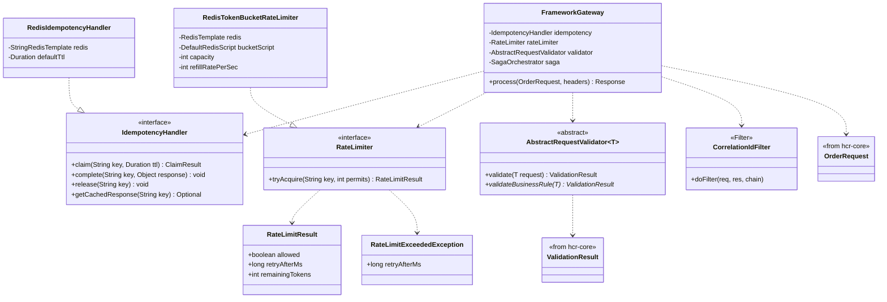

# hcr-gateway

> HTTP entry point của framework — idempotency, rate limiting, validation, correlation ID.

---

## 1. Vai trò trong framework

`hcr-gateway` là **lớp đầu vào** giữa HTTP request và Saga. Nó xử lý các concern cắt ngang **trước khi** request chạm tới logic nghiệp vụ:

1. **Correlation ID** — gán / propagate trace ID qua MDC
2. **Rate limit** — chặn user spam (token bucket)
3. **Idempotency** — chặn duplicate request (cùng `Idempotency-Key`)
4. **Validation** — check format / business rule

Chỉ khi tất cả pass, request mới được forward xuống `SagaOrchestrator`.

---

## 2. Tại sao cần module này?

Mỗi đội tự viết các concern này thì:

- Idempotency bằng SQL `INSERT ... ON CONFLICT` chậm, không TTL → bảng phồng to
- Rate limit cứng `synchronized` → không scale qua nhiều instance
- Correlation ID lúc có lúc không → debug distributed gần như mù
- Validation rải rác trong controller, hard-code message → khó i18n

`hcr-gateway` chuẩn hoá:

| Concern | HCR cách làm |
|---------|--------------|
| Idempotency | `RedisIdempotencyHandler` — Redis `SETNX` + TTL 24h, response cache |
| Rate limit | `RedisTokenBucketRateLimiter` — token bucket distributed qua Redis (Lua) |
| Correlation ID | `CorrelationIdFilter` — `X-Correlation-Id` header → MDC → `DomainEvent.correlationId` |
| Validation | `AbstractRequestValidator` — chain validation, return `ValidationResult` |

---

## 3. Nguyên lý thiết kế

| Nguyên lý | Áp dụng |
|-----------|---------|
| **Hexagonal / Ports & Adapters** | `IdempotencyHandler` + `RateLimiter` interface — Redis là 1 adapter |
| **Filter Chain** (Spring Servlet Filter) | Correlation ID, request logging — chạy trước controller |
| **Token Bucket Algorithm** | Rate limit smooth burst, refill liên tục, không spike rejection |
| **SETNX với TTL** | Idempotency claim atomic + auto-expire — không cần cron cleanup |
| **Result Object** | `RateLimitResult` (allowed / retryAfter) thay throw |
| **Exception cho hard limit** | `RateLimitExceededException` — chỉ throw khi vượt hẳn ngưỡng |
| **Template Method** | `AbstractRequestValidator` — common rules + hook validateBusinessRule() |

---

## 4. Class diagram



---

## 5. Thành phần chính

| Package | Thành phần | Vai trò |
|---------|-----------|---------|
| `(root)` | `FrameworkGateway`, `AbstractRequestValidator` | Entry point + validator base |
| `filter` | `CorrelationIdFilter` | Servlet filter gán/propagate correlation ID |
| `idempotency` | `IdempotencyHandler` | Interface |
| `idempotency.redis` | `RedisIdempotencyHandler` | Implementation Redis SETNX |
| `ratelimit` | `RateLimiter`, `RateLimitResult`, `RateLimitExceededException` | Interface + DTO |
| `ratelimit.redis` | `RedisTokenBucketRateLimiter` | Token bucket distributed |

---

## 6. Idempotency lifecycle

```
1. SETNX  hcr:idem:{key} = "IN_FLIGHT", TTL=24h
   ├─ false → có claim trước đó:
   │            • value = "IN_FLIGHT" → 409 Conflict (request đang xử lý)
   │            • value = orderId    → 200 OK với cached response
   └─ true  → claim thành công → forward xuống saga
2. Sau saga:
   • Reserve fail (CANCELLED) → DELETE key (cho phép retry)
   • Saga thành công        → SET key = orderId, TTL=24h
```

Lưu ý: SETNX atomic + TTL bảo vệ khỏi cả **duplicate** lẫn **stuck IN_FLIGHT** (TTL tự dọn sau 24h).

---

## 7. Liên kết

- Chi tiết đọc code → [`GUIDE.md`](GUIDE.md)
- Thiết kế tổng → [`../docs/framework_design.md`](../docs/framework_design.md) §7
