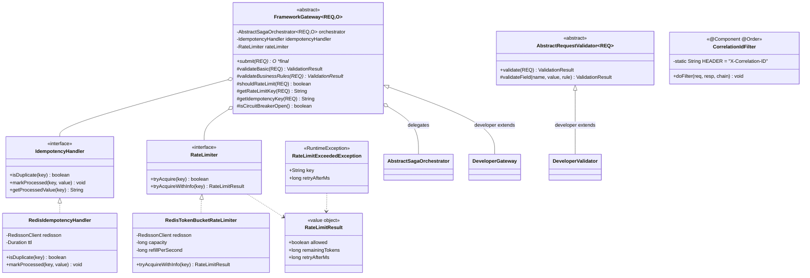
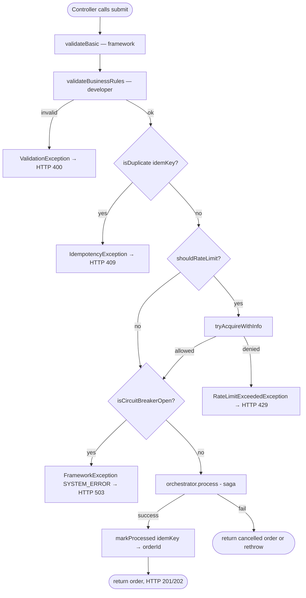

# hcr-gateway — Module Architecture

## Module Purpose

Entry point duy nhất vào framework. Mọi REST request từ controller đều đi qua **pipeline cố định** trước khi tới `AbstractSagaOrchestrator`:

```
1. Validate (basic + business rules)
2. Idempotency check (Redis SETNX)
3. Rate Limit (Redis token bucket — optional)
4. Circuit Breaker check (optional)
5. Submit → SagaOrchestrator.process()
6. Cache idempotency result
```

`FrameworkGateway` là Template Method — pipeline `submit()` là `final`, developer override:

- **`validateBusinessRules`** (BẮT BUỘC) — nghiệp vụ riêng
- `shouldRateLimit` / `getRateLimitKey` / `getIdempotencyKey` / `isCircuitBreakerOpen` (optional)

Bên cạnh đó, module cung cấp:

- **`CorrelationIdFilter`** (`Servlet Filter`) — sinh / propagate `X-Correlation-ID` qua mọi request, để distributed tracing.
- **`AbstractRequestValidator`** — base class developer dùng cho validation phức tạp.
- **`IdempotencyHandler`** + impl **`RedisIdempotencyHandler`** (Redis SETNX, TTL 24h).
- **`RateLimiter`** + impl **`RedisTokenBucketRateLimiter`** + DTO `RateLimitResult` + exception `RateLimitExceededException`.

Phụ thuộc: `hcr-core`, `hcr-saga` (vì `submit()` cần inject `AbstractSagaOrchestrator`).

## Class / Structure Diagram (Mermaid Class)



### Pipeline flow



## Capabilities (Provided to Devs)

| Capability | API | Khi dùng |
|---|---|---|
| Build gateway của project | `class TicketGateway extends FrameworkGateway<TicketRequest, TicketOrder>` | Override `validateBusinessRules` |
| Injection 3 dependency cốt lõi | constructor `super(orchestrator, idempotencyHandler, rateLimiter)` | Spring tự autowire qua autoconfigure |
| Submit | `gateway.submit(request)` | Controller chỉ cần gọi 1 method, mọi thứ còn lại do gateway lo |
| Custom rate limit key | override `getRateLimitKey(req)` | Per-user-per-resource thay vì per-user |
| Custom idempotency key | override `getIdempotencyKey(req)` | Một số case cần kết hợp `requesterId + payload hash` |
| Disable rate limit | override `shouldRateLimit(req) -> false` | Cho admin/internal traffic |
| Wire CB state | override `isCircuitBreakerOpen()` | Trả `cb.getState() == OPEN` |
| Cache result idempotent | `IdempotencyHandler` | Hai request cùng `idempotencyKey` đều trả về cùng `orderId` |
| Token-bucket rate limit | `RedisTokenBucketRateLimiter` (Lua atomic) | Distributed across instances |
| Tracing | `CorrelationIdFilter` | Mỗi request có `X-Correlation-ID` propagate vào saga + event |
| Exception → HTTP code chuẩn | `ValidationException` → 400, `IdempotencyException` → 409, `RateLimitExceededException` → 429, `FrameworkException(SYSTEM_ERROR)` → 503 | `@RestControllerAdvice` của developer chỉ cần map các exception này |

### Cấu hình điển hình

```yaml
hcr:
  gateway:
    idempotency:
      ttl-seconds: 86400          # 24h
    rate-limit:
      enabled: true
      capacity: 100
      refill-per-second: 10
```

### Quy ước quan trọng

1. **`submit()` là `final`** — developer không thể override pipeline.
2. **Idempotency check chạy TRƯỚC rate limit** — request duplicate nên trả 409 ngay, không tốn token.
3. **`markProcessed()` chạy SAU saga thành công**. Nếu saga throw exception, key idempotency không bị mark → client retry được.
4. **`CorrelationIdFilter` phải có `@Order(Ordered.HIGHEST_PRECEDENCE)`** — chạy trước mọi filter khác để mọi log từ filter chain trở đi đều có correlationId.

## To-Do / Detailed Implementation

| Hạng mục | Trạng thái | Ghi chú |
|---|---|---|
| `FrameworkGateway` template + `submit()` final | ✅ Implemented | |
| `IdempotencyHandler` interface | ✅ Implemented | |
| `RedisIdempotencyHandler` (SETNX + TTL) | ✅ Implemented | |
| `RateLimiter` interface | ✅ Implemented | |
| `RedisTokenBucketRateLimiter` (Lua atomic) | ✅ Implemented | |
| `RateLimitResult` (allowed, remainingTokens, retryAfterMs) | ✅ Implemented | |
| `CorrelationIdFilter` | ✅ Implemented | |
| `AbstractRequestValidator` | ✅ Implemented | |
| Built-in `@RestControllerAdvice` để map exception → HTTP code | ❌ Chưa | Developer phải tự viết. **TODO:** ship `HcrExceptionHandlerAdvice` trong autoconfigure (có thể disable nếu app đã có advice riêng) |
| Idempotency cho non-201 response | ⚠️ Cần verify | Khi saga trả về CANCELLED, hiện code vẫn `markProcessed`. Đúng đắn — duplicate request phải nhận lại cùng kết quả. Cần test case |
| Rate limit theo nhiều tier (user/IP/global) | ⚠️ Partial | `getRateLimitKey()` chỉ trả 1 string. **TODO:** cho phép multi-key check |
| Slowloris / large payload protection | ❌ Chưa | Chưa có max-payload-size guard. **TODO:** filter size + read timeout |
| Bot detection / WAF integration | ❌ Chưa | Out of scope framework, nhưng nên doc |
| Auth (JWT, OAuth2) | ❌ Out-of-scope | Project là thesis backend không cần auth (theo memory) |
| Request body audit log | ❌ Chưa | **TODO:** optional `RequestAuditFilter` ghi vào DB cho compliance |
| Circuit Breaker hook chuẩn | ⚠️ Partial | `isCircuitBreakerOpen()` để developer override; chưa có `CircuitBreakerGateway` mặc định wrap luôn `CircuitBreakerInventoryDecorator`. **TODO:** decorator class chuẩn |
| Streaming endpoint (SSE / WebSocket) | ❌ Chưa | Hiện chỉ hỗ trợ unary REST. P3 trả 202 → client cần long-poll/`getStatus` để biết kết quả cuối. SSE sẽ là nâng cấp |

### Logic chi tiết cần implement / cải thiện

1. **Idempotency `markProcessed` semantics:**
   - Hiện flow: `markProcessed(key, orderId)` chạy sau khi saga return. Phải đảm bảo TTL đủ dài (≥ tổng thời gian saga + buffer client retry). Default 24h là an toàn.
   - **Lưu trữ kết quả trả về**: hiện chỉ lưu `orderId` (string). Khi duplicate request đến, `getProcessedValue(key)` trả `orderId` rồi gateway phải gọi `findOrder(orderId)` để dựng lại response. **TODO:** option lưu cả serialized `O order` để skip DB lookup.
2. **Rate limit Lua script:**
   - Verify thuật toán đang là token-bucket chuẩn (refill = `min(cap, current + (now - last) * rate)`, consume 1, store back). Nếu là sliding window thì gọi tên đúng cho khỏi lẫn.
3. **`CorrelationIdFilter` MDC:**
   - Filter PHẢI `MDC.put("correlationId", id)` để mọi log SLF4J có sẵn correlationId. **Cleanup** trong `finally`.
4. **Exception advice mặc định:**
   ```java
   @RestControllerAdvice
   public class HcrExceptionHandlerAdvice {
     @ExceptionHandler(ValidationException.class) ResponseEntity<...> v(...) // 400
     @ExceptionHandler(IdempotencyException.class) ResponseEntity<...> i(...) // 409
     @ExceptionHandler(RateLimitExceededException.class) ResponseEntity<...> r(...) // 429
     @ExceptionHandler(FrameworkException.class) ResponseEntity<...> f(...) // 503/500
     @ExceptionHandler(InsufficientInventoryException.class) ResponseEntity<...> oo(...) // 422
   }
   ```
   Đặt trong autoconfigure với `@ConditionalOnMissingBean`.
