# hcr-inventory

> 3 chiến lược kiểm soát tồn kho atomic (P1/P2/P3) + decorator (circuit breaker) + DB sync consumer.

---

## 1. Vai trò trong framework

`hcr-inventory` là **trái tim của framework**: nơi đảm bảo **zero oversell**. Khi `n` request đồng thời cùng đặt 1 vé cuối cùng, đúng 1 request thắng và `n-1` request bị từ chối — không có race condition.

Module cung cấp 3 strategy với 3 SLA khác nhau (consistency vs throughput) để developer chọn theo bài toán, cùng một interface `InventoryStrategy` thống nhất.

---

## 2. Tại sao cần module này?

Đếm tồn kho nghe đơn giản nhưng **race condition** ở high-concurrency là chỗ ai cũng sai. Các pitfall điển hình mà framework xử lý sẵn:

| Pitfall | Hậu quả | HCR xử lý |
|---------|---------|-----------|
| Read-then-write không atomic | Oversell | P1 dùng `SELECT FOR UPDATE`, P3 dùng Lua atomic |
| `WHERE quantity >= delta` để chống oversell | Idempotency vỡ (request retry trừ 2 lần) | Dùng `eventId` + `hcr_processed_events` |
| `@Version` retry trong cùng Hibernate session | Cache version cũ → infinite loop | P2 tạo TX mới mỗi retry |
| Reserve thành công nhưng publish event fail | Slot mất, không ai release | Reconciliation fix ≤ 5 phút |
| Redis flap → strategy throw lỗi liên tục | Thrash hệ thống | `CircuitBreakerInventoryDecorator` |
| Compensate `release()` reject khi CB OPEN | Inventory leak (slot không quay lại) | CB không reject `release()` — chỉ `reserve()` |
| P3 DB sync chậm → hot resource bị bottleneck | Blocked persistence | 2 mode: SINGLE (1 event = 1 TX) hoặc BATCH (gom flush) |

---

## 3. Nguyên lý thiết kế

| Nguyên lý | Áp dụng |
|-----------|---------|
| **Strategy Pattern** | `InventoryStrategy` interface + 3 concrete (P1/P2/P3) |
| **Decorator Pattern** | `CircuitBreakerInventoryDecorator` bọc bất kỳ strategy nào |
| **Factory Pattern** | `InventoryStrategyFactory` chọn strategy theo config — strategy KHÔNG phải Spring bean (dùng `new`) |
| **Atomic operation** | P1: row lock; P2: CAS qua `@Version`; P3: Lua script chạy single-thread trên Redis |
| **Idempotency by eventId** | `ProcessedEvent` dedup tại consumer, không phải tại WHERE clause |
| **Programmatic transaction** | `TransactionTemplate` thay `@Transactional` (vì strategy không phải Spring bean) |
| **Read-Through cache (P3)** | Redis là source of truth khi đang serve traffic; DB sync async qua EventBus |
| **Configurable persistence** | SINGLE vs BATCH — đổi qua `hcr.inventory.persistence.mode` |

### Ba strategy

| | P1 Pessimistic | P2 Optimistic | P3 Redis Atomic |
|--|:-:|:-:|:-:|
| Cơ chế | `SELECT FOR UPDATE` | `@Version` + retry | Lua `DECRBY` |
| Throughput | ~1 000 req/s | 1 000–5 000 req/s | 5 000–10 000 req/s |
| Consistency | Strong (0 ms) | Strong (0 ms) | Eventual (≤ 5 min) |
| Source of truth | PostgreSQL | PostgreSQL | Redis |
| DB trong critical path? | Có | Có | **Không** |
| Khi nào dùng | Bắt buộc consistent ngay, traffic vừa | Đa số case, ít contention | Hot resource, traffic cực cao |

### P3 — Redis key layout

```
hcr:inventory:{resourceId}            — available quantity (Lua DECRBY/INCRBY)
hcr:inventory:total:{resourceId}      — total quantity (guard cho release.lua)
hcr:inventory:threshold:{resourceId}  — lowStockThreshold (cache từ DB)
```

> ⚠️ Cả 2 key inventory + total **phải tồn tại đồng thời**. SET tay key inventory mà thiếu key total sẽ phá guard release.lua → có thể oversell.

---

## 4. Class diagram

```mermaid
classDiagram
    direction TB

    class InventoryStrategy {
        <<interface>>
        +reserve(String, int, String) ReservationResult
        +reserveBatch(Map, String) ReservationResult
        +release(String, int, String) void
        +confirm(String, int, String) void
        +initialize(String, int) void
        +restock(String, int) void
        +snapshot(String) InventorySnapshot
    }

    class PessimisticLockStrategy {
        -TransactionTemplate tx
        -EntityManager em
        +reserve() — SELECT FOR UPDATE
    }

    class OptimisticLockStrategy {
        -TransactionTemplate tx
        -int maxRetries
        +reserve() — @Version + retry
    }

    class RedisAtomicStrategy {
        -RedisTemplate redis
        -DefaultRedisScript reserveScript
        -DefaultRedisScript releaseScript
        -EventBus eventBus
        +reserve() — Lua DECRBY
    }

    class CircuitBreakerInventoryDecorator {
        -InventoryStrategy delegate
        -CircuitBreaker breaker
        +reserve() — short-circuit when OPEN
        +release() — never reject (avoid leak)
    }

    class CircuitBreakerState {
        <<enumeration>>
        CLOSED
        OPEN
        HALF_OPEN
    }

    class InventoryStrategyFactory {
        +create(StrategyType, Config) InventoryStrategy
    }

    class InventoryInitializer {
        +initialize(AbstractResource) void
    }

    class AbstractInventoryEntity {
        <<abstract>>
        #String resourceId
        #int totalQuantity
        #int availableQuantity
        #Long version
    }

    class InventoryPersistenceConsumer {
        -ProcessedEventRepository dedup
        +onResourceReserved(event)
        +onResourceReleased(event)
    }

    class BatchInventoryPersistenceConsumer {
        -int batchSize
        -long flushIntervalMs
        +onEvent() — buffer + flush
    }

    class PersistenceMode {
        <<enumeration>>
        SINGLE
        BATCH
    }

    class PersistenceConfig {
        +PersistenceMode mode
        +int batchSize
        +long flushIntervalMs
    }

    class ProcessedEvent {
        +String eventId
        +Instant processedAt
    }

    class ProcessedEventRepository {
        <<interface>>
        +existsById(String) boolean
        +save(ProcessedEvent) void
    }

    class ResourceReservedEvent
    class ResourceReleasedEvent
    class ResourceRestockedEvent
    class ResourceLowStockEvent
    class ResourceDepletedEvent

    class InventoryMetrics {
        +recordReserveSuccess() void
        +recordReserveFail(FailureReason) void
        +recordCircuitBreakerState(...) void
    }

    PessimisticLockStrategy ..|> InventoryStrategy
    OptimisticLockStrategy ..|> InventoryStrategy
    RedisAtomicStrategy ..|> InventoryStrategy
    CircuitBreakerInventoryDecorator ..|> InventoryStrategy
    CircuitBreakerInventoryDecorator o--> InventoryStrategy : delegate
    CircuitBreakerInventoryDecorator ..> CircuitBreakerState
    InventoryStrategyFactory ..> InventoryStrategy
    InventoryInitializer ..> InventoryStrategy
    InventoryInitializer ..> AbstractInventoryEntity

    InventoryPersistenceConsumer ..> ProcessedEventRepository
    BatchInventoryPersistenceConsumer ..> ProcessedEventRepository
    PersistenceConfig ..> PersistenceMode
    ProcessedEventRepository ..> ProcessedEvent

    RedisAtomicStrategy ..> ResourceReservedEvent : publish
    RedisAtomicStrategy ..> ResourceReleasedEvent : publish
    InventoryPersistenceConsumer ..> ResourceReservedEvent : consume
    InventoryPersistenceConsumer ..> ResourceReleasedEvent : consume

    ResourceReservedEvent --|> DomainEvent
    ResourceReleasedEvent --|> DomainEvent
    ResourceRestockedEvent --|> DomainEvent
    ResourceLowStockEvent --|> DomainEvent
    ResourceDepletedEvent --|> DomainEvent

    class DomainEvent { <<from hcr-core>> }
    class ReservationResult { <<from hcr-core>> }
    class InventorySnapshot { <<from hcr-core>> }
    InventoryStrategy ..> ReservationResult
    InventoryStrategy ..> InventorySnapshot
```



---

## 5. Thành phần chính

| Package | Thành phần | Vai trò |
|---------|-----------|---------|
| `strategy` | `InventoryStrategy` | Interface 7 method (reserve / release / confirm / ...) |
| `strategy.pessimistic` | `PessimisticLockStrategy` | P1 — DB row lock |
| `strategy.optimistic` | `OptimisticLockStrategy` | P2 — version + retry |
| `strategy.redis` | `RedisAtomicStrategy` | P3 — Lua atomic |
| `decorator` | `CircuitBreakerInventoryDecorator`, `CircuitBreakerState` | Bảo vệ khi backend flap |
| `factory` | `InventoryStrategyFactory` | Tạo strategy từ config |
| `entity` | `AbstractInventoryEntity` | Base JPA entity (P1/P2) |
| `persistence` | `InventoryPersistenceConsumer`, `BatchInventoryPersistenceConsumer`, `ProcessedEvent`, `ProcessedEventRepository`, `PersistenceMode`, `PersistenceConfig` | DB sync cho P3 |
| `event` | `ResourceReserved/Released/Restocked/LowStock/Depleted` | Domain event của module |
| `initializer` | `InventoryInitializer` | Warm-up cache lúc startup (P3) |
| `metrics` | `InventoryMetrics` | Counter / gauge cho Micrometer |

---

## 6. Lua script (P3)

| File | Nhiệm vụ |
|------|----------|
| `inventory_reserve.lua` | `DECRBY` nếu đủ tồn kho, return new available; ngược lại return -1 |
| `inventory_release.lua` | `INCRBY` nhưng cap tại `total` (guard chống `release` quá đà) |

Cả 2 script chạy **single-threaded** trên Redis → atomic, không race.

---

## 7. Liên kết

- Chi tiết đọc code → [`GUIDE.md`](GUIDE.md)
- Thiết kế tổng → [`../docs/framework_design.md`](../docs/framework_design.md) §3
