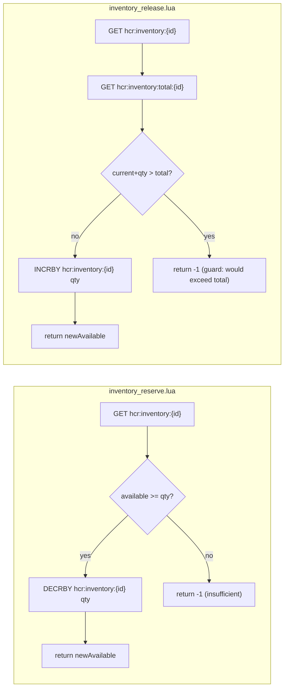
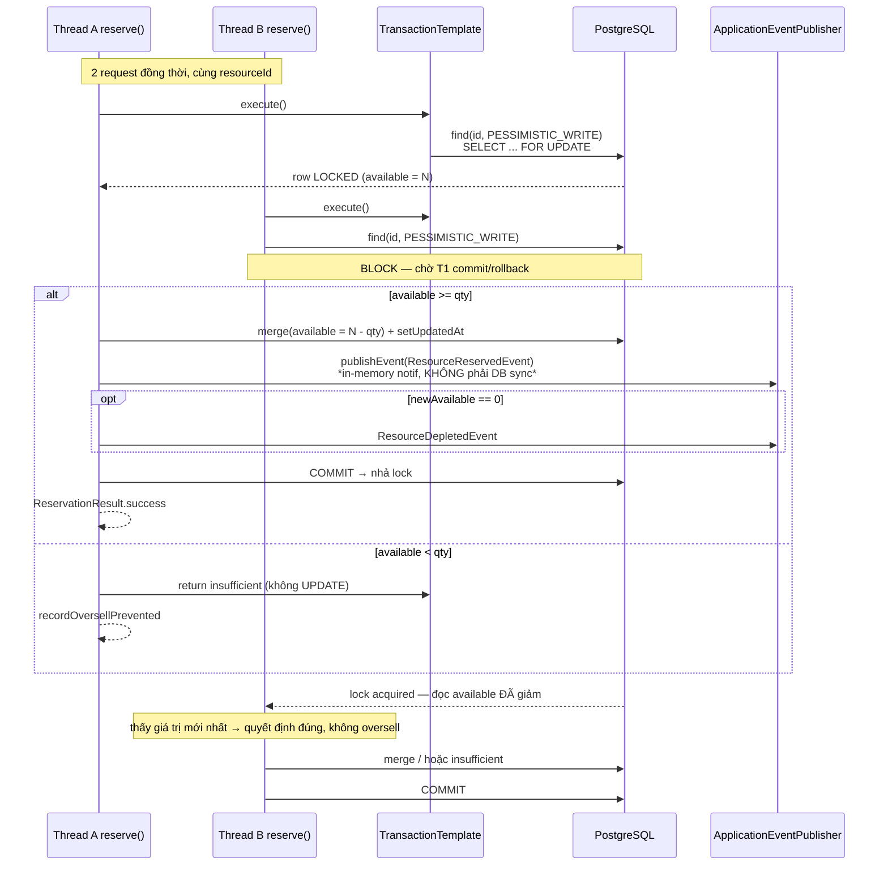
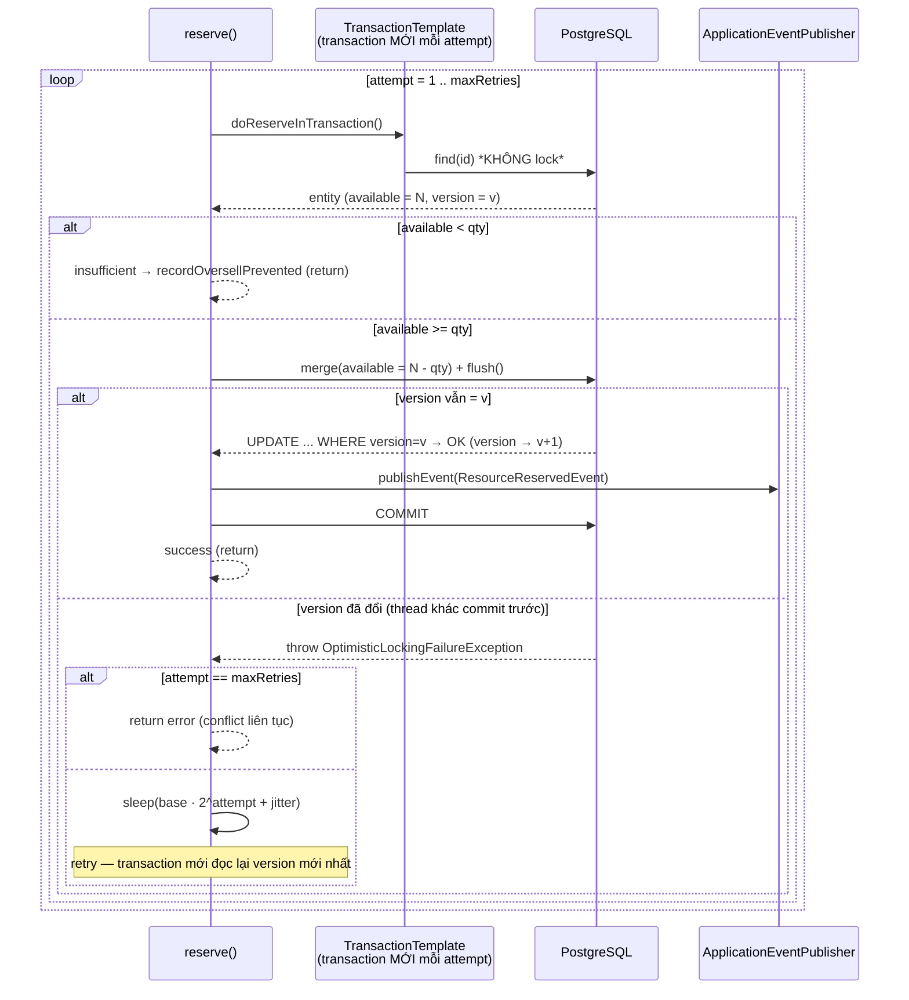
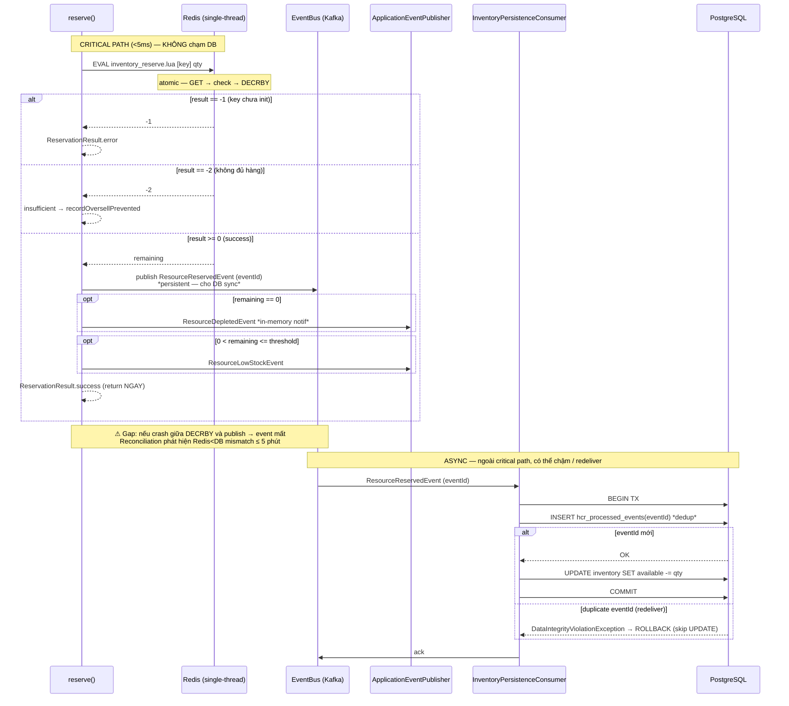

# hcr-inventory — Module Architecture

## Module Purpose

Trái tim của framework — **đảm bảo zero-oversell** dưới concurrent load. Cung cấp 3 strategy có cùng interface `InventoryStrategy` nhưng đánh đổi consistency vs throughput khác nhau:

- **P1 — `PessimisticLockStrategy`**: `SELECT … FOR UPDATE` lock hàng. ~1,000 req/s, strong consistency, đơn giản nhất, baseline.
- **P2 — `OptimisticLockStrategy`**: JPA `@Version` + retry với exponential backoff. 1,000–5,000 req/s, strong consistency, không lock DB.
- **P3 — `RedisAtomicStrategy`**: Lua script `DECRBY` atomic trên Redis, DB sync async qua EventBus. 5,000–10,000 req/s, eventual consistency (≤5 phút worst case).

Bên cạnh strategies, module còn cung cấp:

- **`CircuitBreakerInventoryDecorator`** — wrap bất kỳ strategy nào thêm Circuit Breaker (Resilience4j).
- **`InventoryPersistenceConsumer` / `BatchInventoryPersistenceConsumer`** — consume `ResourceReservedEvent` / `ResourceReleasedEvent` để sync DB cho P3.
- **`ProcessedEventRepository`** — bảng dedup (`hcr_processed_events`) đảm bảo idempotent khi consumer retry.
- **`AbstractInventoryEntity`** — base entity developer extend (resourceId, total, available, lowStockThreshold, version).
- **5 inventory event types** publish qua `EventBus` cho consumer ngoài.

Phụ thuộc: `hcr-core`, `hcr-eventbus`.

## Class / Structure Diagram (Mermaid Class)

```mermaid
classDiagram
    direction TB

    class InventoryStrategy {
      <<interface>>
      +reserve(resourceId, requestId, qty) ReservationResult
      +release(resourceId, requestId, qty) void
      +getAvailable(resourceId) long
      +isAvailable(resourceId, qty) boolean
      +getSnapshot(resourceId) InventorySnapshot
      +initialize(resourceId, total) void
      +restock(resourceId, qty) void
      +deactivate(resourceId) void
      +reserveBatch(Map) Map
      +releaseBatch(Map) void
      +isLowStock(resourceId, threshold) boolean
      +getMetrics() InventoryMetrics
      +getStrategyName() String
      +getConsistencyLevel() ConsistencyLevel
    }

    class PessimisticLockStrategy {
      -EntityManager em
      -TransactionTemplate tx
      +reserve() ReservationResult
      +release() void
      +reserveBatch() Map
    }

    class OptimisticLockStrategy {
      -EntityManager em
      -TransactionTemplate tx
      -int maxRetries
      -long baseBackoffMs
      +reserve() ReservationResult
      -tryReserveOnce() ReservationResult
    }

    class RedisAtomicStrategy {
      -RedissonClient redisson
      -RScript reserveScript
      -RScript releaseScript
      -EventBus eventBus
      -InventoryEntityRepository repo
      +reserve() ReservationResult
      +release() void
      +initialize() void
    }

    class InventoryStrategyFactory {
      -Map customStrategies
      +create(name, cbEnabled) InventoryStrategy
      +registerCustomStrategy(name, strategy) void
    }

    class CircuitBreakerInventoryDecorator {
      -InventoryStrategy delegate
      -CircuitBreaker cb
      +reserve() ReservationResult
      +release() void
      +getState() CircuitBreakerState
    }

    class CircuitBreakerState {
      <<enum>>
      CLOSED
      OPEN
      HALF_OPEN
    }

    class AbstractInventoryEntity {
      <<MappedSuperclass>>
      +String resourceId
      +long total
      +long available
      +long lowStockThreshold
      +long version
      +Instant updatedAt
    }

    class InventoryInitializer {
      <<@Component>>
      -InventoryStrategy strategy
      -List~InitConfig~ configs
      +run(ApplicationArguments) void
    }

    class InventoryMetrics {
      +recordReserve(resourceId, qty)
      +recordRelease(resourceId, qty)
      +recordOversellPrevented(resourceId)
      +recordRetry(resourceId, attempts)
    }

    class InventoryPersistenceConsumer {
      <<EventHandler>>
      -ProcessedEventRepository dedup
      -InventoryEntityRepository repo
      -PlatformTransactionManager tx
      +handle(ResourceReservedEvent, Ack) void
      +handle(ResourceReleasedEvent, Ack) void
    }

    class BatchInventoryPersistenceConsumer {
      <<EventHandler>>
      -BlockingQueue~Event~ queue
      -ScheduledExecutorService flusher
      -int batchSize
      -long flushIntervalMs
      +handle(event, Ack) void
      -flush() void
    }

    class ProcessedEvent {
      <<@Entity>>
      +String eventId PK
      +String processor
      +Instant processedAt
    }

    class ProcessedEventRepository {
      <<JpaRepository>>
      +existsByEventId(String) boolean
      +deleteByProcessedAtBefore(Instant) int
    }

    class ProcessedEventsCleanupJob {
      <<@Scheduled>>
      +cleanup() void
    }

    class PersistenceMode {
      <<enum>>
      SINGLE
      BATCH
    }

    class PersistenceConfig {
      <<@Configuration>>
      +singleConsumer() Bean
      +batchConsumer() Bean
    }

    class ResourceReservedEvent
    class ResourceReleasedEvent
    class ResourceDepletedEvent
    class ResourceLowStockEvent
    class ResourceRestockedEvent

    InventoryStrategy <|.. PessimisticLockStrategy
    InventoryStrategy <|.. OptimisticLockStrategy
    InventoryStrategy <|.. RedisAtomicStrategy
    InventoryStrategy <|.. CircuitBreakerInventoryDecorator
    CircuitBreakerInventoryDecorator o-- InventoryStrategy : delegate
    CircuitBreakerInventoryDecorator ..> CircuitBreakerState
    InventoryStrategyFactory ..> PessimisticLockStrategy : creates
    InventoryStrategyFactory ..> OptimisticLockStrategy : creates
    InventoryStrategyFactory ..> RedisAtomicStrategy : creates
    InventoryStrategyFactory ..> CircuitBreakerInventoryDecorator : wraps

    PessimisticLockStrategy ..> AbstractInventoryEntity : reads/writes
    OptimisticLockStrategy ..> AbstractInventoryEntity
    RedisAtomicStrategy ..> AbstractInventoryEntity : load threshold

    RedisAtomicStrategy ..> ResourceReservedEvent : publish
    RedisAtomicStrategy ..> ResourceReleasedEvent : publish

    InventoryPersistenceConsumer --> ProcessedEventRepository
    InventoryPersistenceConsumer --> AbstractInventoryEntity
    BatchInventoryPersistenceConsumer --> ProcessedEventRepository
    BatchInventoryPersistenceConsumer --> AbstractInventoryEntity
    ProcessedEventRepository ..> ProcessedEvent
    ProcessedEventsCleanupJob --> ProcessedEventRepository

    PersistenceConfig ..> InventoryPersistenceConsumer : bean if SINGLE
    PersistenceConfig ..> BatchInventoryPersistenceConsumer : bean if BATCH
```



### Lua scripts (resources/lua/)



Mỗi script chạy atomic trong Redis single-thread → **không thể oversell**. `release` có guard chống `INCR` quá `total` (tránh double-release leak).

### Redis key layout (P3)

```
hcr:inventory:{resourceId}            STRING long  — available (source of truth)
hcr:inventory:total:{resourceId}      STRING long  — total quantity
hcr:inventory:threshold:{resourceId}  STRING long  — lowStockThreshold (cache từ DB)
```

### DB sync mode (P3 only)

```yaml
hcr.inventory.persistence.mode: single | batch    # default: single
hcr.inventory.persistence.batch-size: 500
hcr.inventory.persistence.flush-interval-ms: 1000
```

| Mode | Mechanism | Throughput tradeoff |
|---|---|---|
| `SINGLE` | `InventoryPersistenceConsumer` — 1 event = 1 DB transaction (`INSERT processed_events` + `UPDATE inventory SET available = available - qty`) | An toàn nhất, rõ ràng nhất |
| `BATCH` | `BatchInventoryPersistenceConsumer` — gom event theo `resourceId` trong queue, flush khi đầy `batch-size` hoặc tới `flush-interval-ms`, 1 transaction cho cả batch. Fallback sang single khi gặp duplicate `eventId` | Cao hơn, nhưng có gap window: ACK trước flush — nếu crash giữa ACK và flush thì mất batch (reconciliation fix) |

## Sequence diagram — `reserve()` theo từng prototype

Ba strategy cùng implement `InventoryStrategy.reserve()` nhưng cơ chế chống oversell hoàn toàn khác nhau. Dưới đây là flow thực tế của từng prototype (đối chiếu trực tiếp với code).

### P1 — `PessimisticLockStrategy` (SELECT … FOR UPDATE)

Điểm cốt lõi: thread thứ 2 **bị BLOCK** ở DB cho tới khi thread thứ 1 commit → luôn đọc được `available` mới nhất → không thể oversell. Đánh đổi: lock giữ throughput thấp (~1,000 req/s).



### P2 — `OptimisticLockStrategy` (@Version + retry)

Điểm cốt lõi: **không lock** khi đọc. Khi `flush()`, JPA chạy `UPDATE … WHERE version = v` — nếu thread khác đã commit trước (version đổi) → 0 row affected → `OptimisticLockingFailureException` → **retry trong transaction MỚI** (bắt buộc, vì Hibernate cache version cũ trong session). Backoff = `base · 2^attempt + jitter`.



### P3 — `RedisAtomicStrategy` (Lua DECRBY + DB sync async)

Điểm cốt lõi: critical path **zero DB hit** — toàn bộ check + trừ kho chạy atomic trong Lua trên Redis single-thread (không race). DB được đồng bộ **bất đồng bộ** qua `EventBus` (persistent) → consumer apply với dedup theo `eventId`. Đánh đổi: eventual consistency (≤ 5 phút worst case nhờ reconciliation).



### Khác biệt mấu chốt giữa 3 prototype

| | P1 Pessimistic | P2 Optimistic | P3 Redis Atomic |
|--|--|--|--|
| Chống oversell tại | DB row lock (`FOR UPDATE`) | `WHERE version=v` (CAS) | Lua atomic trên Redis single-thread |
| Khi có conflict | Thread sau **block & chờ** | Thread sau **fail → retry** | Không có "conflict" — serialize trong Redis |
| `ResourceReservedEvent` dùng cho | Notif in-memory (Spring) | Notif in-memory (Spring) | **DB sync** (EventBus persistent) + notif |
| DB update xảy ra | Trong cùng transaction reserve | Trong cùng transaction reserve | **Async** qua consumer (dedup `eventId`) |
| Source of truth | PostgreSQL | PostgreSQL | Redis |
| Window sai lệch | 0ms | 0ms | ≤ 5 phút (reconciliation đóng) |

> **Lưu ý cho báo cáo:** ở P1/P2, `ResourceReservedEvent` publish qua `ApplicationEventPublisher` (in-memory, chỉ để notification/observability) — DB đã được update *ngay trong transaction*. Chỉ ở P3, event mới đi qua `EventBus` (Kafka) và **là cơ chế ghi DB duy nhất**. Đừng nhầm hai đường này khi mô tả luồng.

`release()` đối xứng với `reserve()`: P1/P2 `UPDATE available += qty` trong transaction (P1 có lock, P2 có retry); P3 chạy `inventory_release.lua` (`INCRBY` + guard `> total → SET = total` chống double-release) rồi publish `ResourceReleasedEvent` cho consumer cộng lại DB.

## Capabilities (Provided to Devs)

| Capability | API | Khi dùng |
|---|---|---|
| Switch strategy bằng config | `hcr.inventory.strategy: pessimistic\|optimistic\|redis-atomic` | Test 3 chiến lược không đổi code |
| Reserve / release | `inventoryStrategy.reserve(...)`, `release(...)` | Saga gọi (developer thường không gọi trực tiếp) |
| Reserve nhiều resource atomic | `reserveBatch(Map<String,Integer>)` | Flash sale combo, đặt nhiều món cùng lúc. P1/P2 sort key alphabet để chống deadlock |
| Khởi tạo inventory | `initialize(resourceId, total)` | `InventoryInitializer` đọc config seed lúc startup |
| Restock | `restock(resourceId, qty)` | Admin thêm hàng; nếu trước đó DEPLETED → reactivate |
| Deactivate | `deactivate(resourceId)` | Admin ngừng bán |
| Snapshot | `getSnapshot(resourceId)` | Reconciliation, observability dashboard |
| Circuit Breaker | wrap với `CircuitBreakerInventoryDecorator` | Khi DB/Redis flaky, OPEN sẽ fail fast và **không reject `release()`** (tránh inventory leak) |
| Custom strategy | `factory.registerCustomStrategy("my-strategy", impl)` | Plug-in chiến lược của riêng project (ví dụ: shard theo resourceId) |
| Inventory entity ready-to-extend | `class TicketInventory extends AbstractInventoryEntity { @Column private String venue; }` | Tận dụng các cột chuẩn |
| Observable events | Subscribe `ResourceReservedEvent` / `ResourceReleasedEvent` / `ResourceDepletedEvent` / `ResourceLowStockEvent` / `ResourceRestockedEvent` | Bắn notification, audit log, ML pipeline |

### Quy ước quan trọng

1. **TransactionTemplate, KHÔNG dùng `@Transactional`** trong strategies — vì strategy được tạo bởi `InventoryStrategyFactory` qua `new`, không phải Spring bean → AOP proxy không có hiệu lực.
2. **P2 phải tạo transaction MỚI mỗi retry** — Hibernate cache version cũ trong session, retry trong cùng tx sẽ luôn fail.
3. **P3 critical path = zero DB hit** — chỉ Redis. DB chỉ access qua async consumer.
4. **Idempotency qua `eventId`** (bảng `hcr_processed_events`), KHÔNG dùng `WHERE available >= delta` (race nguy hiểm khi consumer retry).
5. **Circuit Breaker `release()` KHÔNG bao giờ reject khi OPEN** — luôn cho qua delegate, vì refuse release = inventory leak vĩnh viễn.
6. **`reserveBatch()` sort keys alphabet** (P1/P2) — chống deadlock khi 2 request lock cross-key thứ tự ngược nhau.

## To-Do / Detailed Implementation

| Hạng mục | Trạng thái | Ghi chú |
|---|---|---|
| 3 strategies P1/P2/P3 | ✅ Implemented | Cả 3 đều đầy đủ reserve/release/batch |
| Lua scripts atomic + guard | ✅ Implemented | `inventory_reserve.lua`, `inventory_release.lua` |
| `CircuitBreakerInventoryDecorator` | ✅ Implemented | Resilience4j |
| `InventoryStrategyFactory` (built-in + custom) | ✅ Implemented | |
| `InventoryPersistenceConsumer` (SINGLE) | ✅ Implemented | Dedup qua `processed_events` |
| `BatchInventoryPersistenceConsumer` (BATCH) | ✅ Implemented | Fallback single khi duplicate |
| `ProcessedEventsCleanupJob` | ✅ Implemented (file mới `ProcessedEventsCleanupJob.java`) | `@Scheduled` xoá `processed_events` cũ hơn N ngày |
| `InventoryInitializer` | ✅ Implemented | Seed inventory lúc startup |
| 5 inventory events | ✅ Implemented | reserved/released/depleted/lowStock/restocked |
| Sharded P3 (hot key) | ❌ Chưa | Một resourceId siêu hot có thể đè single Redis CPU. **TODO:** sharding key theo `{resourceId}:{N}` + virtual aggregator |
| P2 backoff jitter | ⚠️ Cần kiểm tra | Phải có random jitter để tránh thundering herd retry. **TODO:** verify implementation hiện tại có jitter không |
| `getMetrics()` per-resource granularity | ⚠️ Partial | Hiện trả về metrics tổng. **TODO:** thêm `getMetrics(resourceId)` |
| `restock` batch | ❌ Chưa | `restock(Map<String,Long>)` cho admin nhập hàng nhiều SKU |
| Cross-region inventory | ❌ Chưa | Multi-region active-active — chưa thiết kế |
| Read-through query API | ❌ Chưa | Khi P3, `getAvailable()` trả Redis. Nếu Redis down, không fallback DB. **TODO:** option `read-through-fallback` |

### Logic chi tiết cần implement

1. **Circuit Breaker tích hợp với `release()`:**
   - Hiện code đã đảm bảo `release()` không reject. Cần thêm metric `inventory.release.cb_open_passthrough` để monitor số lần xảy ra (khi nhiều, có nghĩa CB đang mở trong khi load cao).
2. **`BatchInventoryPersistenceConsumer` ACK semantics:**
   - Hiện flow: nhận event → enqueue → `ack()` → flush sau. Nếu app crash giữa ack và flush → mất event.
   - Fix dài hạn: `ack()` chỉ gọi sau khi DB commit thành công. Cần handle case partial flush + Kafka rebalance.
3. **`ProcessedEventsCleanupJob` retention:**
   - Default xoá entry > 7 ngày. Phải đảm bảo > Kafka log retention để khi consumer rewind không bị mất dedup.
4. **`AbstractInventoryEntity` tách biệt với `AbstractResource` của core:**
   - Cần thống nhất hoặc xoá một trong hai. Hiện chỉ `AbstractInventoryEntity` được dùng thực sự.
