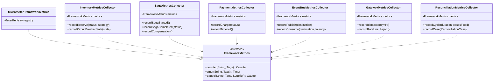

# hcr-observability

> Aggregator metric — gom counter / timer / gauge của mọi module thành 1 facade Micrometer.

---

## 1. Vai trò trong framework

`hcr-observability` cung cấp **`FrameworkMetrics`** — một interface duy nhất để các module khác emit metric, và một implementation Micrometer làm cầu sang Prometheus / Grafana / Datadog. Module này không tự thu thập gì; nó chỉ là **collector point** — các module khác (Inventory / Saga / Payment / EventBus / Gateway / Reconciliation) đẩy metric vào đây.

---

## 2. Tại sao cần module này?

Nếu mỗi module tự gọi Micrometer trực tiếp:

- Tag name không thống nhất (`status` vs `outcome` vs `result`)
- Không thay được backend (đổi từ Micrometer → OpenTelemetry phải sửa cả chục file)
- Test khó — phải mock `MeterRegistry` ở mọi nơi
- Khó audit toàn bộ metric framework đang emit

Module giải quyết bằng:

| Vấn đề | Giải pháp |
|--------|-----------|
| Tag drift giữa module | `*MetricsCollector` — mỗi module 1 collector, naming chuẩn |
| Vendor lock | `FrameworkMetrics` interface; `MicrometerFrameworkMetrics` chỉ là 1 impl |
| Khó audit | 1 chỗ duy nhất biết toàn bộ metric framework có |
| Test khó | Có thể swap fake `FrameworkMetrics` cho test |

---

## 3. Nguyên lý thiết kế

| Nguyên lý | Áp dụng |
|-----------|---------|
| **Facade Pattern** | `FrameworkMetrics` ẩn Micrometer / OpenTelemetry / DataDog phía sau |
| **Per-module Collector** | 1 collector / module — tránh god class |
| **Naming convention** | `hcr_<module>_<metric>_<unit>` — Prometheus standard |
| **Tag standardization** | `status`, `reason`, `resource_id`, `strategy` — chuẩn toàn framework |
| **Lazy registration** | Counter / timer chỉ tạo khi lần đầu emit → không phồng metric registry |
| **No business logic** | Module này không quyết định khi nào "alert" — chỉ emit số; alert là việc của Prometheus rule |

---

## 4. Class diagram

---

## 5. Thành phần chính

| Package | Thành phần | Vai trò |
|---------|-----------|---------|
| `(root)` | `FrameworkMetrics` | Facade interface |
| `micrometer` | `MicrometerFrameworkMetrics` | Default impl bridge sang Micrometer |
| `metrics` | `InventoryMetricsCollector`, `SagaMetricsCollector`, `PaymentMetricsCollector`, `EventBusMetricsCollector`, `GatewayMetricsCollector`, `ReconciliationMetricsCollector` | 1 collector / module |

---

## 6. Metric chuẩn (Prometheus naming)

| Module | Metric | Tag |
|--------|--------|-----|
| Inventory | `hcr_inventory_reserve_total` | `status`, `strategy`, `reason` |
| Inventory | `hcr_inventory_circuit_breaker_state` (gauge) | `resource_id` |
| Saga | `hcr_saga_started_total` | `mode` |
| Saga | `hcr_saga_completed_total` | `status` |
| Saga | `hcr_saga_step_duration_seconds` (timer) | `step` |
| Payment | `hcr_payment_charge_total` | `status`, `gateway` |
| EventBus | `hcr_eventbus_publish_total` | `destination`, `status` |
| EventBus | `hcr_eventbus_consume_duration_seconds` | `destination` |
| Gateway | `hcr_gateway_idempotency_hit_total` | `result` |
| Gateway | `hcr_gateway_rate_limit_reject_total` | — |
| Reconciliation | `hcr_reconciliation_cycle_duration_seconds` | — |
| Reconciliation | `hcr_reconciliation_case_total` | `case` |

---

## 7. Liên kết

- Chi tiết đọc code → [`GUIDE.md`](GUIDE.md)
- Thiết kế tổng → [`../docs/framework_design.md`](../docs/framework_design.md) §9
