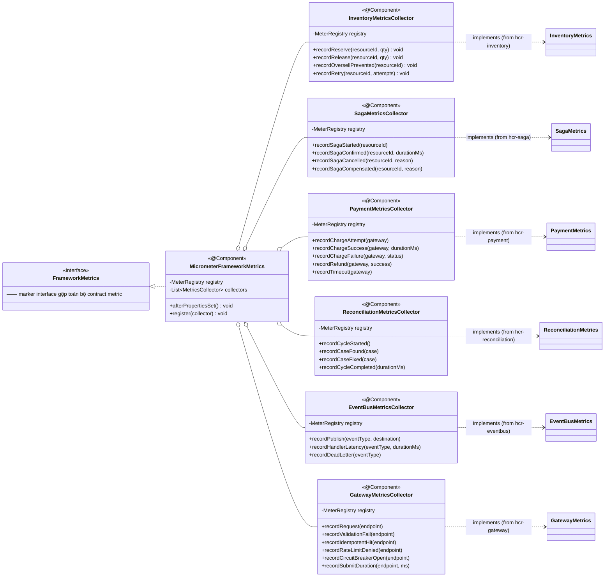
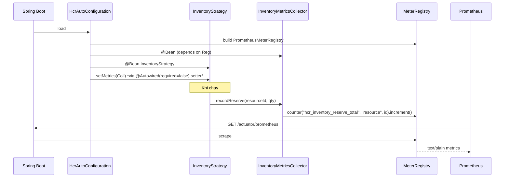

# hcr-observability — Module Architecture

## Module Purpose

Tập trung mọi metrics của framework qua **Micrometer** → expose Prometheus → render Grafana dashboard. Mỗi module nghiệp vụ được "quan sát" bởi một collector tương ứng — collector subscribe vào metric interface (NO-OP default) của module đó và biến thành `Counter`, `Timer`, `Gauge` trên `MeterRegistry`.

Kiến trúc này đảm bảo:

- **Module nghiệp vụ không phụ thuộc Micrometer** — chỉ cần một interface `XxxMetrics` (NO-OP default) trong chính module nghiệp vụ. Khi `hcr-observability` có mặt, autoconfigure inject impl Micrometer vào → metrics được ghi nhận. Khi không có, module vẫn chạy bình thường, không log nhiễu.
- **Per-module collector** giữ logic naming/tag tập trung — đặt cùng convention `hcr_<module>_<metric>`.
- **Pre-built Grafana dashboard** (sample app) đọc đúng tên metric.

Phụ thuộc: `hcr-core`, `hcr-inventory`, `hcr-eventbus`, `hcr-payment`, `hcr-saga`, `hcr-reconciliation` (đọc metric interface từ từng module để bắc cầu Micrometer). Đây là module "sink" cuối cùng — không module khác phụ thuộc ngược lại.

## Class / Structure Diagram (Mermaid Class)



### Wiring sequence



## Capabilities (Provided to Devs)

| Capability | API / Output | Khi dùng |
|---|---|---|
| Auto Prometheus scrape endpoint | `GET /actuator/prometheus` | Spring Boot Actuator + Micrometer Prometheus registry |
| Auto-collected metrics (no code) | xem bảng metric chuẩn dưới đây | Bật `hcr-observability` qua starter là đủ |
| Override 1 collector | declare `@Bean InventoryMetricsCollector myImpl()` | Khi cần custom tag/format riêng |
| Disable observability | exclude `hcr-observability` artifact | Module nghiệp vụ vẫn chạy với `NO_OP` default |
| Pre-built Grafana dashboard | `hcr-sample/dashboards/hcr-overview.json` (nếu có) | Import vào Grafana |

### Bảng metric chuẩn (Prometheus name + labels)

| Module | Metric | Type | Labels |
|---|---|---|---|
| **inventory** | `hcr_inventory_reserve_total` | Counter | `resource`, `strategy` |
| | `hcr_inventory_release_total` | Counter | `resource`, `strategy` |
| | `hcr_inventory_oversell_prevented_total` | Counter | `resource` |
| | `hcr_inventory_retry_attempts` | Histogram | `resource`, `strategy` |
| | `hcr_inventory_available` | Gauge | `resource` |
| **saga** | `hcr_saga_started_total` | Counter | `resource` |
| | `hcr_saga_confirmed_total` | Counter | `resource` |
| | `hcr_saga_cancelled_total` | Counter | `resource`, `reason` |
| | `hcr_saga_compensated_total` | Counter | `resource`, `reason` |
| | `hcr_saga_duration_ms` | Histogram | `resource`, `outcome` |
| **payment** | `hcr_payment_charge_attempts_total` | Counter | `gateway` |
| | `hcr_payment_charge_success_total` | Counter | `gateway` |
| | `hcr_payment_charge_failure_total` | Counter | `gateway`, `status` |
| | `hcr_payment_charge_duration_ms` | Histogram | `gateway` |
| | `hcr_payment_timeout_total` | Counter | `gateway` |
| **reconciliation** | `hcr_reconciliation_cycle_total` | Counter | — |
| | `hcr_reconciliation_case_found_total` | Counter | `case` |
| | `hcr_reconciliation_case_fixed_total` | Counter | `case` |
| | `hcr_reconciliation_cycle_duration_ms` | Histogram | — |
| **eventbus** | `hcr_eventbus_publish_total` | Counter | `event_type`, `destination` |
| | `hcr_eventbus_handler_latency_ms` | Histogram | `event_type` |
| | `hcr_eventbus_dead_letter_total` | Counter | `event_type` |
| **gateway** | `hcr_gateway_request_total` | Counter | `endpoint` |
| | `hcr_gateway_validation_fail_total` | Counter | `endpoint` |
| | `hcr_gateway_idempotent_hit_total` | Counter | `endpoint` |
| | `hcr_gateway_rate_limit_denied_total` | Counter | `endpoint` |
| | `hcr_gateway_cb_open_total` | Counter | `endpoint` |
| | `hcr_gateway_submit_duration_ms` | Histogram | `endpoint`, `outcome` |

### Cấu hình điển hình

```yaml
management:
  endpoints:
    web:
      exposure:
        include: health, info, prometheus
  metrics:
    export:
      prometheus:
        enabled: true
    tags:
      application: ${spring.application.name}
```

## To-Do / Detailed Implementation

| Hạng mục | Trạng thái | Ghi chú |
|---|---|---|
| `MicrometerFrameworkMetrics` | ✅ Implemented | |
| 6 collectors (Inventory/Saga/Payment/Reconciliation/EventBus/Gateway) | ✅ Implemented | |
| Wiring qua `@Autowired(required=false)` setter | ✅ Implemented | Pattern: NO_OP default, override khi bean tồn tại |
| `/actuator/prometheus` endpoint (Spring Boot) | ✅ Available | Cần `management.endpoints.web.exposure.include=prometheus` trong sample |
| Grafana dashboard JSON | ⚠️ Cần verify file tồn tại | Nếu chưa có, **TODO:** ship `dashboards/hcr-overview.json` trong `hcr-sample` |
| Distributed tracing (OpenTelemetry) | ❌ Chưa | `correlationId` đã có nhưng chưa export sang Zipkin/Jaeger. **TODO:** thêm bridge `otel-spring-starter` |
| Structured JSON logging | ❌ Chưa | Log hiện ở pattern mặc định Logback. **TODO:** ship `logback-spring.xml` JSON encoder cho prod |
| Histogram bucket configurable | ⚠️ Partial | Default Micrometer percentiles. **TODO:** doc cách override `management.metrics.distribution.percentiles-histogram` |
| Health indicator framework-wide | ⚠️ Partial | Spring Boot có `/actuator/health` mặc định. **TODO:** custom `HealthIndicator` cho từng dependency (Redis, Kafka, Payment gateway) |
| Alert rules Prometheus | ❌ Chưa | **TODO:** ship `rules/hcr-alerts.yaml` (oversell_prevented_total > 0 trong 5m, saga_cancelled_total tăng đột biến...) |
| Cardinality guard | ⚠️ Partial | Label `resource` có thể grow lớn (10k SKU). **TODO:** doc khuyến cáo enable `tag-filter` hoặc dùng Top-N |
| Sampling cho histogram | ❌ Chưa | High-throughput sẽ làm Prometheus client tốn RAM. **TODO:** option `samplingRate` |
| OpenAPI / SDK metrics export | ❌ Chưa | **TODO:** export schema dạng `/actuator/metrics-schema` để khách hàng tự sinh dashboard |

### Logic chi tiết cần implement / cải thiện

1. **Cardinality control:**
   - Label `resource` quá granular sẽ làm Prometheus storage nổ. Hai chiến lược:
     - **High-cardinality tag bucket:** group resourceId theo prefix (ví dụ `concert:*` thành `concert`).
     - **Top-N exporter:** chỉ export metric cho 100 resourceId có traffic cao nhất, gộp phần còn lại thành `other`.
2. **Tracing propagation chuẩn W3C:**
   - Hiện `correlationId` là custom UUID. Để integrate Zipkin/Jaeger/OTel, cần generate `traceparent` header W3C (`00-<traceId>-<spanId>-<flags>`). `CorrelationIdFilter` cần upgrade.
3. **Wire metric vào async consumer:**
   - `BatchInventoryPersistenceConsumer.flush()` cần record `hcr_inventory_persist_batch_size` (Histogram) để dev biết batch có hiệu quả không.
4. **Grafana dashboard panel chuẩn:**
   - 4 panel cốt lõi: `oversell_prevented` (CRITICAL alert nếu > 0), `saga_p99 latency`, `reconciliation_case_found` per case, `inventory_available` (per top-10 resource).
