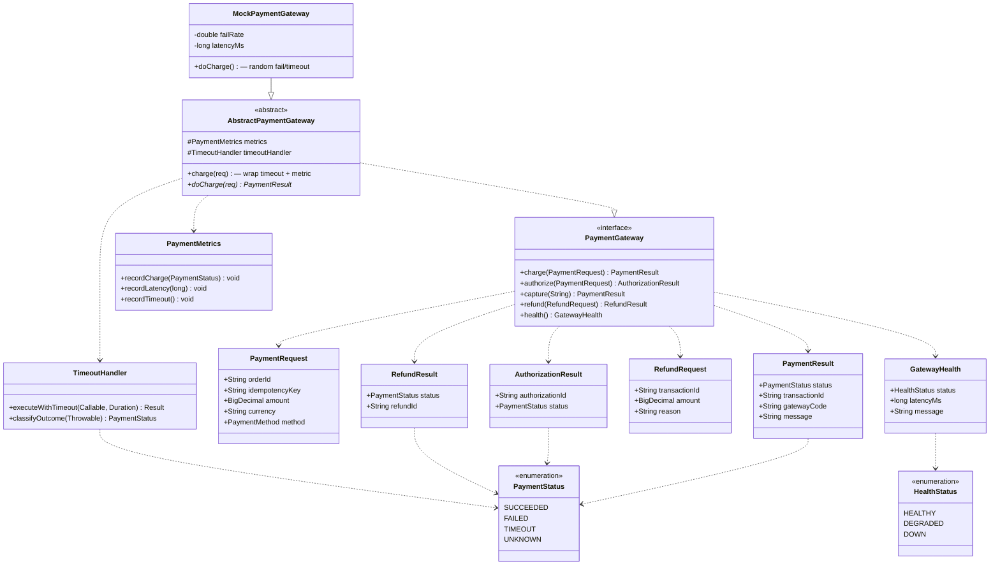

# hcr-payment

> Abstraction cổng thanh toán + timeout handler — chuẩn hoá 3 outcome (succeeded / failed / timeout-unknown).

---

## 1. Vai trò trong framework

`hcr-payment` cung cấp **port** chung để Saga gọi cổng thanh toán bất kỳ (Stripe, VNPay, MoMo, ZaloPay, mock test) mà **không phụ thuộc** vào SDK cụ thể. Module gói luôn xử lý timeout, retry, idempotency của transaction thanh toán — vốn là vùng dễ sai nhất khi gọi external service.

Trong saga, payment là **bước có thể không xác định** (timeout, network drop) — module này chuẩn hoá việc thông báo "không biết" (`PAYMENT_UNKNOWN`) thay vì assume failed.

---

## 2. Tại sao cần module này?

Gọi payment gateway là chỗ dễ "đốt tiền của user" nhất:

| Pitfall | Hậu quả | HCR xử lý |
|---------|---------|-----------|
| Timeout assume = failed | Charge user nhưng đánh dấu failed → trừ kho 2 lần khi retry | `PaymentResult.UNKNOWN` riêng — Reconciliation verify với gateway |
| Mỗi gateway 1 SDK riêng | Saga code rối, đổi gateway = đập đi viết lại | `PaymentGateway` interface + adapter |
| Retry không idempotent | Charge 2 lần | `PaymentRequest.idempotencyKey` truyền xuống gateway |
| Không có circuit breaker → cascade fail | 1 gateway down → toàn hệ thống treo | `AbstractPaymentGateway` quản health + CB |
| Không phân biệt timeout vs failed | Compensate sai (timeout có thể đã succeed) | `PaymentStatus` 4 giá trị: SUCCEEDED / FAILED / TIMEOUT / UNKNOWN |

---

## 3. Nguyên lý thiết kế

| Nguyên lý | Áp dụng |
|-----------|---------|
| **Hexagonal / Ports & Adapters** | `PaymentGateway` (port) — adapter cho mỗi vendor |
| **Template Method** | `AbstractPaymentGateway` — common: timeout, metric, health check; subclass: API call thật |
| **Idempotency** | Bắt buộc truyền `idempotencyKey` xuống gateway (request không idempotent = reject) |
| **Triệt để 3 outcome** | SUCCEEDED / FAILED / **UNKNOWN** — không gộp UNKNOWN vào FAILED |
| **Health check chủ động** | `GatewayHealth` để Saga / CB query trước khi route |
| **Refund pattern** | `RefundRequest` + `RefundResult` cho compensate |

---

## 4. Class diagram

---

## 5. Thành phần chính

| Package | Thành phần | Vai trò |
|---------|-----------|---------|
| `gateway` | `PaymentGateway`, `AbstractPaymentGateway` | Port + template chung |
| `gateway.mock` | `MockPaymentGateway` | Cấu hình fail rate / latency cho test |
| `handler` | `TimeoutHandler` | Phân loại timeout → status đúng (UNKNOWN, không phải FAILED) |
| `model` | `PaymentRequest`, `PaymentResult`, `AuthorizationResult`, `RefundRequest`, `RefundResult`, `PaymentStatus`, `GatewayHealth`, `HealthStatus` | DTO + enum |
| `metrics` | `PaymentMetrics` | Counter cho Micrometer (charge / refund / timeout) |

---

## 6. Quy ước quan trọng

- **Timeout ≠ failed**. Khi `executeWithTimeout` ném `TimeoutException`, `TimeoutHandler` trả `PaymentStatus.UNKNOWN`. Saga compensate phải verify lại với gateway (qua `Reconciliation.verifyPayment()`) trước khi release inventory.
- **`idempotencyKey` bắt buộc** — `PaymentRequest` validate non-null. Gateway adapter phải truyền key này xuống vendor để vendor dedup.
- **CB không bao bọc `refund()`** — refund không thể "open circuit" vì không refund = mất tiền user. Phải retry đến cùng (qua DLQ hoặc thủ công).

---

## 7. Liên kết

- Chi tiết đọc code → [`GUIDE.md`](GUIDE.md)
- Thiết kế tổng → [`../docs/framework_design.md`](../docs/framework_design.md) §5
