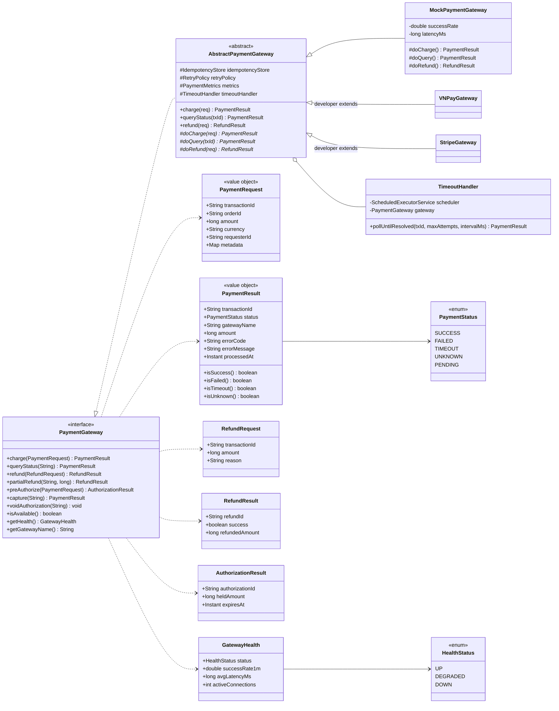
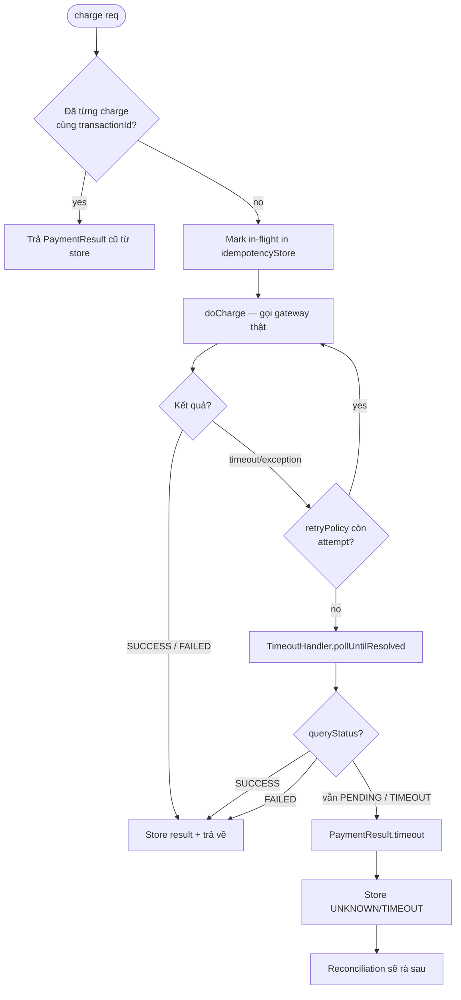

# hcr-payment — Module Architecture

## Module Purpose

Tách Saga / business logic khỏi từng provider thanh toán cụ thể (VNPay, Stripe, MoMo, ZaloPay…). Mục tiêu chính là **xử lý đúng 2 tình huống bất thường khi gọi gateway bên ngoài**:

- **Tình huống A — Gateway crash:** request gửi đi không có response (timeout hẳn). Không biết tiền có bị trừ không.
- **Tình huống B — Lost response:** gateway xử lý thành công nhưng response bị mất giữa đường (network glitch, app restart). Tiền đã trừ nhưng client không biết.

Cả hai đều phải xử lý qua `queryStatus(transactionId)` trên gateway — `TimeoutHandler` lo polling và Reconciliation cũng dùng API này để rà soát muộn.

Module cung cấp:

- **`PaymentGateway` interface** — contract chuẩn (charge, queryStatus, refund, partialRefund, preAuthorize, capture, voidAuthorization, isAvailable, getHealth).
- **`AbstractPaymentGateway`** — base class developer extend, đã wire sẵn idempotency / retry / metrics. Developer chỉ implement `doCharge` / `doQuery` / `doRefund`.
- **`MockPaymentGateway`** — dùng cho test/sample.
- **`TimeoutHandler`** — polling `queryStatus` khi `charge()` timeout.
- **Models bất biến**: `PaymentRequest`, `PaymentResult`, `RefundRequest`, `RefundResult`, `AuthorizationResult`, `PaymentStatus`, `GatewayHealth`, `HealthStatus`.

Phụ thuộc: chỉ `hcr-core`. **KHÔNG** phụ thuộc `hcr-eventbus` — events `PaymentSucceeded/Failed/Timeout/Unknown` được định nghĩa trong `hcr-eventbus` (vì chúng mới cần publish, payment chỉ trả về result đồng bộ).

## Class / Structure Diagram (Mermaid Class)



### Decision flow của `charge()` trong `AbstractPaymentGateway`



## Capabilities (Provided to Devs)

| Capability | API | Khi dùng |
|---|---|---|
| Implement gateway mới | `class VNPayGateway extends AbstractPaymentGateway { doCharge / doQuery / doRefund }` | Tích hợp provider mới — chỉ viết phần gọi HTTP, framework lo idempotency / retry / metrics / timeout |
| Mock cho test | `MockPaymentGateway` (configurable success rate, latency) | Unit test, sample, load test |
| Idempotent charge | `gateway.charge(request)` — `transactionId` là idempotency key | Retry an toàn không bị double charge |
| Query status | `gateway.queryStatus(transactionId)` | Reconciliation case 2 (LATE_PAYMENT_SUCCESS) |
| Pre-authorize / capture | Khách sạn, thuê xe — giữ tiền trước, charge khi check-out | Use case 2-step payment |
| Health check | `gateway.getHealth()` | Trang status, alert khi `successRate1m < 95%` |
| Timeout polling | `TimeoutHandler.pollUntilResolved(txId, n, ms)` | Sau khi `charge()` timeout, framework tự gọi để xác nhận; developer thường không dùng trực tiếp |
| Unified result enum | `PaymentStatus { SUCCESS, FAILED, TIMEOUT, UNKNOWN, PENDING }` | Saga map cùng lúc với `FailureReason` |

### Cấu hình điển hình (`hcr-sample/application.yml`)

```yaml
hcr:
  payment:
    mock-enabled: true
    timeout-ms: 30000
    retry:
      max-attempts: 3
      base-backoff-ms: 500
    timeout-handler:
      poll-attempts: 10
      poll-interval-ms: 2000
```

## To-Do / Detailed Implementation

| Hạng mục | Trạng thái | Ghi chú |
|---|---|---|
| `PaymentGateway` interface (3 nhóm: core, pre-auth, health) | ✅ Implemented | |
| `AbstractPaymentGateway` (idempotency + retry + metrics) | ✅ Implemented | |
| `MockPaymentGateway` | ✅ Implemented | Configurable success-rate / latency |
| `TimeoutHandler` polling | ✅ Implemented | |
| Real gateway impls (VNPay/Stripe/MoMo/Zalo) | ❌ Chưa | Out-of-scope framework — developer tự viết |
| Idempotency store backed by Redis | ⚠️ Cần verify | Nếu hiện tại dùng in-memory map, cross-instance retry sẽ double charge. **TODO:** redis-backed store với TTL ≥ 24h |
| Refund idempotency | ⚠️ Cần verify | `refund()` cũng cần idempotency key (refundId) |
| Pre-authorization expiry | ⚠️ Partial | `AuthorizationResult.expiresAt` có nhưng chưa scheduled job auto-void khi quá hạn |
| Health probe scheduling | ❌ Chưa | `getHealth()` chỉ tính số liệu in-process; **TODO:** background ping endpoint để cập nhật `successRate1m` |
| Webhook callback (gateway gọi ngược về app) | ❌ Chưa | Nhiều gateway dùng webhook thay polling. **TODO:** `WebhookController` chuẩn + signature verifier |
| 3DS / SCA flow | ❌ Chưa | EU/UK PSD2 yêu cầu 3DS — chưa thiết kế |
| Multi-currency rounding | ⚠️ Partial | `PaymentResult.amount` là `long` (chục lẻ tệ). **TODO:** doc rõ unit (cents/đồng) trong từng currency |
| `PartialRefund` semantics | ⚠️ Cần test | Phải đảm bảo tổng refund không vượt amount gốc — gateway thật mới enforce, framework chưa double-check |
| Batch charge | ❌ Chưa | Thường không cần, nhưng cho subscription model có thể cần |

### Logic chi tiết cần implement / cải thiện

1. **`AbstractPaymentGateway` retry + timeout chain:**
   - Thứ tự đúng: `doCharge` → nếu exception/timeout → retry tối đa N lần → vẫn fail → `TimeoutHandler.pollUntilResolved` (vì có thể tiền đã trừ ở lần `doCharge` đầu).
   - PHẢI dùng cùng `transactionId` cho mọi attempt (idempotency cấp gateway thật).
2. **`PaymentResult.UNKNOWN` vs `TIMEOUT`:**
   - `TIMEOUT` = network không trả lời. `UNKNOWN` = `queryStatus` cũng không xác định.
   - Saga sync gặp `TIMEOUT/UNKNOWN` → KHÔNG được auto-cancel order; phải để `PENDING` → reconciliation xử lý case 1/2.
3. **Idempotency store Redis schema:**
   - Key: `payment:idem:{transactionId}` → `{status, amount, processedAt}`. TTL 7 ngày (đủ cho phần lớn dispute window).
4. **`TimeoutHandler` exponential backoff:**
   - Hiện có thể đang fixed interval. Nên dùng `intervalMs * 2^attempt` (cap 30s) để không hammer gateway lúc nó đang phục hồi.
