# HCR Product — Kiến trúc hệ thống Concert Ticket Booking

> Sơ đồ kiến trúc tổng thể `hcr-product`, dùng làm `Hình \ref{fig:sut_architecture}`
> trong báo cáo. Mô tả chi tiết từng prototype: `prototype-flows.md`.

---

## 1. Sơ đồ tổng quát — 3 microservice + hạ tầng dùng chung

```mermaid
flowchart TB
    Client(("Client<br/>k6 / curl"))

    subgraph app["VM hcr-app — 3 microservice JVM"]
      direction TB
      MO["<b>ms-order</b> :8081<br/>━━━━━━━━━━━━━━<br/>• HTTP entry POST /orders<br/>• Idempotency claim (Redis SETNX)<br/>• Saga orchestrator (sync P1/P2, async P3)<br/>• Reconciliation: order kẹt + late payment<br/>• AutoChargeInitiation pool (P3)"]
      MI["<b>ms-inventory</b> :8082<br/>━━━━━━━━━━━━━━<br/>• Seed Redis ban đầu (cả 3 prototype)<br/>• Persistence consumer P3: Redis → DB<br/>• Reconciliation Redis ↔ inventory_db (P3)"]
      MP["<b>ms-payment</b> :8083<br/>━━━━━━━━━━━━━━<br/>• POST /payments — charge<br/>• GET /payments/&#123;orderId&#125; — queryStatus<br/>• Mock gateway (cấu hình tỉ lệ fail)<br/>• Idempotent theo orderId (payment_attempts)"]
    end

    subgraph data["VM hcr-data — hạ tầng dùng chung"]
      direction TB
      PG[("PostgreSQL 15<br/>order_db &#124; inventory_db &#124; payment_db")]
      RD[("Redis 7<br/>idempotency claim (P1/P2/P3)<br/>tồn kho hcr:inventory:* (P3)")]
      KF{{"Kafka (KRaft)<br/>ResourceReserved / ResourceReleased<br/>(chỉ P3)"}}
    end

    Client       -- "POST /orders" -->                                    MO
    MO       -. "① SETNX idempotency claim" .->                           RD
    MO -- "② P1/P2 reserve&#10;SELECT FOR UPDATE / @Version&#10;order_db.concert_tickets" --> PG
    MO -- "② P3 reserve&#10;Lua DECRBY hcr:inventory:&#123;id&#125;" -->  RD
    MO -- "③ charge HTTP POST /payments&#10;P1/P2: request thread (blocking)&#10;P3: background pool (auto-charge-N)" --> MP
    MP -- "payment_attempts" -->                                          PG
    MO -. "queryStatus (reconciliation)" .->                              MP
    MO -. "publish ResourceReservedEvent (P3)" .->                        KF
    KF -. "consume (P3)" .->                                              MI
    MI -. "sync inventory_db (P3, eventual ≤5min)" .->                    PG
    MI <-. "reconcile Redis ↔ DB (P3)" .->                                RD

    classDef svc fill:#E3F2FD,stroke:#1565C0,stroke-width:2px,color:#0D47A1
    classDef inv fill:#FFF3E0,stroke:#E65100,stroke-width:2px,color:#BF360C
    classDef pay fill:#F3E5F5,stroke:#6A1B9A,stroke-width:2px,color:#4A148C
    classDef db  fill:#E8F5E9,stroke:#2E7D32,stroke-width:2px,color:#1B5E20
    classDef rd  fill:#FFEBEE,stroke:#C62828,stroke-width:2px,color:#B71C1C
    classDef kf  fill:#FFFDE7,stroke:#F9A825,stroke-width:2px,color:#F57F17
    class MO svc
    class MI inv
    class MP pay
    class PG db
    class RD rd
    class KF kf
```



### Quy ước cạnh

| Kiểu | Ý nghĩa |
|------|---------|
| `———▶` nét liền | HTTP đồng bộ trong critical path |
| `- - -▶` nét đứt | bất đồng bộ / reconciliation / side concern (không nằm trên đường trả response) |

### Quy ước màu

- **Xanh dương** — `ms-order` (HTTP entry + orchestration)
- **Cam** — `ms-inventory` (persistence consumer, P3)
- **Tím** — `ms-payment` (gateway facade)
- **Xanh lá** — PostgreSQL
- **Đỏ** — Redis
- **Vàng** — Kafka

---

## 2. Đường đi của từng prototype (đọc kèm sơ đồ)

### P1 — Pessimistic Lock (saga đồng bộ)

```
Client → ms-order ① Redis (claim)
                ② PostgreSQL: SELECT FOR UPDATE order_db.concert_tickets
                ③ ms-payment HTTP POST /payments (request thread, blocking)
                → HTTP 201 CONFIRMED
```

Không sử dụng Kafka, không sử dụng Redis ngoài idempotency claim. `ms-inventory`
chỉ làm vai trò seed dữ liệu ban đầu.

### P2 — Optimistic Lock (saga đồng bộ)

Giống P1 về tô-pô, chỉ khác bước ②: dùng `@Version` + retry trong transaction mới
mỗi vòng thay vì khoá bi quan.

```
Client → ms-order ① Redis (claim)
                ② PostgreSQL: UPDATE ... WHERE version=v (retry nếu conflict)
                ③ ms-payment HTTP POST /payments
                → HTTP 201 CONFIRMED
```

### P3 — Redis Atomic (saga bất đồng bộ)

```
[Critical path — request thread]
Client → ms-order ① Redis (claim)
                ② Redis: Lua DECRBY hcr:inventory:{id}    ◀── source of truth
                ③ Kafka publish ResourceReservedEvent
                ④ submit task vào background pool
                → HTTP 202 RESERVED  (trả ngay)

[Payment path — background pool auto-charge-N]
auto-charge → ms-payment HTTP POST /payments
            → ms-order.handlePaymentResult()
               SUCCESS → order CONFIRMED, ghi order_db lần đầu
               FAILED  → compensate Redis INCRBY → CANCELLED

[DB sync path — bất đồng bộ, eventual ≤5 phút]
Kafka → ms-inventory persistence consumer
      → UPDATE inventory_db.concert_tickets
```

P3 là prototype duy nhất sử dụng Kafka và là prototype duy nhất biến Redis thành
source of truth cho tồn kho. `inventory_db` chỉ là bản sao đồng bộ chậm phục vụ
truy vấn / báo cáo, không tham gia vào quyết định reserve.

---

## 3. Ranh giới reconciliation

| Loại | Chạy ở | Mục đích |
|------|--------|----------|
| Order kẹt / Late payment | `ms-order` | Quét order `RESERVED`/`PENDING` quá `expiresAt`, hỏi `ms-payment.queryStatus()`, kết luận CONFIRMED hay CANCELLED |
| Inventory mismatch (P3) | `ms-inventory` | So sánh `Redis.hcr:inventory:*` với `inventory_db.concert_tickets`, alert nếu lệch quá ngưỡng |

Hai luồng reconciliation độc lập nhau, đều dùng distributed lock Redisson để đảm
bảo chỉ một instance chạy tại một thời điểm.

---

## 4. Bảng phân bố lưu trữ theo prototype

| Dữ liệu | Vị trí | Truy cập bởi | Áp dụng cho |
|---------|--------|--------------|-------------|
| Idempotency claim (`hcr:idempotency:{key}`) | Redis | `ms-order` | P1, P2, P3 |
| Tồn kho thực (`concert_tickets.available_quantity`) | `order_db` PostgreSQL | `ms-order` | P1, P2 |
| Tồn kho thực (`hcr:inventory:{resourceId}`) | Redis | `ms-order` (reserve), `ms-inventory` (sync) | P3 |
| Tồn kho bản sao | `inventory_db.concert_tickets` PostgreSQL | `ms-inventory` (writer) | P3 (chỉ để tham chiếu) |
| Đơn hàng (`ticket_orders`) | `order_db` PostgreSQL | `ms-order` | P1, P2, P3 |
| Lịch sử thanh toán (`payment_attempts`) | `payment_db` PostgreSQL | `ms-payment` | P1, P2, P3 |
| Sự kiện reserve/release | Kafka topic `hcr.resource-*` | publisher `ms-order`, consumer `ms-inventory` | Chỉ P3 |

---

## 5. Ghi chú dùng cho phần "Kiến trúc hệ thống" trong báo cáo

- Hình `architecture.md` này được dùng làm minh hoạ cho mục mở đầu Chương 4.
  Khi đưa vào LaTeX, có thể render mermaid sang PNG/SVG (ví dụ:
  `mmdc -i architecture.md -o architecture.svg`) hoặc vẽ lại bằng TikZ
  để khớp font typeface báo cáo.
- Cùng một mã nguồn `hcr-product` được chạy cho cả ba prototype; việc chuyển
  đổi chỉ qua thuộc tính cấu hình `hcr.product.active-prototype`. Nhờ đó các
  phép so sánh hiệu năng được thực hiện trên nền hạ tầng và tham số JVM/HikariCP
  đồng nhất, chỉ khác biệt ở thuật toán reserve và mô hình saga.
- Các phần phụ thuộc bên ngoài đều được container hoá (PostgreSQL, Redis,
  Kafka), chạy trên một VM dùng chung (`hcr-data`) để loại trừ ảnh hưởng
  network giữa các thành phần hạ tầng.
