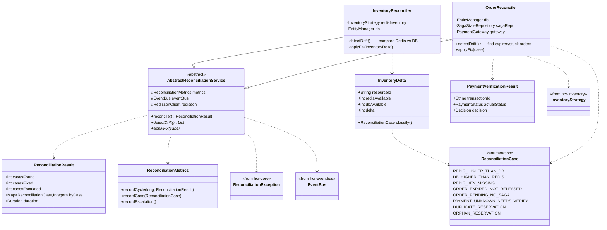

# hcr-reconciliation

> Drift detection + auto-fix giữa Redis và Postgres, cleanup order treo.

---

## 1. Vai trò trong framework

`hcr-reconciliation` là **safety net** chạy nền — tuần hoàn so sánh trạng thái giữa các source và sửa drift. Đây là module bù lại cho **trade-off eventual consistency của P3** và mọi crash window khác trong hệ thống bất đồng bộ.

Hai loại reconciliation:

1. **Inventory** — Redis vs Postgres `available_quantity` lệch → sync lại
2. **Order** — order RESERVED quá `expiresAt` → cancel + release inventory; order PENDING không có saga state → resume hoặc cleanup

Cam kết SLA: **drift fix ≤ 5 phút** (cycle interval mặc định 60s).

---

## 2. Tại sao cần module này?

Async system có nhiều "crash window" mà framework không thể atomic 100%:

| Crash window | Hậu quả nếu không fix | HCR fix qua |
|--------------|----------------------|-------------|
| Redis `DECRBY` thành công nhưng `EventBus.publish()` fail | Slot mất, không bao giờ persist xuống DB | `InventoryReconciler` so sánh Redis vs DB |
| Batch persistence ACK trước flush, crash giữa | Data loss tại DB nhưng Redis đã trừ | `InventoryReconciler` |
| Order RESERVED nhưng payment timeout không phản hồi | Order kẹt PENDING, slot không release | `OrderReconciler` cancel khi expired |
| Saga crash giữa reserve và publish | Order PENDING, không có event | `OrderReconciler` quét pending + verify |
| Payment gateway trả UNKNOWN | Không biết succeed hay fail | `verifyPayment()` query lại gateway |

Không có reconciliation, framework chỉ "đa số đúng". Có reconciliation, framework cam kết **eventually consistent ≤ 5 phút**.

---

## 3. Nguyên lý thiết kế

| Nguyên lý | Áp dụng |
|-----------|---------|
| **Template Method** | `AbstractReconciliationService` — schedule + lock + metric; subclass điền compare + fix |
| **Compare-then-Fix** | Đọc snapshot 2 nguồn, tính delta, fix theo policy (Redis là truth cho available, DB là truth cho metadata) |
| **Distributed Lock** | Chỉ 1 instance chạy reconciliation tại 1 thời điểm (Redisson lock) |
| **Idempotent Fix** | Mỗi cycle có thể chạy lại an toàn — fix đã apply không gây ảnh hưởng |
| **Bounded SLA** | `hcr.reconciliation.interval=60s` — dev biết drift max là 60s |
| **Case classification** | `ReconciliationCase` enum chuẩn hoá 8 case có thể gặp → metric chia theo case |
| **Manual escalation** | Drift quá ngưỡng → throw `ReconciliationException` → trigger alert, không tự fix |
| **Event publish** | `ReconciliationStartedEvent`, `Fixed`, `InventoryMismatchEvent` để observability |

---

## 4. Class diagram

---

## 5. Thành phần chính

| Package | Thành phần | Vai trò |
|---------|-----------|---------|
| `(root)` | `AbstractReconciliationService`, `ReconciliationCase`, `ReconciliationMetrics` | Base + enum case + metric |
| `inventory` | `InventoryReconciler` | So sánh Redis vs DB |
| `order` | `OrderReconciler` | Cleanup expired / stuck order |
| `model` | `InventoryDelta`, `PaymentVerificationResult`, `ReconciliationResult` | DTO |

---

## 6. Policy fix

| Case | Source of truth | Fix |
|------|----------------|-----|
| Redis_avail > DB_avail | Redis (đang serve traffic) | UPDATE DB available = Redis |
| DB_avail > Redis_avail (lệch nhỏ) | Redis | UPDATE DB available = Redis (slot đã reserved nhưng event chưa flush) |
| DB_avail >> Redis_avail (lệch > threshold) | **Manual** | Throw `ReconciliationException`, alert ops |
| Redis key missing | DB | Re-seed Redis từ DB available |
| Order expired không release | — | Transition CANCELLED + `inventory.release()` |
| Order PENDING không saga state | DB | Cancel + cleanup |
| Payment UNKNOWN | Gateway | `verifyPayment()` → SUCCEED → confirm; FAIL → compensate |

---

## 7. Liên kết

- Chi tiết đọc code → [`GUIDE.md`](GUIDE.md)
- Thiết kế tổng → [`../docs/framework_design.md`](../docs/framework_design.md) §8
