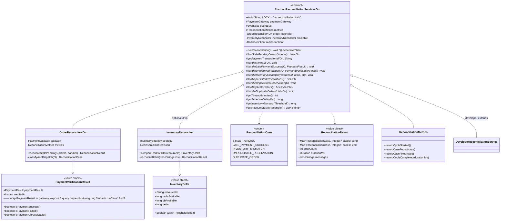
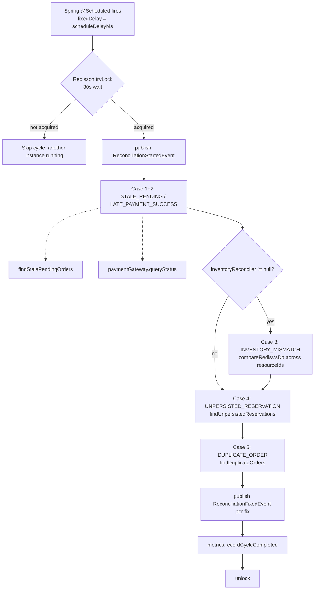
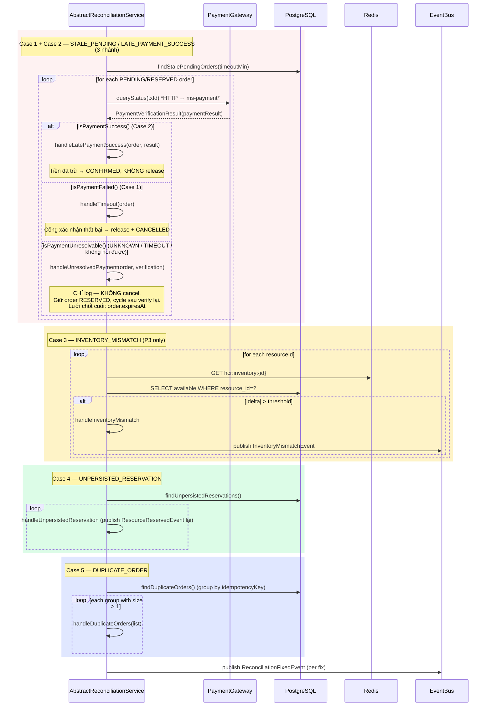

# hcr-reconciliation — Module Architecture

## Module Purpose

**Safety net** của framework — chạy ngầm theo lịch (`@Scheduled`) để phát hiện và sửa chữa 5 loại inconsistency mà critical path có thể bỏ sót.

**Nguyên tắc cốt lõi:** reconciliation **gọi `paymentGateway.queryStatus()`** (HTTP sang ms-payment / cổng thanh toán thật) để xác định trạng thái payment — KHÔNG đọc DB local. Lý do: DB chỉ là audit log của ms-payment, cổng thanh toán mới là source of truth thực sự (Tình huống B: tiền đã trừ thật nhưng response mất → DB ghi FAILED nhưng gateway có SUCCESS record).


| # | Case | Mô tả | Áp dụng cho |
|---|---|---|---|
| 1 | **STALE_PENDING** | Order ở `PENDING` quá `getTimeoutMinutes()` (gateway không phản hồi hoặc consumer chậm) | All |
| 2 | **LATE_PAYMENT_SUCCESS** | Tiền đã trừ nhưng order bị cancel nhầm do timeout — phải refund hoặc unconfirm | All |
| 3 | **INVENTORY_MISMATCH** | Redis available ≠ DB available — Redis crash recovery, batch consumer mất data | **P3 only** |
| 4 | **UNPERSISTED_RESERVATION** | Order CONFIRMED nhưng DB inventory chưa giảm (event mất giữa Redis DECR và publish) | **P3 only** |
| 5 | **DUPLICATE_ORDER** | Hai+ order có cùng `idempotencyKey` (race rất hiếm) | All |

`AbstractReconciliationService<O>` là Template Method — `runReconciliation()` là `@Scheduled` final, developer implement các method abstract để cung cấp DB query cụ thể (vì framework không biết schema của developer).

Chỉ **1 instance được làm việc tại một thời điểm** nhờ Redisson distributed lock `hcr:reconciliation:lock`.

Phụ thuộc: `hcr-core`, `hcr-inventory`, `hcr-payment`, `hcr-eventbus` (publish `ReconciliationStartedEvent`, `ReconciliationFixedEvent`, `InventoryMismatchEvent`).

## Class / Structure Diagram (Mermaid Class)



### `runReconciliation()` flow



### 5 case → handler mapping



## Capabilities (Provided to Devs)

| Capability | API | Khi dùng |
|---|---|---|
| Implement reconciliation service của project | `class TicketReconciliation extends AbstractReconciliationService<TicketOrder>` | Sample app |
| Auto schedule | `@Scheduled(fixedDelayString = "${hcr.reconciliation.schedule-delay-ms:300000}")` đã có sẵn trên `runReconciliation()` | Không cần tự đặt cron |
| Distributed lock | `Redisson` lock — tự động trong framework | Deploy nhiều instance không cần config thêm |
| 5 case detection | `OrderReconciler` + `InventoryReconciler` | Developer chỉ cần cung cấp query (find + handle methods) |
| **3-nhánh** quyết định Case 1+2 | abstract `handleUnresolvedPayment(O, PaymentVerificationResult)` | Product quyết định policy khi cổng thanh toán trả UNKNOWN/TIMEOUT — skip (default), alert, hoặc force-cancel sau N cycle |
| Tuỳ chỉnh interval | `getScheduleDelayMs()` override hoặc property `hcr.reconciliation.schedule-delay-ms` | Default 5 phút |
| Tuỳ chỉnh threshold mismatch | `getInventoryMismatchThreshold()` (default 0 = alert only) | Tránh false positive trong khi async sync đang catching up |
| Skip Case 3 (P1/P2) | Truyền `inventoryReconciler = null` cho constructor | DB là source-of-truth duy nhất |
| Resource list cho Case 3 | `getResourceIdsToReconcile()` — bắt buộc override khi P3 | Nếu trả empty list → skip Case 3 |
| Metrics | `ReconciliationMetrics` ghi `casesFound/casesFixed/duration` per cycle | Grafana dashboard `hcr_reconciliation_*` |
| Event hooks | Subscribe `ReconciliationStartedEvent`, `ReconciliationFixedEvent`, `InventoryMismatchEvent` | Alerting, audit log |

### Cấu hình điển hình

```yaml
hcr:
  reconciliation:
    enabled: true
    schedule-delay-ms: 300000           # 5 phút
    timeout-minutes: 5                  # PENDING quá 5 phút → STALE
    inventory-mismatch:
      threshold: 0                      # 0 = alert only
      auto-fix: false
    distributed-lock:
      lease-seconds: 60
      wait-seconds: 30
```

## To-Do / Detailed Implementation

| Hạng mục | Trạng thái | Ghi chú |
|---|---|---|
| `AbstractReconciliationService` template + `@Scheduled` | ✅ Implemented | |
| Redisson distributed lock | ✅ Implemented | |
| `OrderReconciler` (Case 1+2) | ✅ Implemented | Query `paymentGateway.queryStatus()` (HTTP sang ms-payment), không đọc DB |
| **3-nhánh decision trong `runCase1And2`** | ✅ Implemented | SUCCESS → confirm, FAILED → cancel, **UNRESOLVED → `handleUnresolvedPayment` (abstract)** — bỏ behavior cũ "huỷ oan order chỉ đang chậm" |
| `PaymentVerificationResult` với `isPaymentSuccess/Failed/Unresolvable` | ✅ Implemented | Wrap `PaymentResult` từ gateway, expose 3 helper phân loại |
| `InventoryReconciler` (Case 3) | ✅ Implemented | Optional, null khi P1/P2 |
| Case 4 / Case 5 abstract hooks | ✅ Implemented | |
| `ReconciliationMetrics` | ✅ Implemented | |
| Publish `ReconciliationFixedEvent` per fix | ✅ Implemented | |
| Auto resourceIds discovery | ❌ Chưa | Hiện developer phải override `getResourceIdsToReconcile()`. **TODO:** scan `AbstractInventoryEntity` table tự động |
| Pagination cho `findStalePendingOrders` | ⚠️ Cần verify | Nếu có 100k order PENDING (sự cố lớn), một query không giới hạn sẽ OOM. **TODO:** chunked query (LIMIT 1000) |
| Backoff khi gateway down | ⚠️ Partial | Khi `paymentGateway.queryStatus()` throw, hiện cycle break. **TODO:** circuit breaker cho gateway calls + skip Case 1+2 nếu gateway DOWN |
| Auto-fix Case 3 (đẩy Redis về đồng bộ DB) | ⚠️ Partial | Hiện default chỉ alert. Cần policy rõ: ưu tiên Redis (P3 source of truth) hay DB? Doc đang nghiêng về Redis. **TODO:** flag `inventory-mismatch.direction: redis-to-db | db-to-redis` |
| DLQ replay job | ❌ Chưa | Khi consumer fail event quá retry, event vào DLQ. **TODO:** scheduled job đọc DLQ → re-publish |
| Reconciliation history | ❌ Chưa | Lưu lịch sử cycle vào DB `hcr_reconciliation_runs` để audit |
| Manual trigger API | ❌ Chưa | Admin endpoint `/admin/reconcile/run` để chạy ngay không chờ schedule |

### Logic chi tiết cần implement

1. **Distributed lock fairness:**
   - Hiện dùng `tryLock(waitTime, leaseTime, TimeUnit)`. Khi instance nào đó bị "đói" (luôn miss lock), không ai phát hiện. **TODO:** alert nếu một instance không acquire trong N cycle liên tiếp (có thể clock skew).
2. **Case 4 logic chi tiết:**
   - "Unpersisted reservation" = order trong DB ở trạng thái CONFIRMED nhưng `concert_tickets.available` chưa giảm tương ứng (vì `ResourceReservedEvent` mất).
   - Cách phát hiện: query `WHERE EXISTS (SELECT 1 FROM orders WHERE order.confirmed_at < NOW - 1m AND NOT EXISTS (SELECT 1 FROM processed_events WHERE event_id = order.reservation_event_id))`.
   - Cách fix: re-publish `ResourceReservedEvent` với cùng `eventId` → consumer dedup không double-decrement.
3. **Case 5 (DUPLICATE_ORDER) policy:**
   - Khi tìm được nhiều order cùng `idempotencyKey`, KHÔNG được tự ý cancel ngẫu nhiên. Chính sách: **giữ order CONFIRMED, cancel + refund các order còn lại**. Nếu cả nhiều cùng CONFIRMED → manual intervention (alert + ghi vào audit log).
4. **Threshold cho `INVENTORY_MISMATCH`:**
   - Default 0 quá nghiêm trọng nếu batch consumer flush lag. **TODO:** dynamic threshold = max(10, 1% of total).
