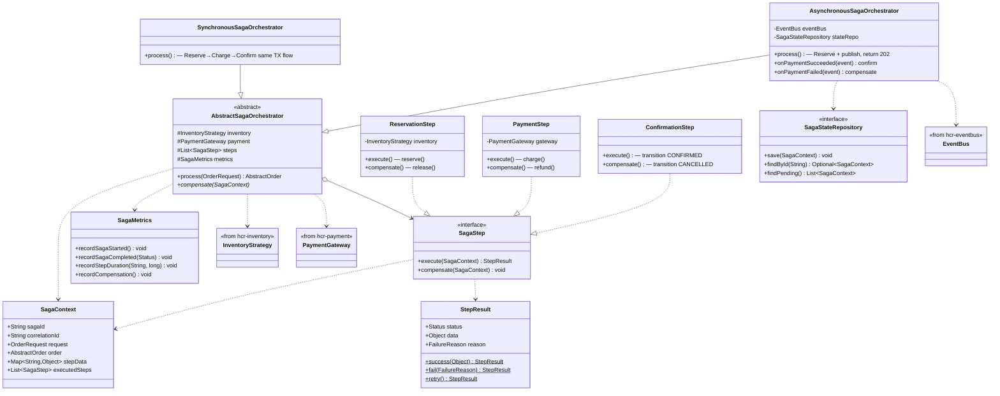

# hcr-saga

> Saga orchestration — điều phối Reserve → Payment → Confirm với compensate khi fail. 2 mode: sync (P1/P2) và async (P3).

---

## 1. Vai trò trong framework

`hcr-saga` là **bộ điều phối nghiệp vụ** — nối Inventory + Payment + EventBus thành 1 saga có khả năng compensate. Khi payment fail, orchestrator tự gọi `release()` trên inventory để hoàn slot. Khi reserve fail, orchestrator dừng saga ngay, không tốn payment call.

Module cung cấp 2 implementation cho cùng 1 abstract base:

- **Sync** (P1/P2): Reserve → Charge → Confirm — tất cả trong 1 HTTP request, trả 201/422
- **Async** (P3): Reserve → publish event → trả 202; Payment + Confirm xử lý qua EventBus consumer

---

## 2. Tại sao cần module này?

Saga là chỗ business logic dễ rò rỉ ra khắp codebase nếu không đóng gói:

| Pitfall | Hậu quả | HCR xử lý |
|---------|---------|-----------|
| Compensate gọi sai thứ tự (release trước rollback DB) | Inventory leak hoặc oversell | `AbstractSagaOrchestrator` định khung compensate ngược chiều forward |
| Reserve thành công nhưng publish event fail | Slot mất, payment không kích hoạt | `SagaContext` log từng step → Reconciliation phát hiện |
| Async saga không có state → không retry được | Order mãi PENDING | `SagaStateRepository` (bắt buộc với async) |
| Sync saga giữ DB connection xuyên suốt charge() | Connection pool cạn | Saga tách Reserve và Payment thành 2 TX riêng |
| Mỗi step viết tự do → khó test | Test fragile | Template Method: `SagaStep` interface + `StepResult` |
| HTTP success count != commits trong async | Test đo sai zero-oversell | Documented invariant ở storage layer, không HTTP layer |

---

## 3. Nguyên lý thiết kế

| Nguyên lý | Áp dụng |
|-----------|---------|
| **Template Method** | `AbstractSagaOrchestrator` định khung 4 bước; subclass chọn sync/async |
| **Strategy Pattern** | Saga step plug-in (`ReservationStep`, `PaymentStep`, `ConfirmationStep`) |
| **Result Object** | `StepResult` phân biệt SUCCESS / RETRY / FAIL / SKIP |
| **Compensate ngược chiều forward** | Forward stack: reserve → charge → confirm; compensate stack: refund → release |
| **Saga state persistence (async)** | `SagaStateRepository` bắt buộc với async để recover sau crash |
| **Fail Fast khi config sai** | Async mode mà thiếu `SagaStateRepository` bean → throw lúc startup |
| **Separation of TX** | Reserve và Payment là 2 transaction riêng — không lock DB suốt charge() |
| **Correlation tracing** | `SagaContext` chứa `correlationId` propagate qua mọi event |

---

## 4. Class diagram



---

## 5. Thành phần chính

| Package | Thành phần | Vai trò |
|---------|-----------|---------|
| `orchestrator` | `AbstractSagaOrchestrator` | Template chung 4 bước |
| `orchestrator.sync` | `SynchronousSagaOrchestrator` | P1/P2 — Reserve→Charge→Confirm trong 1 request |
| `orchestrator.async` | `AsynchronousSagaOrchestrator` | P3 — Reserve sync, Payment+Confirm async qua EventBus |
| `step` | `SagaStep`, `ReservationStep`, `PaymentStep`, `ConfirmationStep`, `StepResult` | Step plug-in |
| `context` | `SagaContext` | Trạng thái 1 saga instance |
| `repository` | `SagaStateRepository` | Persist context (bắt buộc với async) |
| `metrics` | `SagaMetrics` | Counter / timer cho Micrometer |

---

## 6. Sync vs Async — chọn khi nào

| Tiêu chí | Sync (P1/P2) | Async (P3) |
|----------|:-:|:-:|
| HTTP response | 201 CREATED / 422 | 202 ACCEPTED — payment chạy sau |
| Latency end-to-end | Cao (chờ payment) | Thấp (trả về sau reserve) |
| Throughput | Trung bình | Cao |
| Cần `SagaStateRepository`? | Không | **Có** (recover crash) |
| User UX | Biết kết quả ngay | Cần polling / webhook |
| Phù hợp với | Web checkout truyền thống | Mobile spike, flash sale |

---

## 7. Invariant zero-oversell trong async saga

Trong async với compensate cycle, **HTTP 202 count CÓ THỂ > capacity** mà vẫn không oversell:

```
500 reserve thành công → DECRBY → Redis = 0 → 500 HTTP 202
N payment fail → release → INCRBY → Redis += N
N request mới DECRBY trúng slot vừa release → +N HTTP 202
Tổng HTTP 202 = 500 + N
```

Verify zero-oversell **phải** ở storage layer:

```
DB:    CONFIRMED + RESERVED ≤ total
Redis: CONFIRMED_count + Redis_available = total
```

Đừng dùng "HTTP success count ≤ capacity" làm invariant.

---

## 8. Compensation / Rollback flow

Khi bất kỳ step nào fail, framework chạy compensate **theo thứ tự ngược** với forward execution. Quy trình rollback **không chỉ dựa vào số vé tồn (`available`) và tổng số vé (`total`)** — đó chỉ là 2 trong 5 nguồn dữ liệu mà framework phối hợp để đảm bảo idempotent + không lệch.

### 5 lớp dữ liệu cần đồng bộ khi rollback

| # | Lớp | Vai trò khi rollback |
|---|-----|---------------------|
| L1 | `available` + `total` (Redis cho P3, DB cho P1/P2) | Nguồn cấp số liệu cần `release()` cộng trả lại bao nhiêu |
| L2 | `SagaContext.completedSteps` (in-memory) | Quyết định step NÀO cần compensate, theo thứ tự ngược (refund → release) |
| L3 | `SagaStateRepository` (async only) | Persist `SagaContext` để recover sau crash giữa Reserve và Payment |
| L4 | **Bảng log `hcr_processed_events` trong DB** | Idempotency anchor — chống double-release ở DB consumer khi `ResourceReleasedEvent` bị redeliver (at-least-once) |
| L5 | Order entity status + `failure_reason` | State machine `RESERVED → COMPENSATING → CANCELLED` + audit lý do |

### Vai trò cụ thể của bảng log `hcr_processed_events`

Khi compensate gọi `release()` ở P3, framework publish `ResourceReleasedEvent` lên EventBus. `InventoryPersistenceConsumer` xử lý event này trong **1 transaction duy nhất**:

```
BEGIN TX
  INSERT INTO hcr_processed_events (event_id, event_type, processed_at)
    → Nếu duplicate key (event redeliver) → DataIntegrityViolationException
       → ROLLBACK toàn bộ TX, KHÔNG UPDATE inventory → ACK ngay (idempotent skip)
  UPDATE inventory SET available = available + qty WHERE resource_id = ?
COMMIT
```

→ Cùng 1 `eventId` không thể UPDATE inventory 2 lần dù bus redeliver bao nhiêu lần. Đây là điểm thiết kế quan trọng: **`available + qty` là phép toán không idempotent (cộng 2 lần → lệch +qty)**, nên KHÔNG thể chỉ dựa vào tồn kho. Phải có log eventId trong DB làm "đã xử lý hay chưa".

Tương tự, ở Redis layer, Lua script `inventory_release.lua` có guard `newAvailable > total → SET = total` để chống double-INCRBY trên Redis (nếu Saga retry release).

### Tại sao chỉ tồn kho không đủ?

| Câu hỏi | Tồn kho có trả lời được? | Cần dữ liệu gì |
|---------|--------------------------|----------------|
| "Order này đã reserve thành công chưa?" | KHÔNG | `SagaContext.completedSteps` có `"reservation"` |
| "Đã release chưa hay event đang lag?" | KHÔNG | `hcr_processed_events` có `eventId` của ResourceReleasedEvent |
| "Đã refund tiền chưa?" | KHÔNG | `SagaContext.paymentResult` + log `PaymentResult.SUCCESS` |
| "Có đang giữa chừng saga không?" (async) | KHÔNG | `SagaStateRepository.findByOrderId(orderId)` |
| "Cộng lại bao nhiêu?" | CÓ (qty từ order) | — |

Tồn kho chỉ trả lời được câu hỏi cuối. 4 câu trên đều cần các bảng log/state riêng → đó là lý do framework có 5 lớp.

### Failure modes — và lớp nào bắt được

| Tình huống | Lớp phát hiện | Cách fix |
|-----------|---------------|----------|
| Refund gateway down | L2 (compensate log + continue) | Reconciliation refund retry |
| `ResourceReleasedEvent` redeliver | **L4 (`hcr_processed_events` duplicate key)** | Skip + ACK |
| Saga crash giữa Reserve và Payment (async) | L3 (SagaStateRepository còn entry) | Recover qua `findByOrderId`, retry payment hoặc compensate |
| Lua release gọi 2 lần | L1 (guard `≤ total` trong script) | Cap về total |
| Order đã CONFIRMED rồi nhận PaymentFailedEvent muộn | L5 (state machine reject transition CONFIRMED → CANCELLED) | Reconciliation `LATE_PAYMENT_SUCCESS` |
| Crash sau Redis release, trước publish event | L4 + Reconciliation `INVENTORY_MISMATCH` | Auto-fix Redis = DB |

### Mapping với invariant zero-oversell

```
P3 invariant: CONFIRMED_count_DB + Redis_available = total

Compensate phải duy trì:
  ΔCONFIRMED_count_DB = 0   ← L5 đảm bảo (state machine không cho phục sinh CONFIRMED)
  ΔRedis_available    = 0   ← L1 + L2 đảm bảo (release đúng qty của reservation đã success)
  ΔDB_available       = 0   ← L4 đảm bảo (consumer apply đúng 1 lần dù event redeliver)
```

Bỏ L4 → DB có thể bị `+qty` 2 lần → ΔDB_available > 0 → vỡ invariant. Đó là lý do `hcr_processed_events` là **bắt buộc** trong P3 chứ không phải tùy chọn.

→ Chi tiết đầy đủ (sequence diagram sync/async, full failure matrix, mapping invariant): xem [`architecture.md` §"Compensation / Rollback Flow"](architecture.md#compensation--rollback-flow).

---

## 9. Liên kết

- Chi tiết đọc code → [`GUIDE.md`](GUIDE.md)
- Thiết kế tổng → [`../docs/framework_design.md`](../docs/framework_design.md) §4
- Bảng `hcr_processed_events` → [`hcr-inventory/src/main/java/io/hrc/inventory/persistence/ProcessedEvent.java`](../hcr-inventory/src/main/java/io/hrc/inventory/persistence/ProcessedEvent.java)
- Lua release script (guard double-release) → [`hcr-inventory/src/main/resources/lua/inventory_release.lua`](../hcr-inventory/src/main/resources/lua/inventory_release.lua)
