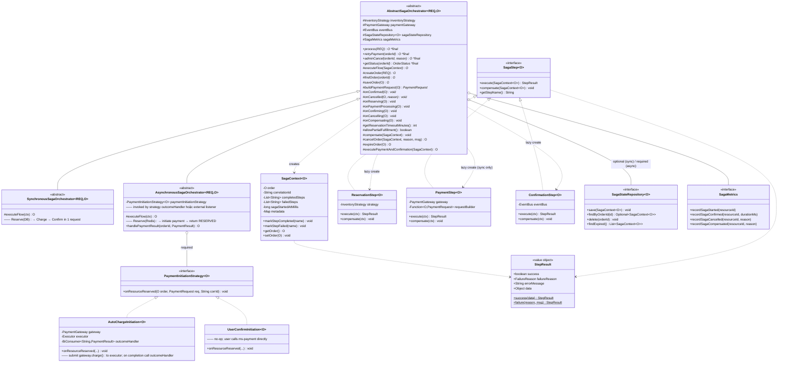
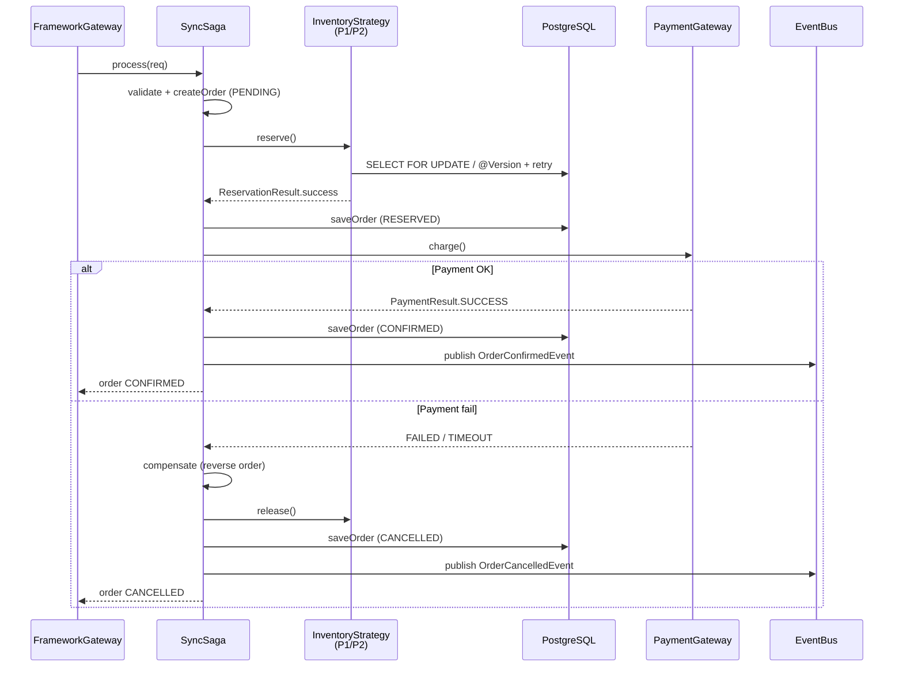
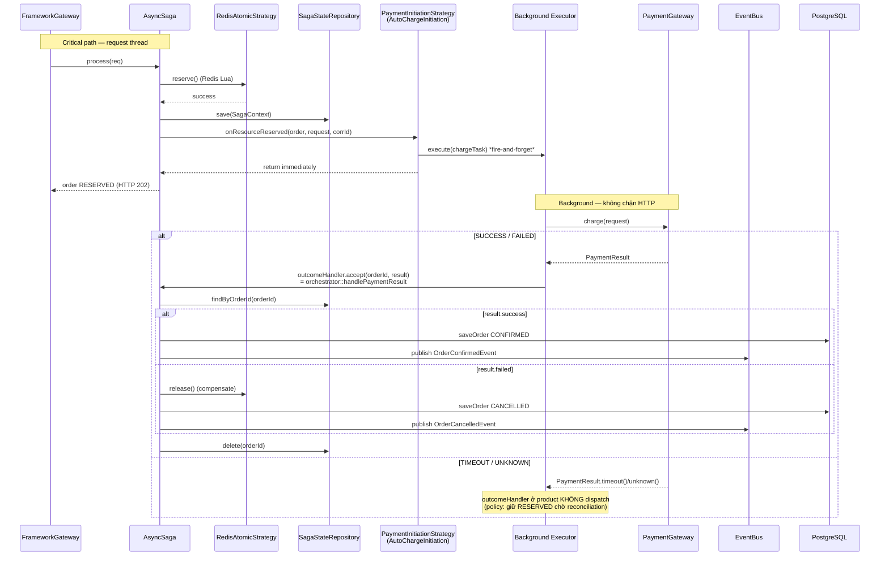
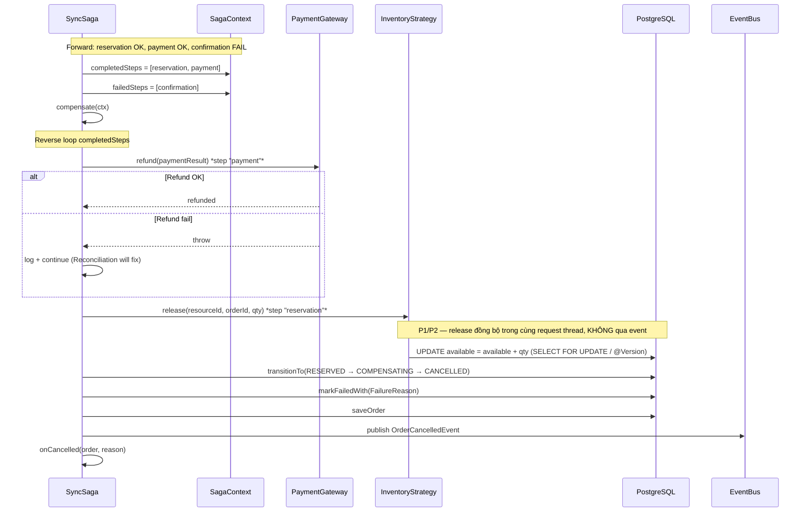
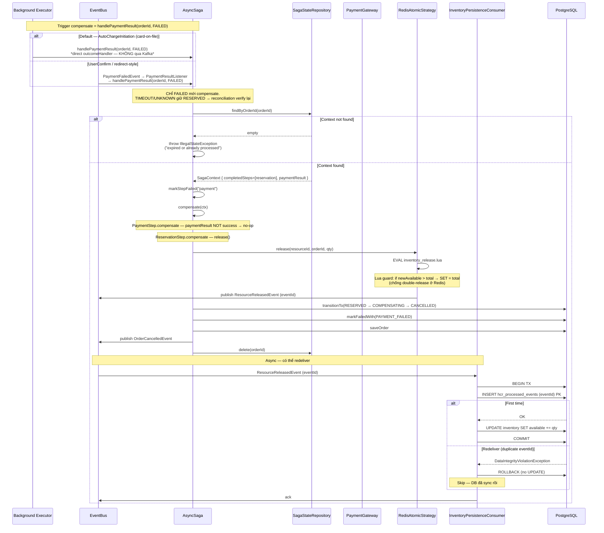

# hcr-saga — Module Architecture

## Module Purpose

Điều phối distributed transaction giữa **Inventory** và **Payment** với compensating action khi có bước nào fail. Cùng một logic flow nhưng có 2 hình thái thực thi:

- **`SynchronousSagaOrchestrator`** (P1/P2): toàn bộ Reserve → Charge → Confirm chạy **trong cùng một HTTP request**. Trả về order CONFIRMED → HTTP 201. Không cần `SagaStateRepository` (state nằm trong DB order).
- **`AsynchronousSagaOrchestrator`** (P3): chỉ Reserve (Redis) chạy đồng bộ; sau reserve, gọi `PaymentInitiationStrategy.onResourceReserved()` (fire-and-forget) rồi trả order RESERVED → HTTP 202. **Bắt buộc** có cả `SagaStateRepository` (để recover state) **và** `PaymentInitiationStrategy` (default `AutoChargeInitiation` cho card-on-file; dev có thể thay `UserConfirmInitiation` hoặc impl riêng).

`AbstractSagaOrchestrator` là Template Method — định nghĩa pipeline cố định (validate → createOrder → executeFlow → cancel/compensate khi fail), `executeFlow()` là hook cho 2 subclass quyết định sync hay async.

Compensation theo thứ tự **ngược** với thứ tự đã hoàn thành: nếu đã `reservation` + `payment` mà `confirmation` fail → undo `payment` trước, rồi undo `reservation`.

Phụ thuộc: `hcr-core`, `hcr-inventory`, `hcr-payment`, `hcr-eventbus`.

## Class / Structure Diagram (Mermaid Class)



### Sync flow (P1/P2)



### Async flow (P3) — sau refactor PaymentInitiationStrategy



> **Khác với thiết kế trước refactor:** trước đây critical path publish `PaymentRequestedEvent` lên Kafka, ms-payment subscribe → charge → publish `PaymentSucceededEvent` → ms-order subscribe → `handlePaymentResult`. Sau refactor: 1 HTTP roundtrip (ms-order → ms-payment) trên background pool + direct method call vào `handlePaymentResult`. Bỏ 2 Kafka hop. Critical path P3 chỉ còn 1 event ra Kafka: `ResourceReservedEvent` (cho ms-inventory DB sync).
>
> **`UserConfirmInitiation` (no-op):** giữ flow event-driven cho mô hình redirect — user chủ động gọi ms-payment, ms-payment publish `PaymentSucceeded/Failed` → ms-order subscribe event → `handlePaymentResult`. Listener `PaymentResultListener` ở product giữ nguyên cho path này.

## Compensation / Rollback Flow

Khi bất kỳ bước nào của saga fail, framework chạy **compensating actions** theo thứ tự **ngược** với forward execution (`completedSteps` stack). Đây là phần quan trọng nhất để đảm bảo zero-oversell **và** không thất thoát tiền — phải đúng tuyệt đối kể cả khi crash, retry, hay event redeliver.

### Nguyên tắc cốt lõi

1. **Compensate theo `completedSteps`, KHÔNG theo `failedSteps`** — chỉ undo những gì đã thật sự thành công. `markStepCompleted(name)` được gọi ngay sau mỗi step OK; `markStepFailed(name)` đánh dấu step gây ra cancel nhưng KHÔNG nằm trong stack compensate.
2. **Reverse order là bắt buộc** — refund TRƯỚC release. Nếu release trước, slot quay về kho và có thể bị user khác mua trong khi mình đang refund tiền của order cũ, tạo ra "phantom restock notification".
3. **Compensate KHÔNG được throw** — `ReservationStep.compensate()` và `PaymentStep.compensate()` đều `try/catch` exception và log lỗi, để Reconciliation xử lý phần fail còn lại sau (≤ 5 phút). Throw sẽ dừng compensate cycle giữa chừng → leak.
4. **State machine bảo vệ ở mức entity** — `OrderAccessor.transitionTo()` enforce `RESERVED → COMPENSATING → CANCELLED`. Không cho phép `RESERVED → CANCELLED` trực tiếp (audit gap) hoặc `CONFIRMED → CANCELLED` (đã terminal).

### 5 lớp bảo vệ — không chỉ dựa vào tồn kho

Rollback đúng đắn KHÔNG chỉ phụ thuộc vào "số vé tồn (`available`) + tổng số vé (`total`)" — đó chỉ là 2/5 tín hiệu. Framework phối hợp **5 nguồn dữ liệu** để đảm bảo idempotent + không lệch:

| Lớp | Nơi lưu | Vai trò khi rollback | Cơ chế chống sai |
|-----|---------|---------------------|------------------|
| **L1. `available` + `total` (Redis/DB)** | `hcr:inventory:{id}` (P3) hoặc bảng inventory entity (P1/P2) | Nguồn cấp số liệu cần `release()` cộng trả lại bao nhiêu | Lua guard `newAvailable > total → SET = total` chống double-INCRBY |
| **L2. `SagaContext.completedSteps`** | In-memory (sync) hoặc qua `SagaStateRepository` (async) | Quyết định step nào CẦN compensate, theo đúng thứ tự ngược | `markStepCompleted` chỉ gọi sau khi step success → compensate không bao giờ chạy trên step chưa chạy |
| **L3. `SagaStateRepository` (async only)** | Redis hoặc DB tùy implementation | Recover context sau crash giữa Reserve và Payment — không có nó, consumer không biết order ở đâu trong saga | `delete(orderId)` chỉ ở terminal state (CONFIRMED hoặc CANCELLED) → trước đó luôn có state để load |
| **L4. `hcr_processed_events` (DB log)** | Bảng PostgreSQL | Idempotency anchor cho `ResourceReleasedEvent` consumer — chống double-release ở **DB layer** (P3) | INSERT eventId + UPDATE available trong **cùng 1 transaction** → at-least-once redeliver gây duplicate-key → skip UPDATE |
| **L5. Order entity status + `failure_reason`** | DB row của developer | Audit trail "tại sao order này bị cancel" + state machine guard | `OrderAccessor.transitionTo()` throw nếu transition không hợp lệ; `markFailedWith(reason)` ghi `FailureReason` enum |

→ Khi viết báo cáo: nhấn mạnh rằng "rollback dựa trên tồn kho" là **chưa đủ**. Tồn kho cho biết phải cộng lại bao nhiêu, nhưng:
- **Có cộng lại CHƯA** → kiểm tra `hcr_processed_events` (eventId nằm trong đó nghĩa là consumer đã apply).
- **Đã đến bước nào của saga** → `completedSteps` (in-memory + persisted).
- **Đã thật sự xảy ra crash hay chỉ là lag** → `SagaStateRepository` còn entry không (nếu xóa rồi → đã terminal).

### Compensation sequence — Sync (P1/P2)



### Compensation sequence — Async (P3)



### Failure modes của compensation

| Tình huống | Cơ chế phát hiện | Cơ chế fix |
|-----------|------------------|------------|
| Refund call throw (gateway down) | `PaymentStep.compensate()` log + continue | Reconciliation `LATE_PAYMENT_SUCCESS` / refund retry job |
| Release call throw (Redis down) | `ReservationStep.compensate()` log + continue | Reconciliation case `STALE_PENDING` — re-release từ DB state |
| Crash giữa Saga (sync) sau payment, trước save CANCELLED | Order ở DB vẫn RESERVED nhưng payment đã refund | Reconciliation case `STALE_PENDING` (`expiresAt < now`) → expireOrder |
| Crash giữa Saga (async) sau Redis release, trước publish ResourceReleasedEvent | Redis đã +qty nhưng DB chưa | Reconciliation case `INVENTORY_MISMATCH` (Redis > DB) → AUTO-FIX set Redis = DB |
| `ResourceReleasedEvent` redeliver | Consumer INSERT `hcr_processed_events` fail duplicate key | Skip UPDATE, ACK — idempotent |
| Lua release bị gọi 2 lần (cùng eventId nhưng khác ack) | Lua guard `newAvailable > total → SET = total` | Cap về total, không leak slot lên trên |
| Async PaymentFailedEvent đến nhưng `SagaStateRepository` đã bị xóa (admin cancel chạy trước) | `findByOrderId` return empty | Saga throw — tránh double-compensate |
| Order đã CONFIRMED rồi nhận PaymentFailedEvent muộn | `OrderAccessor.transitionTo(CANCELLED)` từ CONFIRMED → throw IllegalState | Late event ignored, log warn — Reconciliation `LATE_PAYMENT_SUCCESS` reverse |

### Tại sao 5 lớp này đủ — mapping với invariant

```
INVARIANT (P3): CONFIRMED_count_DB + Redis_available = total

Saga compensate phải duy trì:
  ΔCONFIRMED_count = 0   (không có CONFIRMED nào bị tạo)
  ΔRedis_available = 0   (release đúng bằng reserve trước đó)
  ΔDB_available    = 0   (consumer apply đúng 1 lần)
```

- L1 (Redis/DB tồn kho): cung cấp cơ số `qty` để release đúng.
- L2 (`completedSteps`): đảm bảo release CHỈ chạy nếu reservation đã thật sự success → ΔRedis_available = 0.
- L3 (SagaStateRepository): đảm bảo async crash không làm mất `completedSteps` → vẫn compensate đúng sau recovery.
- L4 (`hcr_processed_events`): đảm bảo consumer apply đúng 1 lần → ΔDB_available = 0.
- L5 (state machine + `failure_reason`): đảm bảo order không "phục sinh" thành CONFIRMED sau khi cancel → ΔCONFIRMED_count = 0.

Bỏ bất kỳ lớp nào → 1 trong 3 delta có thể ≠ 0 → vỡ invariant. Đó là lý do framework yêu cầu cả 5.

## Capabilities (Provided to Devs)

| Capability | API | Khi dùng |
|---|---|---|
| Implement saga sync (P1/P2) | `class TicketSaga extends SynchronousSagaOrchestrator<TicketRequest, TicketOrder>` | Sample app |
| Implement saga async (P3) | `class TicketSaga extends AsynchronousSagaOrchestrator<...>` + bean `SagaStateRepository<TicketOrder>` | High-throughput app |
| Submit order | `saga.process(request)` | Gateway gọi |
| Retry payment | `saga.retryPayment(orderId)` | Khi RESERVED nhưng payment fail trước đó (admin tool, retry endpoint) |
| Admin cancel | `saga.adminCancel(orderId, reason)` | Hỗ trợ chăm sóc khách hàng |
| Lifecycle hooks | override `onReserving / onPaymentProcessing / onConfirming / onCancelling / onCompensating` | Audit log, notification |
| Required hooks | `createOrder`, `findOrder`, `saveOrder`, `buildPaymentRequest`, `onConfirmed`, `onCancelled` | Plumb persistence của developer |
| Reservation timeout | override `getReservationTimeoutMinutes()` (default 5) | Khách sạn cần 30 phút, flash sale chỉ 1 phút |
| Compensation tự động | Framework chạy ngược các step đã `markStepCompleted` | Developer không phải tự undo |
| State machine bảo vệ | `OrderAccessor.transitionTo()` enforce `OrderStatus.canTransitionTo` | Không thể nhảy từ PENDING → CONFIRMED |
| Built-in saga metrics | `SagaMetrics.recordSagaStarted/Confirmed/Cancelled/Compensated` | Auto-wire khi có observability bean |
| Saga state persistence (P3) | implement `SagaStateRepository<O>` (Redis hoặc DB) | Bắt buộc — async constructor sẽ throw nếu null |

### Standard 3 step

| Step | execute | compensate | Dùng ở |
|---|---|---|---|
| `ReservationStep` | `inventoryStrategy.reserve(...)` | `inventoryStrategy.release(...)` | Sync + Async (critical path) |
| `PaymentStep` | `paymentGateway.charge(...)` | `paymentGateway.refund(...)` (nếu đã trừ) | **Sync only** (P1/P2). Async dùng `PaymentInitiationStrategy` thay vì step này |
| `ConfirmationStep` | `eventBus.publish(OrderConfirmedEvent)` | (no-op — chỉ là notification) | Sync + Async (qua `handlePaymentResult` confirm path) |

### Payment trigger trong Async — `PaymentInitiationStrategy`

| Strategy | Hành vi | Khi dùng |
|---|---|---|
| `AutoChargeInitiation` (default) | Submit `gateway.charge()` lên `Executor` background; khi xong gọi `outcomeHandler(orderId, result)` (thường là `orchestrator::handlePaymentResult`) | Card-on-file: Uber, Grab, subscription, demo zero-oversell |
| `UserConfirmInitiation` | No-op; user tự gọi `POST /payments` của ms-payment | Redirect-style: VNPay, Momo, Stripe Checkout |
| Custom impl | Dev viết, vd: tạo payment intent + webhook callback | Khi cần khác 2 mô hình trên |

`outcomeHandler` ở product có thể bọc policy filter (vd: TIMEOUT/UNKNOWN giữ order RESERVED, để reconciliation hỏi lại gateway sau).

### Quy ước quan trọng

1. **`process()` là `final`** — developer không thể override pipeline. Customize qua hooks `onXxx`.
2. **State transition CHỈ qua `OrderAccessor`** — không gọi `order.setStatus()` trực tiếp.
3. **Reserve và Payment KHÔNG cùng 1 DB transaction** — đặc biệt với P1: `reserve()` commit ngay, `charge()` chạy ở transaction khác. Bằng không, lock DB suốt quá trình gọi gateway 30s sẽ kill throughput.
4. **Compensation theo thứ tự ngược** với `completedSteps` — đảm bảo refund trước release inventory (vì release có thể trigger restock notification cho user khác đang chờ).
5. **`AsynchronousSagaOrchestrator` constructor throw** nếu `sagaStateRepository == null` HOẶC `paymentInitiationStrategy == null` — fail-fast tại boot.
6. **`expireOrder` chạy trong `retryPayment`** khi order đã expired — đảm bảo idempotent với reconciliation case 1.
7. **`AutoChargeInitiation` wire orchestrator qua `@Lazy`** — orchestrator cần strategy trong constructor, strategy cần callback vào orchestrator → circular dep. Spring `@Lazy` proxy giải quyết (xem `OrderConfiguration` trong product).

## To-Do / Detailed Implementation

| Hạng mục | Trạng thái | Ghi chú |
|---|---|---|
| `AbstractSagaOrchestrator` template (final process/retry/cancel/getStatus) | ✅ Implemented | |
| `SynchronousSagaOrchestrator` (P1/P2 flow) | ✅ Implemented | |
| `AsynchronousSagaOrchestrator` (P3 critical path) | ✅ Implemented | Constructor đã guard `null` repo |
| `ReservationStep` / `PaymentStep` / `ConfirmationStep` | ✅ Implemented | |
| `SagaContext` (completedSteps, failedSteps, metadata) | ✅ Implemented | |
| `SagaStateRepository` interface | ✅ Implemented | Concrete impl (Redis/DB) là việc của developer |
| `SagaMetrics` (NO_OP default + Micrometer override) | ✅ Implemented | |
| `compensate()` reverse order | ✅ Implemented | |
| `PaymentInitiationStrategy` abstraction + 2 default impl | ✅ Implemented | `AutoChargeInitiation` (default cho card-on-file), `UserConfirmInitiation` (no-op cho redirect). Loại bỏ phụ thuộc cứng vào Kafka cho payment trigger. |
| Payment outcome routing | ✅ Implemented | Auto-charge: direct callback vào `handlePaymentResult` (no event). User-confirm: ms-payment publish `PaymentSucceeded/Failed` → product's `PaymentResultListener` consume → `handlePaymentResult`. Cả 2 path cùng đích đến |
| Default `SagaStateRepository<O>` impl (Redis-backed) | ❌ Chưa | Hiện developer phải tự viết. **TODO:** ship `RedissonSagaStateRepository` mặc định trong starter |
| Saga timeout (treo trong RESERVED) | ⚠️ Partial | Reconciliation case 1 cover. **TODO:** thêm `@Scheduled` riêng trong saga module để callback `expireOrder()` thay vì để reconciliation lo |
| Partial fulfillment | ❌ Chưa | `allowPartialFulfillment()` flag có nhưng strategy chưa hỗ trợ trả về số lượng partial. **TODO:** nâng `ReservationResult` thêm `reservedQty` |
| Multi-step pipeline (custom step) | ⚠️ Partial | Hard-code 3 step `reservation/payment/confirmation`. **TODO:** cho phép developer inject custom step list (ví dụ tax-calculation step) |
| Saga visualisation tool | ❌ Chưa | Có `SagaContext.metadata` lưu trace nhưng chưa có UI để view |

### Logic chi tiết cần implement

1. **Default `Executor` cho `AutoChargeInitiation`:** hiện product tự khai `@Bean Executor autoChargeExecutor`. **TODO:** ship `ThreadPoolTaskExecutor` mặc định trong starter, expose qua `hcr.saga.async.auto-charge.threads`.
2. **Idempotent state transition khi consumer retry:** payment consumer có thể nhận `PaymentSucceededEvent` 2 lần (at-least-once). Code `executePaymentAndConfirmation` đang gọi `transitionTo(CONFIRMED)` — nếu đã CONFIRMED, `canTransitionTo` trả `false` → throw. Cần wrap try/catch hoặc check `isTerminal()` trước.
3. **`adminCancel` vs ongoing async payment:** nếu admin cancel trong khi `PaymentConsumer` đang `charge()`, có thể double work. Cần `SagaStateRepository.markCancellationRequested(orderId)` để consumer check trước khi gọi gateway.
4. **`allowPartialFulfillment()`:** chưa wire xuyên suốt — `ReservationStep.execute()` hiện chỉ trả success/fail. Cần `ReservationResult.reservedQty` rồi update `order.quantity` trước khi sang `PaymentStep`.
