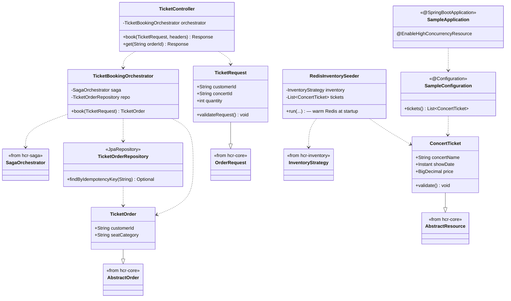

# hcr-sample

> Demo monolith — concert ticket service minh hoạ cách dùng framework end-to-end.

---

## 1. Vai trò trong framework

`hcr-sample` là **reference application** kiểu monolith — 1 Spring Boot service nhúng cả ms-order + ms-inventory + ms-payment trong cùng JVM, dùng framework HCR. Mục tiêu: cho developer một "minimum working example" để đọc và copy.

Khác biệt với `hcr-product/` (3 microservice riêng biệt + Kafka + load test k6), `hcr-sample/` là phiên bản đơn giản nhất chạy được — phù hợp đọc đầu tiên trước khi xem product.

---

## 2. Tại sao cần module này?

Test framework giúp framework đúng kỹ thuật, nhưng không giúp developer **hiểu cách dùng**. Cần một sample để:

| Mục đích | hcr-sample cung cấp |
|----------|---------------------|
| Hướng dẫn extend `AbstractResource` | `ConcertTicket` minh hoạ |
| Hướng dẫn extend `AbstractOrder` | `TicketOrder` |
| Hướng dẫn viết business orchestrator gọi framework saga | `TicketBookingOrchestrator` |
| Hướng dẫn warm-up Redis lúc startup (P3) | `RedisInventorySeeder` |
| Hướng dẫn config full stack | `application.yml` + `docker-compose.yml` |
| Có chỗ chạy + thử ngay | `docker-compose up` rồi `curl` |

---

## 3. Nguyên lý thiết kế

| Nguyên lý | Áp dụng trong sample |
|-----------|----------------------|
| **Minimal but realistic** | Chỉ logic concert ticket — đủ để demo framework, không phồng tính năng |
| **Concrete subclass cho mọi abstract** | `ConcertTicket extends AbstractResource`; `TicketOrder extends AbstractOrder`; `TicketRequest extends OrderRequest` |
| **Show, don't tell** | Code chạy thật, không pseudocode |
| **Comment as documentation** | Mỗi class có Javadoc giải thích "framework đang dùng nó như thế nào" |
| **Observability bundled** | `observability/` chứa Grafana dashboard JSON — demo cách integrate |
| **Docker-first** | `docker-compose.yml` dựng đầy đủ stack: Postgres + Redis + Kafka + Prometheus + Grafana |

---

## 4. Class diagram



---

## 5. Thành phần chính

| Package | Thành phần | Vai trò |
|---------|-----------|---------|
| `(root)` | `SampleApplication` | Entry point Spring Boot + `@EnableHighConcurrencyResource` |
| `domain` | `ConcertTicket`, `TicketOrder`, `TicketRequest` | Concrete subclass của abstract framework |
| `controller` | `TicketController` | REST endpoint `POST /tickets` |
| `service` | `TicketBookingOrchestrator` | Wrapper gọi `SagaOrchestrator` |
| `repository` | `TicketOrderRepository` | JPA repo cho `TicketOrder` |
| `config` | `SampleConfiguration`, `RedisInventorySeeder` | Bean registration + Redis warm-up |

---

## 6. Chạy thử

```bash
# 1. Dựng infra
cd hcr-sample
docker compose up -d

# 2. Run application
mvn spring-boot:run

# 3. Đặt vé
curl -X POST http://localhost:8080/tickets \
  -H "Content-Type: application/json" \
  -H "Idempotency-Key: $(uuidgen)" \
  -d '{"customerId":"u1","concertId":"concert-001","quantity":1}'

# 4. Mở Grafana
open http://localhost:3000
```

---

## 7. Sample vs Product

| | hcr-sample | hcr-product |
|--|:-:|:-:|
| Kiểu | Monolith 1 service | 3 microservice |
| Đọc trước? | ✅ Đầu tiên | Đọc sau khi nắm sample |
| Có Kafka? | Optional (in-memory được) | Bắt buộc |
| Có k6 load test? | Không | Có (`oversell-check`, `burst`, `sustained`) |
| Mục đích | Hiểu framework | Bench + thesis demo |

---

## 8. Liên kết

- Chi tiết đọc code → [`GUIDE.md`](GUIDE.md)
- Phiên bản microservice → [`../hcr-product/README.md`](../hcr-product/README.md)
