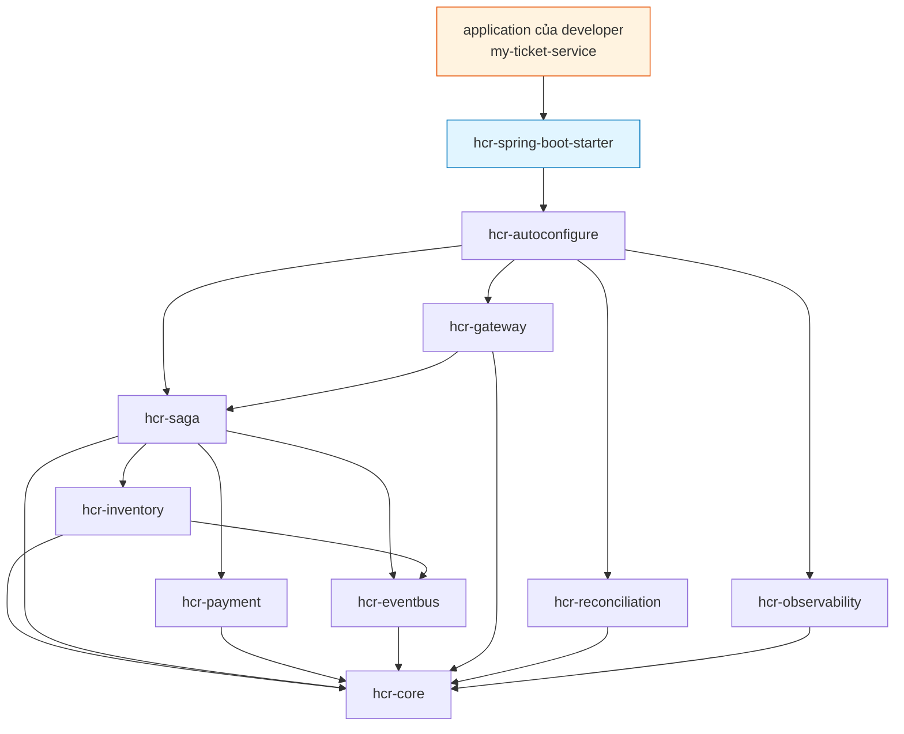

# hcr-spring-boot-starter

> Aggregator POM — chỉ cần thêm 1 dependency là có toàn framework.

---

## 1. Vai trò trong framework

`hcr-spring-boot-starter` là **distribution package** — không chứa Java source nào, chỉ là `pom.xml` aggregate `hcr-autoconfigure` (kéo theo cả chuỗi transitive dependency: core / inventory / saga / payment / eventbus / gateway / reconciliation / observability).

Đây là module **đối diện với người dùng cuối** (developer của application). Họ chỉ cần:

```xml
<dependency>
    <groupId>io.hrc</groupId>
    <artifactId>hcr-spring-boot-starter</artifactId>
    <version>1.0.0-SNAPSHOT</version>
</dependency>
```

Không cần biết 12 module nội bộ ra sao.

---

## 2. Tại sao cần module này?

Nếu không có starter:

| Vấn đề | Hậu quả |
|--------|---------|
| Developer phải khai 8-9 dependency trong `pom.xml` | Boilerplate, dễ thiếu |
| Version mismatch giữa các module HCR | NoClassDefFoundError lúc runtime |
| Không có chỗ cố định để thêm metadata starter | `spring.factories` / `AutoConfiguration.imports` rải rác |
| Khó publish 1 release version | Phải bump 12 artifact đồng bộ |

`hcr-spring-boot-starter` xử lý bằng cách:

- Aggregate transitive: thêm 1 dep → kéo cả chuỗi
- Version pin: parent POM quản lý version, starter chỉ inherit
- Convention Spring Boot: artifact tên `*-spring-boot-starter` → developer biết đây là starter chuẩn

---

## 3. Nguyên lý thiết kế

| Nguyên lý | Áp dụng |
|-----------|---------|
| **Spring Boot Starter convention** | Naming `*-spring-boot-starter`, không chứa source, chỉ aggregate auto-configure |
| **Single point of dependency** | 1 artifact = full framework |
| **Pure POM packaging** | `<packaging>` mặc định jar nhưng không có `src/` |
| **Transitive contract** | Bất kỳ artifact dùng `hcr-spring-boot-starter` đều có version đồng nhất qua parent POM |

---

## 4. "Class diagram" — dependency graph

Vì không có Java code, đây là dependency graph thay cho class diagram:



Khi `my-ticket-service` thêm `hcr-spring-boot-starter`, Maven kéo về **toàn bộ** module HCR đúng version đã pin trong parent POM.

---

## 5. Thành phần

| File | Vai trò |
|------|---------|
| `pom.xml` | Khai 1 dependency duy nhất: `hcr-autoconfigure` (kéo theo phần còn lại transitive) |

(không có thư mục `src/`)

---

## 6. Cách dùng

```xml
<!-- application pom.xml -->
<dependency>
    <groupId>io.hrc</groupId>
    <artifactId>hcr-spring-boot-starter</artifactId>
    <version>1.0.0-SNAPSHOT</version>
</dependency>
```

```java
@SpringBootApplication
@EnableHighConcurrencyResource
public class MyTicketService {
    public static void main(String[] args) {
        SpringApplication.run(MyTicketService.class, args);
    }
}
```

```yaml
# application.yml
hcr:
  inventory.strategy: redis-atomic
  saga.mode: async
  eventbus.type: kafka
```

Xong. Auto-config tự đăng ký toàn bộ bean.

---

## 7. Liên kết

- Auto-config detail → [`../hcr-autoconfigure/README.md`](../hcr-autoconfigure/README.md)
- Demo end-to-end → [`../hcr-sample/README.md`](../hcr-sample/README.md)
