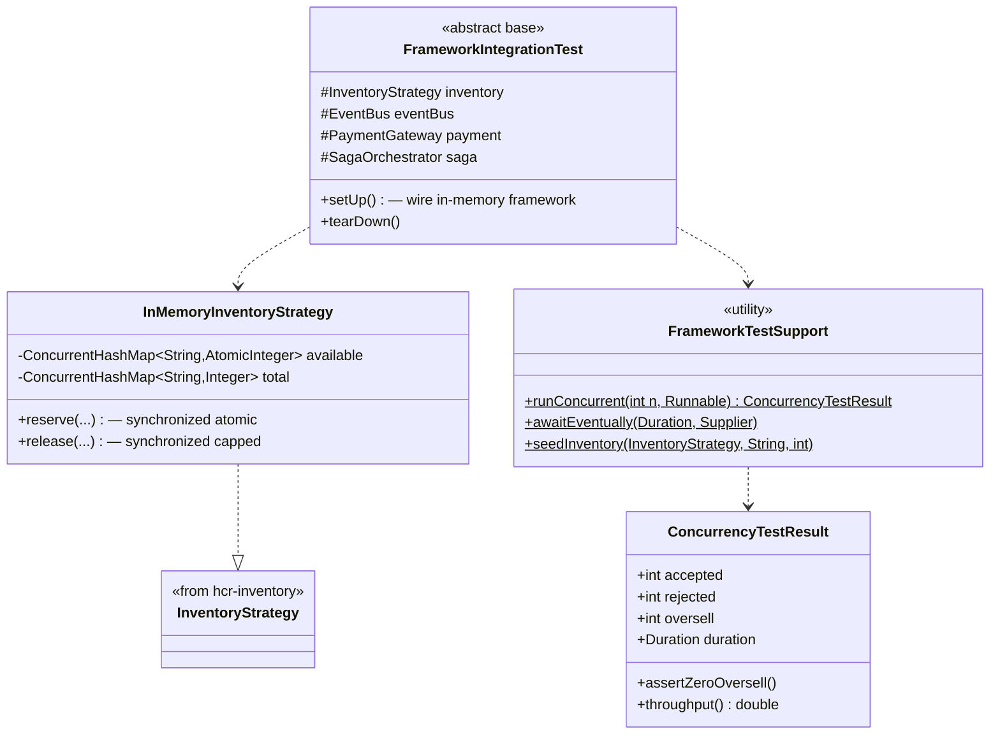

# hcr-testing

> Test support — in-memory inventory strategy + concurrency harness + integration test base.

---

## 1. Vai trò trong framework

`hcr-testing` cung cấp tooling để developer (cả của framework lẫn của ứng dụng dùng framework) **viết test concurrency** mà không cần spawn Postgres / Redis / Kafka thật. Module này **không bao giờ vào production runtime** — chỉ test scope.

Có 3 capability chính:

1. **`InMemoryInventoryStrategy`** — strategy `ConcurrentHashMap` + `AtomicInteger`, deterministic, không cần infra
2. **`FrameworkIntegrationTest`** — base class JUnit 5 dựng full framework với in-memory adapter
3. **`FrameworkTestSupport`** — utility chạy N thread cùng lúc, đo zero-oversell

---

## 2. Tại sao cần module này?

Test concurrency là chỗ đa số đội bỏ qua vì khó:

| Vấn đề | Hậu quả nếu không có module | HCR cách làm |
|--------|----------------------------|--------------|
| Test cần Redis thật | CI chậm, fragile, phụ thuộc Docker | `InMemoryEventBusAdapter` + `InMemoryInventoryStrategy` |
| Manual thread spawn dễ sai | Race trong test code → false positive/negative | `FrameworkTestSupport.runConcurrent(n, task)` |
| Không có chuẩn cho zero-oversell test | Mỗi nơi tự verify khác nhau | `ConcurrencyTestResult` với invariant check |
| Setup full framework boilerplate | Mỗi test class lặp 100 dòng | `FrameworkIntegrationTest` base |

---

## 3. Nguyên lý thiết kế

| Nguyên lý | Áp dụng |
|-----------|---------|
| **In-memory test double** thay mock | `InMemoryInventoryStrategy` chạy thật logic, không mock — test sát thực tế hơn |
| **Determinism via single-thread Lua-equivalent** | `synchronized` block giả lập atomic Redis Lua |
| **Test as documentation** | `FrameworkIntegrationTest` minh hoạ cách wire framework |
| **Test only scope** | `<scope>test</scope>` ở dependency, không leak vào main |
| **Result-based verification** | `ConcurrencyTestResult` chứa accepted / rejected / oversell — assertion 1 dòng |

---

## 4. Class diagram



---

## 5. Thành phần chính

| Package | Thành phần | Vai trò |
|---------|-----------|---------|
| `inventory` | `InMemoryInventoryStrategy` | Strategy in-memory cho test |
| `base` | `FrameworkIntegrationTest` | Base class JUnit 5 wire full framework |
| `result` | `ConcurrencyTestResult` | DTO + assertion helper |
| `(root)` | `FrameworkTestSupport` | Utility chạy concurrent + await |

---

## 6. Pattern dùng

```java
class TicketServiceConcurrencyTest extends FrameworkIntegrationTest {

    @Test
    void zeroOversell_under_500_concurrent_requests() {
        FrameworkTestSupport.seedInventory(inventory, "concert-001", 100);

        var result = FrameworkTestSupport.runConcurrent(500, () -> {
            saga.process(new TicketRequest("concert-001", randomKey(), 1));
        });

        result.assertZeroOversell();
        assertThat(result.getAccepted()).isEqualTo(100);
        assertThat(result.getRejected()).isEqualTo(400);
    }
}
```

---

## 7. Liên kết

- Chi tiết đọc code → [`GUIDE.md`](GUIDE.md)
- Thiết kế tổng → [`../docs/framework_design.md`](../docs/framework_design.md) §10
